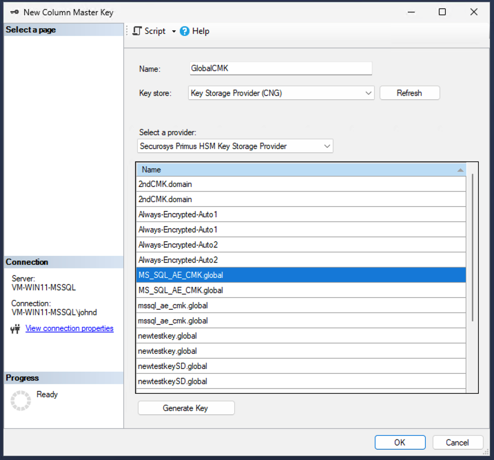

In certain cases where shared access to MS SQL AE is needed, global keys can be created. These global keys can be created with the [`ksputilcons`](/mscng/Tutorial/KSP-utils) utility, where the key must have the suffix `.global` added within the name.

When key name suffix **`.global`** is set, the key is accessible by any authenticated user on this device, without administrative privileges. To learn more about the global key accessibility, please see our Primus HSM CNG/KSP Provider online documentation chapter [Key Accessibility](/mscng/Tutorial/Key-Access).

In this section we will quickly describe the steps to allow shared access to MS SQL, encrypted with a global key:
- [Creating a Global Key with Ksputilcons](#creating-a-global-key-with-ksputilcons)
- [Creating a CMK with the Global Key](#creating-a-cmk-with-the-global-key)
- [Using the Global CMK](#using-the-global-cmk)

## Creating a Global Key with Ksputilcons

1. Navigate to the folder where `ksputilcons` is installed. By default the utility is installed within the `%ProgramFiles%` folder: `"%ProgramFiles%\Securosys\PrimusHsmKsp\ksputilcons.exe"`

2. To create a global key on the HSM that can serve as a Column Master Key in MS SQL Always Encrypted, use the command below.  

```
ksputilcons.exe createkey --name <keyname>.global --algorithm RSA --size 4096  
```
    - Rename the key as required, but ensure that it retains the “.global” suffix
    - In order to create a CEK in MS SQL for a given CMK, the CMK requires **signing** and **decrypt** usage for a key. Therefore, either use the default setting when creating a key with ksputilcons or specify both the –sign and –decrypt options.

3. You can verify the creation of the key by using the command:
```
ksputilcons.exe enumkeys

Owner: S-1-5-11 (Shared)
------------------------

+ Key name:                     <keyname>.global
  Algorithm, size, type:        RSA, 4096 bit, PublicKey

+ Key name:                     <keyname>.global
  Algorithm, size, type:        RSA, 4096 bit, PrivateKey
```

:::tip Ksputilcons Parameters and Information
For more information and parameter information about the `ksputilcons createkey` and `enumkeys` commands, see [CNG/KSP Provider - Testing & Key Management - Create Key](/mscng/Tutorial/KSP-utils#create-key).
:::

## Creating a CMK with the Global Key

1. In MS SQL, navigate to **Always Encrypted Keys** -> **Column Master Keys** and select **New Column Master Key…** (See [Creating A Column Master Key (CMK)](/ms-sql-ae/Installation/creating-cmk) for more information.) 
2. Specify the name of the CMK,
3. Select the key store `Key Storage Provider CNG`,
4. Select the `Securosys Primus HSM Key Storage Provider` provider and then select your previously created global key (in our example we use `MS_SQL_AE_CMK.global`) from the list of keys stored on the selected KSP. 

:::warning
**Do not** select `Generate Key`, as this will trigger MS SQL to generate a CMK on the selected provider, which scope is limited to the current Windows user.
:::

<figure className="image">
  
  <figcaption>
  Example creation of Global key as a CMK.
  </figcaption>
</figure>

5. Review your choices and click `OK` to finish the global CMK key.

## Using the Global CMK

With the global CMK created proceed as normal and create a new CEK that is protected by the afore mentioned CMK and then use this new CEK to protect sensitive column data in your database. See [Creating A Column Encryption Key (CEK)](/ms-sql-ae/Installation/creating-cek) for more information.

Authenticated users that wish to access sensitive data that is protected by a CEK encrypted by a global CMK are required to have the Securosys Primus HSM KSP installed and configured access to the HSM partition in which the global key used for the CMK has been created.
