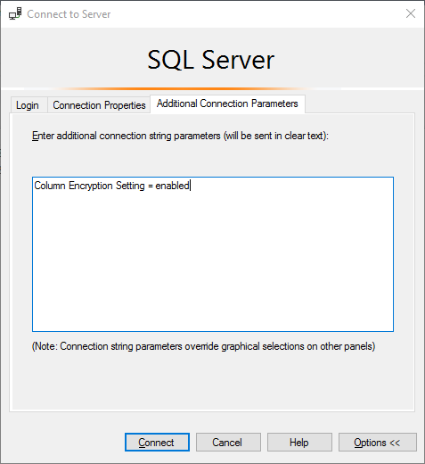
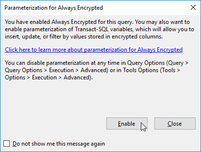

# Connecting to Column Encrypted Database

Additional database connection parameters are required to show encrypted columns in plaintext.

The parameter is entered at the `Connect to Database Engine` logon screen. Select the required server name and click on `Options>>`. Select the `Additional Connection Parameters` tab then add the connection string `Column Encryption Setting = enabled` and then click `Connect`.

The first time you query the database you may get the `Parameterization for Always Encrypted` prompt. Click on `Enable` to proceed.

Running queries on the table will now show the original values decrypted by the CEK.