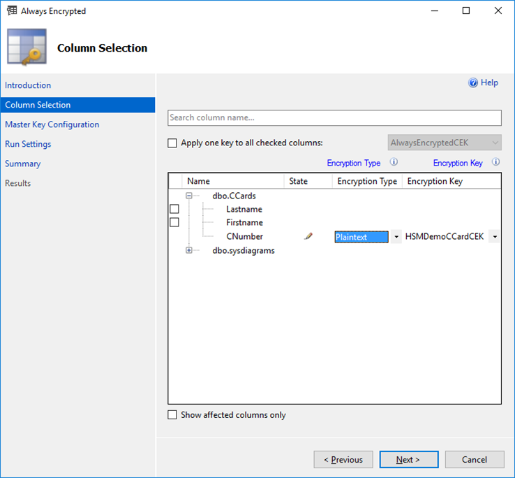

import Tabs from '@theme/Tabs';
import TabItem from '@theme/TabItem';

# Removing Column Encryption

Use the **SQL Server Management Studio** to remove the protection provided by Always Encrypted column encryption. 

<Tabs groupId="Column Encryption Key">
  <TabItem value="gui" label="Graphical User Interface (GUI)" default>

Right-click on the required database.

Select `Tasks` -> `Encrypt Columns…` to open the Always Encrypted wizard.



- On the Column Selection page change the Encryption type to `Plaintext` for the columns to decrypt.
- If all necessary columns are defined properly, click `Next >` `Next >` `Next >` and review on the Summary page that the correct Decrypt columns are listed. 
- Click `Finish` to see the Results page and click `Close`.
When you next log into the database you can remove the `Column Encryption Setting = enabled` string from the `Additional Connection Parameters` tab of the database login screen.

 </TabItem>
<TabItem value="cli" label="Command Line Interface (CLI))" default>


To remove column encryption from previously encrypted column data, replace the column EncryptionType value with `Plaintext` and execute `Set-SqlColumnEncryption` cmdlet.

Take the database preferably offline before proceeding to remove column encryption.
```
# Import Module SqlServer
Import-Module SqlServer 

# Set up connection and database SMO objects 
$sqlConnectionString = "Data Source=server_name;Initial Catalog=your_database;Integrated Security=True;MultipleActiveResultSets=False;Connect Timeout=30;Encrypt=False;TrustServerCertificate=True;Packet Size=4096;Application Name=`”Microsoft SQL Server Management Studio`”;Column Encryption Setting=Enabled” 
$smoDatabase = Get-SqlDatabase –ConnectionString $sqlConnectionString 

# Change encryption schema 
$encryptionChanges = @() 

# Add changes for table [dbo].[DemoTable] 
$encryptionChanges += New-SqlColumnEncryptionSettings –ColumnName dbo.DemoTable.ColToDecrypt 
–EncryptionType Plaintext
Set-SqlColumnEncryption –ColumnEncryptionSettings $encryptionChanges –InputObject $smoDatabase
```

The `Always Encrypted` column data will revert to plaintext. 
Remove the `Column Encryption Setting = enabled` string from the `Additional Connection Parameters` field of the database login screen.


:::note
When removing Always Encryption from your database columns, ensure that all columns appear in plaintext. You must delete any Column Encryption Keys (CEK) before you can drop the Column Master Keys (CMK).
:::

    </TabItem>
</Tabs>
