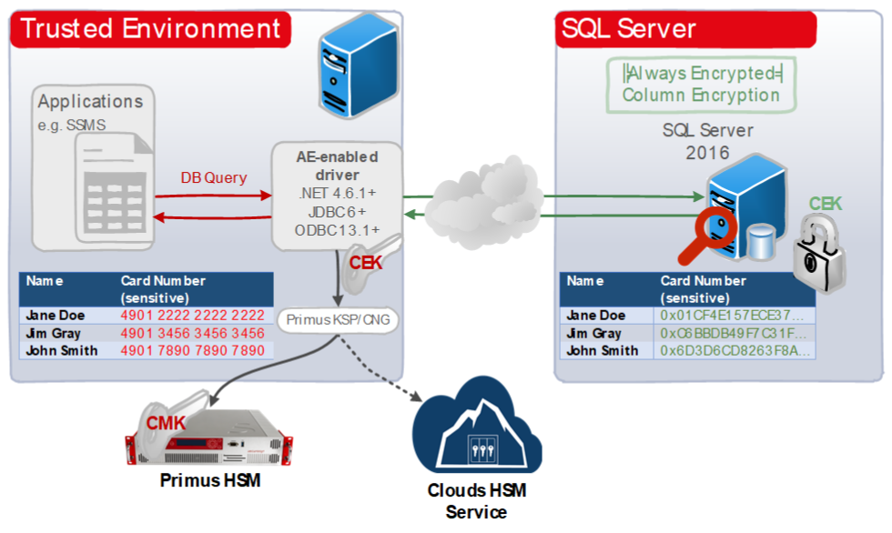

import Tabs from '@theme/Tabs';
import TabItem from '@theme/TabItem';

# Microsoft SQL Always Encrypted
### HSM Integration Guide

This document describes how to secure private keys used by the Microsoft SQL Server by using the Securosys Hardware Security Modules (HSMs).

Microsoft SQL Server 2016 (all editions) provides a new feature called “Always Encrypted” (AE), designed to protect sensitive data, such as credit card numbers or national identification numbers, both **at rest and in motion** between an on-premises client application and Azure or SQL Server databases.

There are a couple of good reasons why Always Encrypted should be used:
- **Regulatory support**: personal data must be protected by more and more industry regulations, e.g. General Data Protection Regulation (GDPR) or US GSA PII standard (“Personally Identifiable Information”). Not having appropriate technical and organizational protection mechanisms in place, the data owner can be severely penalized.
- **Data Security**: data always needed to be secure. AE brings another layer of data in motion protection, filling the gap if other transport security mechanisms are compromised (e.g. SSL)

Securosys Hardware Security Modules can easily be integrated in a **Microsoft Windows system** by installing the Primus CNG Provider on the host machine. This enables all Windows servers and clients to generate and store their private keys and certificates securely in the HSMs, and perform all related cryptographic functionality, like signing or certificate validation, hardware accelerated on the Primus HSM.

- **Securosys HSM on-premises**

The Primus HSMs are built to securely generate and store true random cryptographic keys, providing a central, certified secure storage. They also control and regulate access to the keys and the related cryptographic functionality. The Primus HSM combined with Microsoft SQL Server Always Encrypted meets or exceeds the best practice security requirements and is one step ahead of fulfilling your compliance demands.

- **Securosys HSM in the cloud**

[Securosys CloudHSM](/cloudhsm/overview/) is a Hardware Security Module (HSM) available as cloud service, without having to worry about time consuming things like evaluation, setup, operation, redundancy, and maintenance of the HSM infrastructure, and is scalable according to your needs. The redundant cluster architecture, providing different redundant regions up to redundant world-wide cluster, fits perfectly for Microsoft SQL Always Encrypted.

All certificate issuance and validation processes occur within the protected confines of the HSM. Private keys are never accessible outside the HSM.

## Target Audience

This document is intended for Securosys Primus HSM or Microsoft administrators and IT professionals in charge of the Microsoft SQL Server administration. This guide requires that you are already familiar with Microsoft Windows Server administration.

For on-premises HSM deployed operation administrative skills are required for Securosys Primus HSMs.

## Support Contact

If you encounter a problem while installing/configuring the provider or
integrating the HSM with Microsoft SQL Server, make sure that you have read the
referenced documentation. If you cannot resolve the issue, please
contact Securosys Customer Support. For specific requests regarding
Securosys integration, the Securosys
Support Portal is reachable under https://support.securosys.com.

## Get started with Microsoft SQL AE & Securosys HSMs

For a smooth start integrating your Primus HSM with Microsoft SQL Server using the Primus CNG/KSP Provider:
- Consult the [Quick Start Guide](./quickstart) for a comprehensive task listing.
- For detailed instructions on installing and configuring your Primus HSM with Microsoft SQL Server, read and follow the [Installation](/ms-sql-ae/Installation/prerequisites) section.
- Enable column encryption for Microsoft SQL Server using CloudHSM or Primus HSM by following the [Tutorials](/ms-sql-ae/Tutorials/connecting-column-encrypted-db) section.