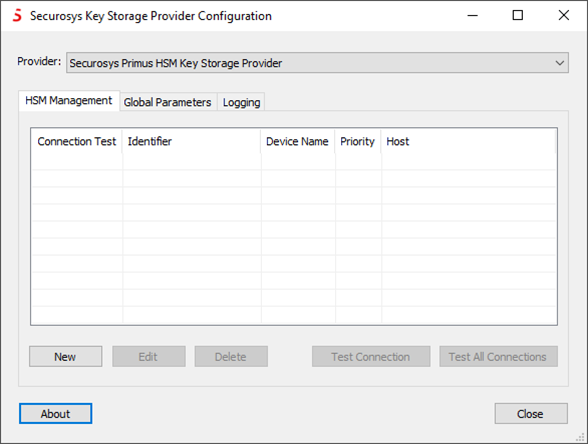
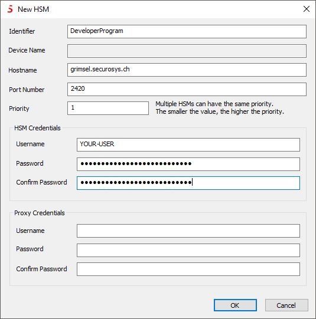
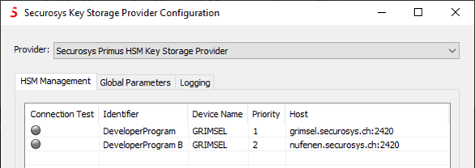
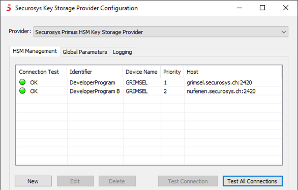
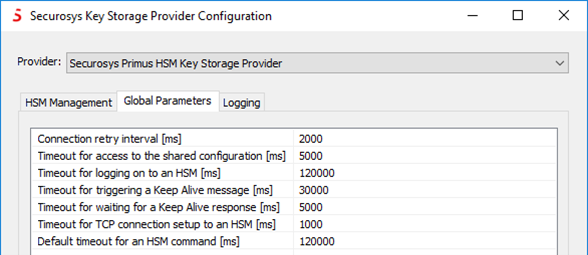

# Configuring the Microsoft CNG/KSP Provider

## Manage the Hardware Security Module (HSM)

Each instance of the Primus CNG/KSP Provider addresses a single partition within a redundant Primus HSM cluster. Different partitions or different non-redundant HSM partitions require a dedicated provider instance.

1) Run the Securosys **`Key Storage Provider Configuration`** tool from the Windows menu:

2) From the _Provider_ drop-down list, select the provider instance to configure
 (in case multiple instances are installed). 

3) Add all the redundant HSM connections of the cluster with their fallback priority.



4) Click **```New```**  to add a new HSM connection.

5) Fill in all the required parameters, user partition credentials and, if required, the proxy credentials (e.g. for CloudHSM), provided by your Security Officer or your CloudHSM service provider. You can also refer to [this section](/connectivity-details/cloudhsm-connectivity-details).



|   Parameter                  |   Description         |                                                                                                                                           
| ---                   | ---           |                                                                                                                                                   
| **```Identifier```**    | Your HSM connection description. It is recommended to include a hint to your user/partition name for later reference, as the Username is later invisible. |         
| **```Device Name```**   | Will be read from the device after successful connection |         
| **```Hostname```** | Hostname or IP address of your HSM connection point |      
| **```Port Number```** | TCP connection port number of your HSM connection point (CNG default: 2320, Clouds HSM: 2320, developer program: 2420; see [Default HSM Connection Parameters](/connectivity-details/cloudhsm-connectivity-details)) |      
| **```Priority```** | Priority in selecting a redundant HSM. The smaller value, the higher priority. Random selection for equal priority. |      
| **```HSM Credentials```** | Username and Password of your HSM partition (setup password) (as provided by your security officer or your Clouds HSM service provider) |      
| **```Proxy Credentials```**  | Username and Password of your HSM proxy (service user) (as provided by your security officer or your Clouds HSM service provider) |      

6) Configure all your further redundant HSM connections (and provider instances) in the same way.

 Click **```Test all Connections```** to verify connectivity to your HSMs and to retrieve the permanent secret (if not done previously).

 

The status indicators should change to green after successful connection.
The CNG/KSP Provider is now ready for use by the applications.



 ## Global Parameters

1) If requested by your HSM administrato, adjust the "Global Parameters". The following screenshot shows the default values after installation:



|                Parameter        |  Description          |                                                                                                                                           
| ---                   | ---           |                                                                                                                                                   
| **```Connection retry interval [2000 ms]```** | The list of configured HSMs is processed once until a connection can be established to an HSM. If the connection is then interrupted or no connection can be established to any HSM, a new run is started. To avoid constant runs and thus high processor load in the event of an error, a pause is inserted between two runs. The duration of the pause is defined by the specified value. |         
| **```Timeout for access to the shared configuration [5000 ms]```**  | Timeout for serialized access to shared HSM configuration as multiple instances can run in parallel. |         
| **```Timeout for logging on to an HSM [120000 ms]```**| Timeout for the entire logon process to an HSM, i.e. from Hello to the successful start of line encryption. |      
| **```Timeout for triggering a Keep Alive message [30000 ms]```** | Idle time to trigger a keep alive message.
 |      
| **```Timeout for waiting for a Keep Alive response [5000 ms]```**| Maximum time the provider waits for the keep alive response from an HSM |      
| **```Timeout for TCP connection setup to an HSM [1000 ms]```**| Timeout overriding the default TCP connection timeout (introduced with v1.43.1). Reduce this timeout if your HSMs are connected locally (not using satellite lines). |      
| **```Default timeout for an HSM command [120000 ms]```**  | Maximum time the provider waits for a response to all other commands. |      

 ## Access Restrictions

In case of required **Registry Access Hardening**, please proceed according to [this chapter](/mscng/Tutorial/Hardening.md).