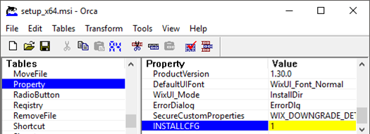

# Installation via Active Directory Group Policy

The MSI package can be distributed on multiple machines easily via **Microsoft Active Directory Group Policy** (Software Installation). For further details, please consult the corresponding Microsoft documentation.

Here is a brief overview of the steps:

- If you want to distribute the initial configuration of the CNG/KSP Provider via Group Policy, modify the MSI package using ```Orca.exe``` (available in the Microsoft Windows SDK Components for Windows Installer Developers).
 Within Orca, add the Property **```INSTALLCFG = 1```**.
 
 

- Additionally, configure the default configuration file **```KspCfg.ini```** with the necessary HSM details.
- Create a Distribution Point (e.g. shared network folder) and set the permissions to allow access to the MSI package. Copy the MSI package into that shared folder (to distribute the initial configuration include the configuration file KspCfg.ini).
- Create and apply a Group Policy Object to computers.
- Assign the MSI package to" **``**`Computer Configuration```**". Expand the tree ( **```Policies```** , **```Software Settings```** ). Right-click **```Software Installation```** , select the **```New```** context menu and then click on **```Package```**. In the **```Open```** dialog type the full UNC path of the shared package you want to assign.
