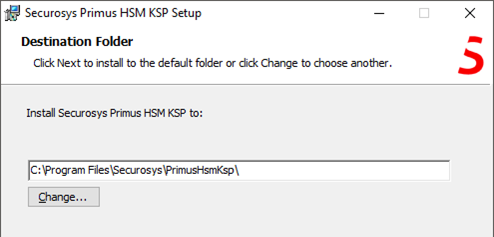

# Installing Microsoft CNG via GUI

1) Download the latest [CNG/KSP Provider](/mscng/downloads.md) (account required). Copy the zip file to your server or client and extract the archive.

1) Select the appropriate MSI setup package according to your Windows System type (x86, x64). Double-click the MSI package to begin the interactive installation.


3) Click **```Next```**.



4) Click **```Next```** to leave the default installation folder or adapt it according to your needs.


then click **```Install```** to start the installation.


5) Click **```Finish```** to complete the installation and to launch the configuration GUI.
After successful installation, the "Securosys Primus HSM Key Storage Provider" should be listed when executing the following command as administrator:

```sh
certutil -csplist
```


