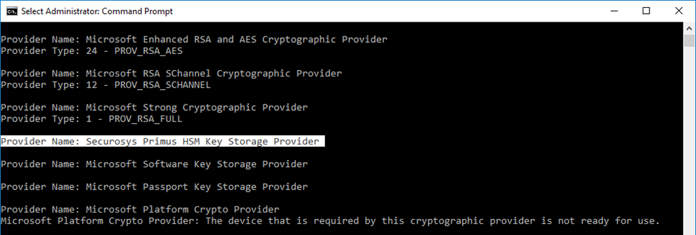
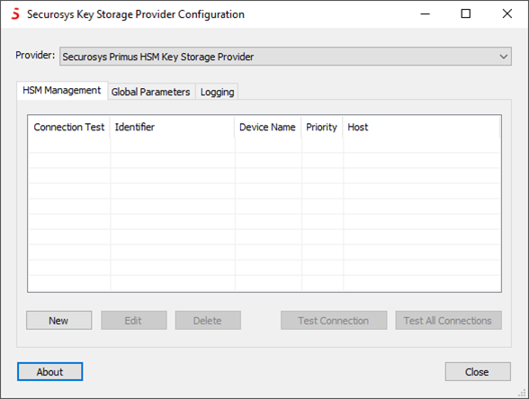
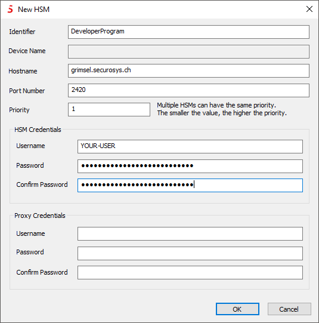
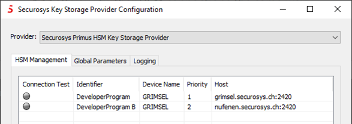
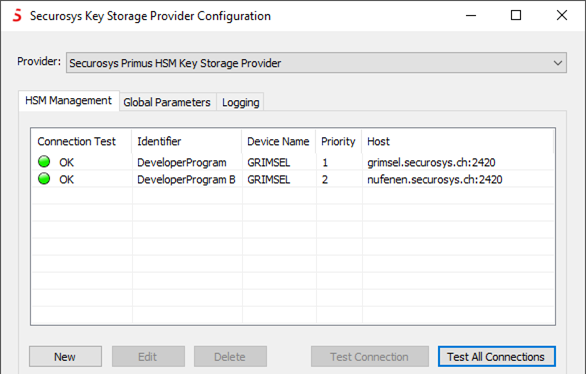

# Quick Start Guide

This quick start guide provides a comprehensive task listing to download, set up and use the **Securosys Primus CNG/KSP Provider**.

:::info Before starting the installation
Please ensure that all [prerequisites](/mscng/Installation/Prerequisites.md) are met.
:::

## 1. Quick GUI installation

1) Download the latest [CNG/KSP Provider](/mscng/downloads.md) (account required).
1) Copy the zip file to your server or client and extract the archive.
1) Select the appropriate MSI setup package according to your Windows System type (x86, x64).
1) Double-click the MSI package to begin the interactive installation.


5) Click **```Next```**.


6) Click **```Next```** to leave the default installation folder or adapt it according to your needs.


7) then click **```Install```** to start the installation.


8) Click **```Finish```** to complete the installation and to launch the configuration GUI.
After successful installation, the "Securosys Primus HSM Key Storage Provider" should be listed when executing the following command as administrator:

```sh
certutil -csplist
```



## 2. KSP Configuration

From the Windows menu, run the Securosys "Key Storage Provider Configuration":
1) If multiple instances are installed, choose the one want to configure one from the _Provider_ drop-down list: 
1) Add all redundant HSM connections of the cluster, as well as their fallback priority.



3) Click **```New```**  to add a new HSM connection.

4) Fill in all the required parameters, including user partition credentials and, if required, the proxy credentials (e.g. for CloudHSM), as provided by your Security Officer (SO) or your CloudHSM service provider.

    You can also refer to the [HSM Connection Parameters](/connectivity-details/cloudhsm-connectivity-details).



5) Configure all your further redundant HSM connections (and provider instances) in the same way.

6) Click **```Test all Connections```** to verify connectivity to your HSMs and to retrieve the permanent secret (if not done previously).

 

The status indicators should change to green after a successful connection.
The CNG/KSP Provider is now ready for use by the applications.



For more detailed instructions, please consult:
- the [Installation](/mscng/Installation/Prerequisites) section
- the [Tutorials](/mscng/category/tutorial) section