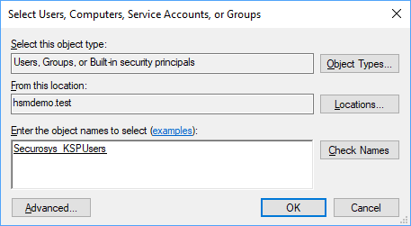

# HSM Registry Access Hardening
:::info 
This applies to Primus CNG/KSP Provider **V1.35 and later**.
:::
As the CNG/KSP may be executed in the context of any application, the Hardware Security Modules (HSMs) can be accessed via CNG/KSP by any system user or service.

To restrict access to your HSMs for a specific user group, you must limit the permissions on the registry key containing the HSM connection details.

## Step-by-Step Instructions

To limit permissions on the registry key, follow these steps:

For 64-bit Windows installations:
```bash
Computer\HKEY\_LOCAL\_MACHINE\SOFTWARE\WOW6432Node\Securosys\hsm\_ksp\HSMs
```
For 32-bit Windows installations:

```bash
Computer\HKEY\_LOCAL\_MACHINE\SOFTWARE\Securosys\hsm\_ksp\HSMs
```
The following procedure requires administration rights:

- Define a new user group having access to the HSMs, e.g. Securosys_KSPUsers, either on
  - the local machine ("Computer Management", "Local Users and Groups")
  - or within the Active Directory ("Active Directory Users and Computers")
- Add the specific users or accounts to above user group, having access to the HSMs
- Open the Registry Editor as administrator (regedit.exe)
- Navigate to the above-mentioned registry key
- Assign the newly created group (Securosys\_KSPUsers) to the registry key permissions: Right-click on the HSMs key and select **```Permissions…```**


 
  - On the following dialog click the button **`Add…`**

  

  - Enter the new group name and click the button **`Check Names`** and **```OK```**

  - Assign the **`Read`** permission tick for the new group 
  - Click the button **```Apply```**
- To remove inheritance
  - Click the button **```Advanced```**
  - On the following dialog click **`Disable Inheritance`**
  
  - Select **`Convert inherited permissions …`**

- **Remove** the group **Users (…\…)** by selecting it and clicking the button **```Remove```**
- Confirm all changes by clicking the button **```OK```** twice
- Exit the Registry Editor application and test the behavior

:::caution **CAUTION!**
 Newer Windows versions use some unresolved and Special Security Identifiers (SIDs; e.g. for recovery purposes). Before deleting such SIDs, please consult [Microsoft documentation](https://support.microsoft.com/en-us/help/4502539/some-sids-do-not-resolve-into-friendly-names). These hardenings have to be checked and eventually reapplied after every CNG/KSP update!
:::