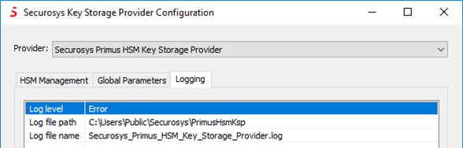

# Logging Capabilities

Logging to a file requires CNG/KSP version V1.35 onwards.

The default _Log Level_ should always be set to **"Error"** or **"Off"** due to **performance impact**. Since the Key Storage Provider (KSP) is run in the context of the applications using it, the log file should be accessible publicly.

The Key Storage Provider (KSP) version V1.41 onwards assigns a dedicated log file per provider instance.

 

