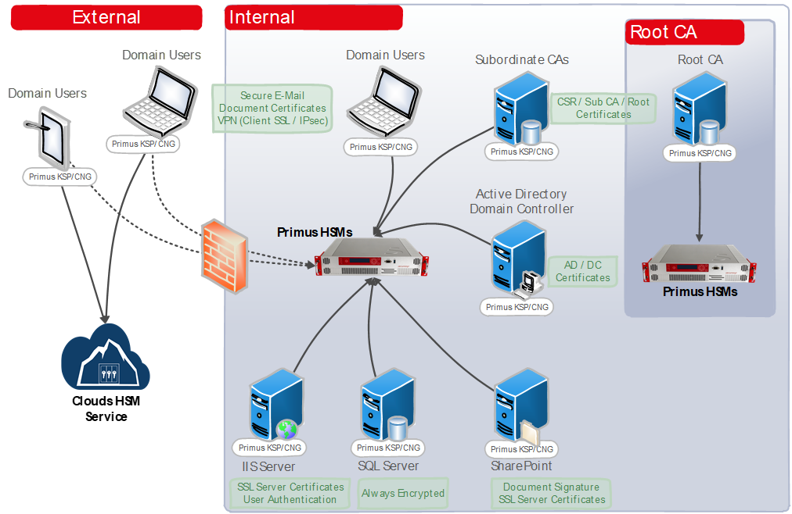

# Primus CNG/KSP Provider
### HSM Installation guide

This guide describes the installation and update of the **Primus CNG/KSP Provider** on Microsoft Windows Server or Client, to integrate Securosys Hardware Security Modules (HSMs), both cloud & on-premises.

The provider is delivered as a Windows Installer package (MSI) which can be distributed via AD group policy.

  

Securosys HSMs are built to securely generate and store true random cryptographic keys, providing central, certified secure storage. They also control and regulate access to the keys and the related crypto-graphic functionality.

Securosys HSMs meets or exceeds the best practice security requirements and is one step ahead of fulfilling your compliance demands by providing:
-	Hardware-based secure generation of true random cryptographic keys
-	Central and highly secure storage of cryptographic keys
-	Load balancing and fail-over by clustering the HSMs
-	Controlled and regulated access to the keys
-	Hardware acceleration of cryptographic operations such as encryption, authentication, and digital signatures, relieving the host server of processor-intensive computations
- Scalable performance at manageable cost

All certificate issuance and validation processes occur within the protected confines of the HSM. Private keys are never accessible outside the HSM.

Securosys HSMs can easily be integrated into a **Microsoft Windows** system by installing the Primus CNG Provider. This enables all Windows servers and clients to generate and store their private keys and certifi-cates securely in the HSMs, and perform all related cryptographic functionality, hardware accelerated on the Primus HSM.

Starting with V1.30, the CNG/KSP Provider is delivered as an MSI package, which can be installed interactive via GUI, on the command line with additional parameters (e.g. to configure from file), via Active Directory Group Policy or other software distribution tools.

CNG/KSP Provider V1.40 onwards supports installation of multiple instances (via configuration file only).

:::info 64-bit (x64)

Please note, that the MSI setup package depends on the Windows System type (x86, x64). The following examples are shown for 64-bit (x64) target systems only.

:::

## Target Audience

This document is intended for Securosys Primus HSM or [CloudHSM](../cloudhsm/overview/) administrators and IT professionals. The installation of the Securosys Primus CNG/KSP Provider requires that you are already familiar with Microsoft Windows Server administration.

For on-premises HSM deployed operation, administrative skills are required for Securosys Primus HSMs.

## Support Contact

If you encounter a problem while installing/configuring the provider or
integrating the HSM, make sure that you have read the
referenced documentation. If you cannot resolve the issue, please
contact Securosys Customer Support. For specific requests regarding
Securosys Docker Image Signing and Encryption plugins, the Securosys
Support Portal is reachable at https://support.securosys.com.

## What's Next

For a smooth start with the Primus CNG/KSP Provider:
- Consult the [Quick Start Guide](/mscng/category/get-started) for a comprehensive task listing.
- For detailed instructions, read and follow the [Installation guide](/mscng/Installation/Prerequisites).
- Initiate the usage and hardening by reading and following the [Tutorial](/mscng/category/tutorial) section.
- Delve into the [Use-Cases](/mscng/category/use-cases) section for application notes on different use cases.