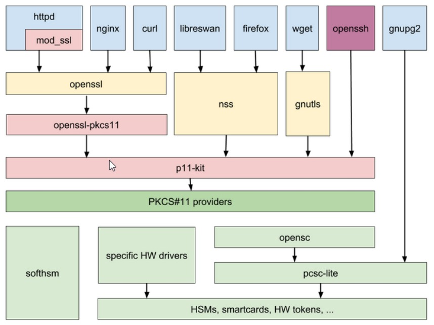

# Introduction

:::note

The p11-kit was designed to work with OpenSSL v1.1. When running OpenSSL 3.x we recommend using the [OpenSSL pkcs11-provider](/openssl/osslv3/overview) instead.

:::

This application note describes the integration of Primus Hardware
Security Module with PKCS#11 provider as p11-kit module, to be used by
applications like OpenSSL, Apache, Nginx supporting such modules.

RedHat Enterprise Linux 8 onwards improves support for storing secrets
on external hardware like smartcards and HSMs via PKCS#11. Additional
libraries (p11-kit, openssl-pkcs11), application extensions and
standardization of key references (URI) provide the necessary
mechanisms to integrate HSMs based on manufacturer PKCS#11 providers.

<figure className="image">
  

  <figcaption>
  Architecture graphics from RHEL 8
  </figcaption>
</figure>

