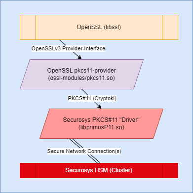

# OpenSSL v3.x

The Primus PKCS #11 library provides a convenient way to integrate Securosys Hardware Security Modules (HSMs) with OpenSSL v3.x.

The following diagram shows the architecture.

<figure className="image">
  

  <figcaption>
  Architecture: The pkcs11-provider sits between the
  OpenSSL library and the PKCS#11 interface provided by
  Securosys
  </figcaption>
</figure>

The open-source OpenSSL PKCS#11 provider, [latchset
pkcs11-provider][1], is used in this implementation. Pre-built binaries tested with Securosys HSMs are available in the [download section][2] (login required).

[1]: https://github.com/latchset/pkcs11-provider
[2]: /openssl/osslv3/downloads

:::warning OpenSSL v1.x
This library was designed to work with OpenSSL v3.x. When running OpenSSL **v1.x**, we recommend using the [Engine API (deprecated)](/openssl/ossl-legacy/overview) instead.
:::

**Continue your visit**

- [Getting Started with Primus PKCS#11](/openssl/osslv3/quickstart)
- [Create a self-signed root certificate with OpenSSL](/openssl/osslv3/Use-Cases/self_signed_certificate)
- [Generate a key with OpenSSL](/openssl/osslv3/Tutorial/openssl_cli)