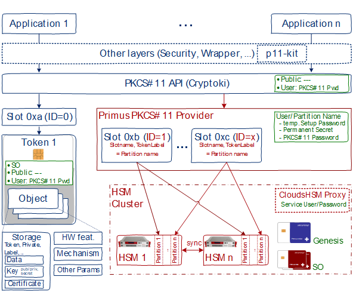

# PKCS#11 Provider
### HSM Integration Guide

This document outlines the steps to install the Primus HSM PKCS#11
Provider with Unix and Windows platforms.

The Primus PKCS#11 Provider handles the vendor specific configuration
and communication with Primus HSM cluster(s). The following architecture
diagram shows on the left side the legacy Smart Card architecture (blue)
and on the right side the integration of the Primus PKCS#11 provider
(red) and in green the authentication mechanisms.

<figure className="image">
  

  <figcaption>
  PKCS#11 Architecture Overview and Primus PKCS#11 Provider integration
  </figcaption>
</figure>

Network HSM and redundant clusters are currently not known by the
PKCS#11 standard. Therefore, an HSM partition corresponds to a **slot
with inserted token**, both having the name of the partition. _Multiple
partitions_ are referenced via _different IDs_.
_Redundant partitions_ (cluster) must have the _same
ID_ configured and are not visible for the applications.

An additional tool (ppin) is used to initialize secure communication
with the HSM(s), to initially retrieve a permanent secret using the
temporary setup password. The application API provides only the public
access (e.g. listing public objects) or User access (e.g. using private
objects) requiring the PKCS#11 password/pin.

While multiple applications per partition is supported by the PKCS #11
standard, it is the customer's responsibility to validate that
applications sharing a partition do so in a manner that does not result
in conflicts between the applications.

Securosys SA strongly recommends customers to implement frequent,
high-quality backups of the key material held within the HSM in a manner
consistent with the value of the data being protected by them. It is
critical to align this backup strategy with the application's key
management behavior. For example, backups must be refreshed immediately
after the application performs any key rotation activities; backups
should also be refreshed before any application, provider or HSM
upgrades are performed. This is particularly critical for data
encryption applications, where loss of the keys renders the data
inaccessible.

Primus HSMs provide different mechanisms like backup, key invalidation,
manual cloning and HA-cloning which allow the reliable backup of such
data for an HSM and/or synchronization within a cluster of HSMs. Please
refer to the Primus HSM User Guide for more details on these features.

Backups and redundant setups should be verified on a regular basis both
to ensure they are usable and to ensure the team responsible for the
system knows how to use them to perform a recovery.

Securosys SA also recommends users to test thoroughly all application
and HSM upgrades before deploying them on production systems. Depending
on the customer's deployments behavior changes in the application or HSM
may have an unexpected result.
