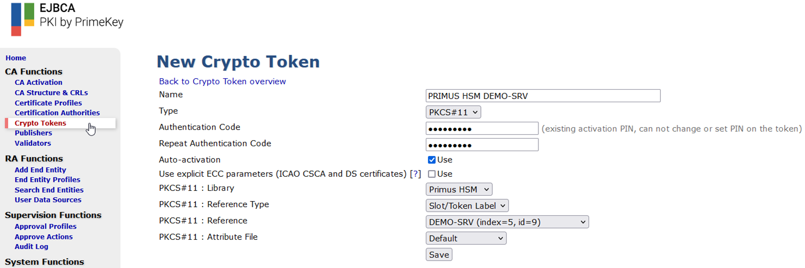
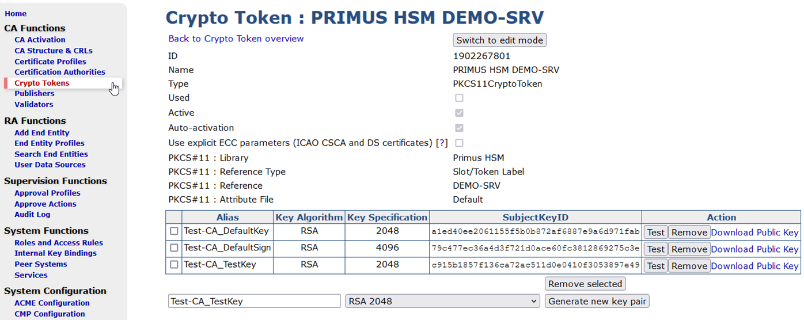
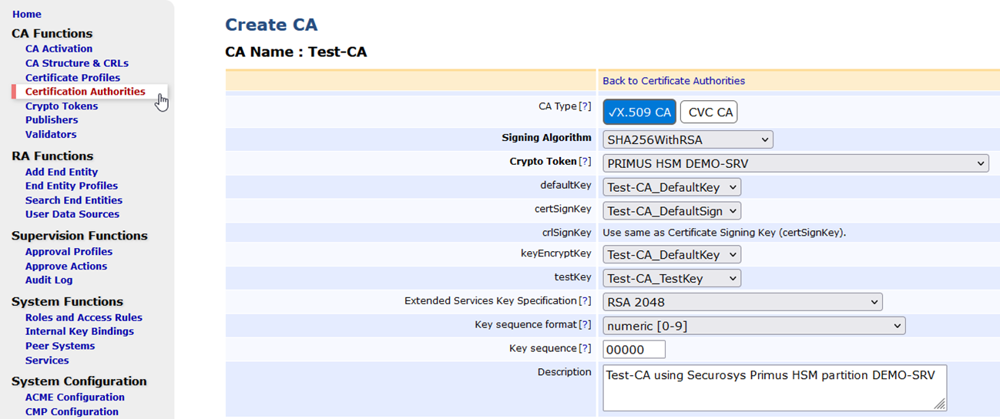

# Installation & Configuration

## 1. Verify File locations

This guide assumes the following:
- EJBCA is installed in `/opt/ejbca`
- EJBCA configurations can be found in `/opt/ejbca-custom/`
- The Primus [PKCS#11 Provider](/pkcs/overview) is installed in `/usr/local/primus`

:::note
If **additional locations** are set, update the relevant parameters in this guide as necessary.
:::

##	2. Update Environment Settings
Change the profile settings for user `ejbca` (`.bash`, `.bash_profile` or `.profile`) to include the binaries and libraries to the search path:
```sh
APPSRV_HOME=/opt/jboss
EJBCA_HOME=/opt/ejbca
PRIMUS_HOME=/usr/local/primus

LD_LIBRARY_PATH=$PRIMUS_HOME/lib:$LD_LIBRARY_PATH
PATH=${APPSRV_HOME}/bin:${EJBCA_HOME}/bin:$PRIMUS_HOME/bin:$PATH
export PATH APPSRV_HOME EJBCA_HOME PRIMUS_HOME LD_LIBRARY_PATH
```

## 3. Configure EJBCA

### EJBCA Property FILE 

Edit the file `web.properties`:
```bash
vim /opt/ejbca-custom/conf/web.properties
```
and add the following lines at the end of the file (only for EJBCA < v7.8.1 ):
```bash
# Securosys Primus HSM Section
cryptotoken.p11.lib.132.name=Primus HSM
cryptotoken.p11.lib.132.file=/usr/local/primus/lib/libprimusP11.so
```

:::note
Note that as of EJBCA Enterprise 7.8.1, default properties are included in the EJBCA configuration files to ease the configuration and automatically find the Primus HSM driver installed on the system. Following the integration guide, it is therefore not needed to update the `conf/web.properties` file in (EJBCA Property File) if libprimusP11.so is located in `/usr/local/primus/lib` or `/opt/primus/lib`.
:::

Optionally, it is possible to define a custom PKCS#11 attribute file by appending the following lines to the file `web.properties`.

Example:
```
cryptotoken.p11.attr.132.name=Primus HSM Attributes
cryptotoken.p11.attr.132.file=/opt/ejbca-custom/conf/primus_hsm_p11.conf
```

The following file `primus_hsm_p11.conf` shows such an example:
```
name=PrimusHSM
library=/usr/local/primus/lib/libprimusP11.so
slotListIndex=0-9
attributes(generate,*,*) = {
   CKA_TOKEN = true
}
attributes(generate,CKO_PUBLIC_KEY,*) = {
   CKA_ENCRYPT = true
   CKA_VERIFY = true
   CKA_WRAP = true
}
attributes(generate, CKO_PRIVATE_KEY,*) = {
   CKA_EXTRACTABLE = true
   CKA_DECRYPT = true
   CKA_SIGN = true
   CKA_UNWRAP = true
   CKA_ALWAYS_AUTHENTICATE = false
}
```


### Optional: Database Protection Settings

The configuration file `databaseprotection.properties` (Enterprise feature) specifies the configuration used to sign the rows of various tables in order to give evidence of tampering, most commonly the AuditRecordData table (to be configured prior to installation). 
```bash
### custom settings using Securosys Primus HSM
databaseprotection.enablesign = false
databaseprotection.enableverify = false
databaseprotection.enablesign.AuditRecordData = true
databaseprotection.enableverify.AuditRecordData = true
databaseprotection.keyid = 010
databaseprotection.keyid.0 = 010
databaseprotection.keylabel.0 = EJBCATEST_AuditSign01
databaseprotection.classname.0 = org.cesecore.keys.token.PKCS11CryptoToken
databaseprotection.properties.0 = sharedLibrary=/usr/local/primus/lib/libprimusP11.so, slotLabelType=SLOT_NUMBER, slotLabel-Value=0
databaseprotection.data.0 =
databaseprotection.tokenpin.0 = PRIMUSDEV
databaseprotection.version.0 = 2
```
### Test with clientToolBox

Before deploying EJBCA with the new provider it might be useful to test whether the connection to the HSM and key generation works.
Deploy the EJBCA clientToolBox for this test:
```bash
su - ejbca
cd /opt/ejbca
ant clean clientToolBox
```
After successful deployment, the clientToolBox can be found in /opt/ejbca/dist/clientToolBox/.
Generate an RSA test key:
```bash
/opt/ejbca/dist/clientToolBox/ejbcaClientToolBox.sh PKCS11HSMKeyTool generate /usr/local/primus/lib/libprimusP11.so 4096 Securosys_EJBCA_Test_Key 0
```
:::note
The last parameter of the command indicates the slot number (`id`).
:::


Example output:
```
Using Slot Reference Type: Slot Number.
PKCS11 Token [SunPKCS11-libprimusP11.so-slot0] Password:
2020-05-19 14:40:41,678 INFO [org.cesecore.keys.util.SignWithWorkingAlgorithm] Signature algorithm 'SHA1WithRSA' working for provider 'SunPKCS11-libprimusP11.so-slot0 version 1.8'.
Created certificate with entry Securosys_EJBCA_Test_Key.
```


## 4. Deploy EJBCA

Deploy EJBCA with the new settings:
```bash
su - ejbca
cd /opt/ejbca
ant clean deployear
```
Wait until the jboss application server has finished the deployment:
```bash
2020-05-19 14:52:13,600 INFO [org.jboss.as.server] (DeploymentScanner-threads - 2) WFLYSRV0016: Replaced
deployment "ejbca.ear" with deployment "ejbca.ear"
```

### Configure new Crypto Token

Point your browser to the EJBCA Admin Web interface.

Example: `https://your-ejbca-server.com:8443/ejbca/adminweb`


 
- Click on `Crypto Tokens` in the left navigation bar and click on `Create new…`.
- Enter a name for the new Crypto Token.
- Select `PKCS#11` from the dropdown list.
- Enter the `PKCS#11 Password` twice for the HSM partition.
- Select `Auto-activation` to keep the partition connected when EJBCA is restarted.
- Select the `Securosys Primus provider`. The name was set in the `web.properties` file.
- Select `Slot/Token Label` from the dropdown list.
- Select the `partition label` to use.
- Select the `P11 Attribute` file if you have created a custom file.

### Generate RSA Keys 

Generate 3 key pairs (e.g. `Test-CA_DefaultKey`, `Test-CA_DefaultSign`, `Test-CA_TestKey`) for a new CA.

For more information on how to generate key pairs, refer to [Keyfactor/PrimeKey EJBCA Documentation](https://docs.keyfactor.com/ejbca/latest/ca-operations-guide).

Example:




### Create New CA 

Select `Certification Authorities`, name the new Certificate Authority (CA) and click `Create`. Define your CA configuration using the previously created Crypto Token and keys from the HSM. Continue setting up the CA according to your requirements and EJBCA best practices.

For more information on EJBCA setup and best practices, refer to [Keyfactor/PrimeKey EJBCA Documentation](https://docs.keyfactor.com/ejbca/latest/ca-operations-guide) 

