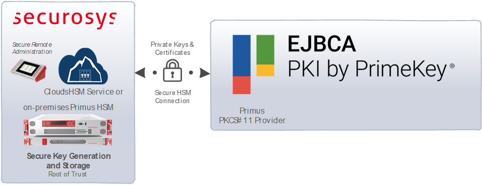

import Tabs from '@theme/Tabs';
import TabItem from '@theme/TabItem';

# Keyfactor EJBCA

[Keyfactor](https://www.keyfactor.com/) and PrimeKey have completed their merger, creating a significant entity in the field of machine identity management. This merger, finalized under the Keyfactor brand, integrates Keyfactor’s certificate lifecycle automation with PrimeKey’s robust EJBCA software, forming an end-to-end platform for managing machine identities across various environments, including DevOps, IoT, and enterprise applications​. 

[EJBCA Enterprise Edition](https://www.keyfactor.com/products/ejbca-enterprise/) is a comprehensive and scalable Public Key Infrastructure (PKI) solution designed for large organizations that require robust security, high availability, and compliance with industry standards like Common Criteria and FIPS. It offers extensive customization and integration options, making it suitable for a variety of use cases, including IoT, DevOps, and enterprise environments.

 In contrast, [EJBCA Community Edition](https://www.ejbca.org/) is an open-source version that provides core PKI functionalities for issuing, managing, and validating digital certificates. 

## Securosys HSMs & EJBCA

Securosys Primus HSMs and [CloudHSM](/cloudhsm/overview) integrate easily with either **EJBCA Enterprise** or **Community Edition**, to protect the confidentiality and integrity of sensitive keys. Organizations looking to extend the security of on-premises or hosted PKIs can deploy EJBCA Enterprise solutions in conjunction with on-premises Securosys Primus HSMs, or the ready-to-go [CloudHSM](/cloudhsm/overview) service via the Primus [PKCS#11 Provider](/pkcs/overview). Securosys HSMs securely generate, store and manage CA private keys, ensuring that critical keys are never exposed to unauthorized entities, and are required in case of strong compliance regulations.

Ease CA key ceremonies and automate audit procedures using Securosys Key Attestation and Audit features, proofing all keys and relevant parameters with a chain of trust originating from our Securosys root certificate. Decanus allows for easy and cost-efficient remote management of HSM clusters and CloudHSM partitions (2-of-n, 2FA) without compromising security.

As Securosys supports integrations with versions of EJBCA still under just the PrimeKey name, the naming convention used in this document for EJBCA is Keyfactor/PrimeKey EJBCA.

## Target Audience

This document is intended for Securosys Primus HSM or [CloudHSM](../cloudhsm/overview) administrators and IT professionals in charge of the Keyfactor/PrimeKey EJBCA. Installation of the Securosys Primus [PKCS#11 Provider](../pkcs/overview) requires that you are already familiar with Server administration.

For on-premises HSM deployed operation administrative skills are required for Securosys Primus HSMs.

## Support Contact

If you encounter a problem while installing/configuring the provider or integrating the HSM with Keyfactor/PrimeKey EJBCA, make sure that you have read the referenced documentation. If you cannot resolve the issue, please contact Securosys Customer Support. For specific requests regarding Keyfactor/PrimeKey EJBCA, the Securosys Support Portal is reachable under https://support.securosys.com.

## What's Next

For a smooth start integrating your Keyfactor/PrimeKey EJBCA using the Primus PKCS#11 Provider:
- Consult the [Quickstart](/primekey-ejbca/quickstart.md) section for a comprehensive task listing.
- For detailed instructions, read and follow the [Installation](/primekey-ejbca/category/installation) section.

