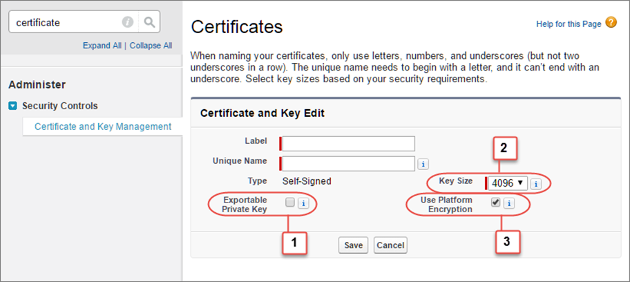
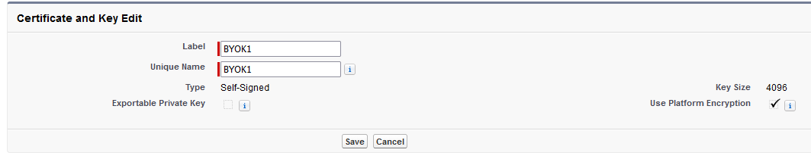

# Generate a Certificate

To encrypt data in Salesforce with **Bring Your Own Key (BYOK)** key material, use Salesforce to generate a 4096-bit RSA self-signed certificate. 

Each BYOK-compatible certificate’s private key is encrypted with a derived, org-specific tenant secret key. This tenant secret key will be generated within the Securosys HSM (see [Generate and Wrap BYOK Key Material](/salesforce-byok/Tutorials/byok-key-material)) and wrapped by the Salesforce BYOK-compatible certificate’s public key. 

You can also generate a **certificate-authority (CA) signed certificate**. See [Generate a Certificate Signed by a Certificate Authority](https://help.salesforce.com/s/articleView?id=sf.security_keys_uploading_signed_cert.htm&language=en_US) for more information.
To ensure that your certificate is BYOK-compatible, remember to manually change the `Exportable Private Key`, `Key Size`, and `Platform Encryption` settings.

:::note
If you’re not sure whether a self-signed or CA-signed certificate is right for you, consult your organization’s security policy. For more information about what each option implies, see [Certificates and Keys](https://help.salesforce.com/s/articleView?id=sf.security_keys_about.htm&language=en_US) in Salesforce Help.
:::

To create a self-signed certificate follow the next steps:

1. From `Setup`, in the `Quick Find` box, enter `Platform Encryption`, and then select `Key Management`.
2. Click `Bring Your Own Key`.
3. Click `Create Self-Signed Certificate`.
4. Enter a unique name for your certificate in the `Label` field. The `Unique Name` field automatically assigns a name based on what you enter in the `Label` field.
    - The Exportable Private Key (1), Key Size (2), and Use Platform Encryption (3) settings are preset. (For a BYOK certificate, you must select 4096 for the key size). These settings ensure that your self-signed certificate is compatible with Salesforce Shield Platform Encryption.
    

    - Example:
    

5. When the `Certificate` and `Key Detail` page appears, click `Download Certificate`. The certificate will be downloaded as a `.crt` file.

:::tip[need help ?]
Contact our support team for further assistance.
+ [Create a ticket (account required)](https://support.securosys.com)
+ [Send an email](mailto:support@securosys.com)
:::