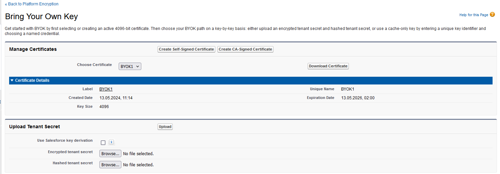

# Import BYOK Key Material

After a successful export and wrap of the BYOK-compatible key material, 2 exported files are created. These files are needed to import the BYOK-compatible key material into Salesforce.

The **Salesforce Shield Key Management Service (KMS)** uses your tenant secret to derive your org-specific data encryption key.

Follow the next steps to import the BYOK key material:
1. From `Setup`, in the `Quick Find` box, enter `Platform Encryption`, and then select `Key Management`.
2. In the `Key Management Table`, select a `key type`.
3. Click `Bring Your Own Key`.
4. In the `Upload Tenant Secret` section, attach both the encrypted key material (e.g. `BYOK.b64`) by clicking on `Browse...` and the hashed plaintext key material (e.g. `BYOK_hash.b64`). Click `Upload`.

 
<figure class="image">
  
  <figcaption>Example page of Salesforce Bring Your Own Key Tenant Secret Upload</figcaption>
</figure>

The newly imported tenant secret automatically becomes the active tenant secret within Salesforce. 

Your tenant secret is now ready to be used for key derivation. From here on, the Shield KMS uses your tenant secret to derive an org-specific data encryption key. The app server then uses this key to encrypt and decrypt your users’ data.

If you don’t want Salesforce to derive a data encryption key for you, you can opt out of key derivation and upload your own final data encryption key. For more information, see [Opt-Out of Key Derivation with BYOK](https://developer.salesforce.com/docs/atlas.en-us.securityImplGuide.meta/securityImplGuide/security_pe_byok_opt_out_derivation.htm) in Salesforce Help.

:::tip[need help ?]
Contact our support team for further assistance.
+ [Create a ticket (account required)](https://support.securosys.com)
+ [Send an email](mailto:support@securosys.com)
:::