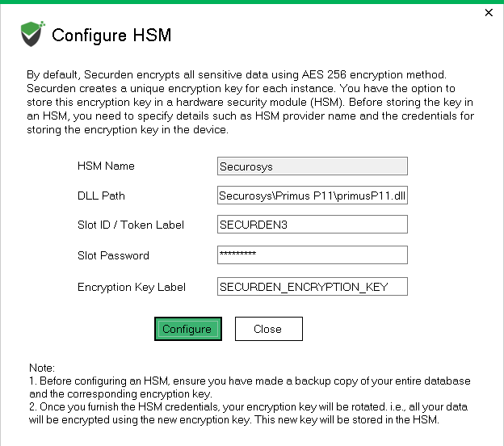

import Tabs from '@theme/Tabs';
import TabItem from '@theme/TabItem';

# Securden PAM Integration

Proceed according the **Securden Unified PAM Administrator Guide**, chapter "Store Encryption Keys on Securosys HSM", included in the Securden software distribution. 
The steps below are only a short extract and not complete!

:::info Backup

Take a backup of the entire database along with the encryption key before starting the HSM configuration process.

:::

- Stop the Securden PAM service on Primary and Secondary servers
- Configure the HSM details
  - Navigate to `/<Securden installation folder>/bin` and execute `ConfigureHSM.exe`
  - Provide the necessary details for the HSM connection and click `Configure` (see screenshot below)

| Provider name         | HSM Provider selection: Securosys                                                                                  |
|:----------------------|:-------------------------------------------------------------------------------------------------------------------|
| DLL path              | Path to the PKCS#11 provider library file                                                                          |
| - Windows default     | *C:\Program Files\Securosys\Primus P11\primusP11.dll*                                                              |
| - Linux default       | */usr/local/primus/lib/libprimusP11.so*                                                                            |
| Slot ID or Token name | HSM user name (partition name) or alternatively PKCS#11 slot id where the Securden encryption key should be stored |
| PKCS#11 password      | PKCS#11 password of the **HSM partition**                                                                          |
| Encryption key label  | Label of the **Securden** encryption key in the HSM                                                                |

      

