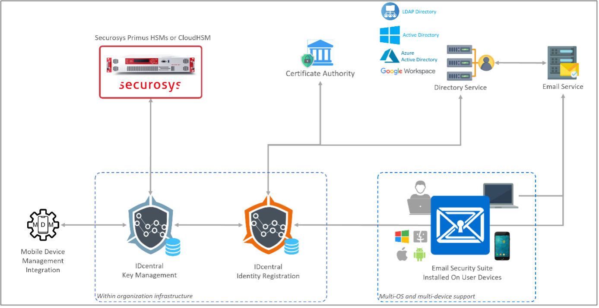

# Sixscape IDcentral Key Management
### HSM Integration guide

**Sixscape**’s [IDcentral Key Management Platform](https://sixscape.com/products/irp/) with Securosys' Hardware Security Modules (HSMs) allows to securely escrow S/MIME encryption key pairs using the Sixscape:
- [Email Security Suite](https://sixscape.com/products/emailsecuritysuite/) and
- [IDcentral Identity Registration Platform](https://sixscape.com/products/irp/) (IRP).

S/MIME key escrow in Sixscape’s IDcentral Key Management Platform ensures secure, compliant, and centralized storage and management of cryptographic keys, enabling data recovery and business continuity in case of key loss. This enhances security, supports regulatory compliance, and simplifies key management for users.

<figure className="image">
  
  <figcaption>Architecture overview</figcaption>
</figure>

## Prerequisites

As a prerequisite for integration, please ensure that you fulfill the following requirements:

- [x] A Hardware Security Module (HSM):
  - [ ] **On-premises**: Securosys Primus HSM (cluster), OR
  - [ ] **Cloud**: Securosys [CloudHSM](/cloudhsm/overview/) with PKCS#11 API.
- [x] [Primus HSM PKCS#11 Provider](/pkcs/overview), downloaded for the installation on the IDcentral Identity Registration Platform (IRP).
- [x] **IDcentral Identity Registration Platform (IRP)**:
  - installed in the enterprise network and
  - configured with the required issuing CA connection and certificate profile to generate the S/MIME certificates.
- [x] **IDcentral Key Management** installed and configured with IDcentral IRP.
- [x] Sixscape’s **Email Security Suite Add-In** installed on end-user devices.

## Get started with Sixscape IDcentral

To integrate Sixscape IDcentral with Securosys Hardware Security Modules (on-premises and cloud), follow the instructions provided on [Sixscape’s support portal](https://support.sixscape.com/portal/en/kb/articles/securosys-escrow) (Sixscape login required).