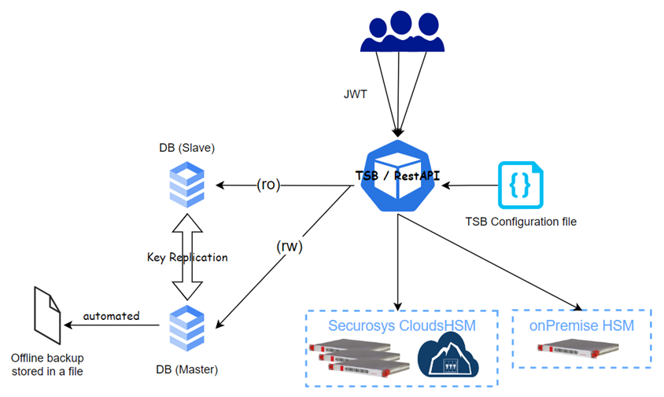

import Tabs from '@theme/Tabs';
import TabItem from '@theme/TabItem';

Different use cases in blockchain, IoT or signing (TSP) industries require very big numbers of keys to be protected by HSM. The Infinite Key Store (IKS)  offers a scalable and efficient solution for securely storing and managing large volumes of cryptographic keys for on-premises and CloudHSM environments when integrated using Transaction Security Broker (TSB).
With IKS keys are stored as external key objects in the TSB inherent database, encrypted by the Partition Key stored inside the HSM. Thus, the storage size can theoretically grow limitless and provide storage for an infinite number of keys.
In CloudHSM TSBaaS one TEST and PRODUCTION instance will be deployed including database redundancy and offline backups. 

Begin with the basic keystore size and effortlessly scale it as your business expands by simply updating the license. No additional hardware costs or operational efforts are required.

**At the moment, migration from an internal keystore to an external keystore, and vice versa, is not supported.**

:::info Infinite Keystore

The Infinite Key Store (IKS) is limited to specific enterprise use cases. Reach out to your Securosys Support or your Sales representative for further details on IKS.

:::

## Capabilities

- Unlock limitless scalability sans costly upgrades.
- Elevate performance with persistent keys over derivation.
- Deploy seamlessly on-premises or in Securosys Cloud.
- Optimize resource use with increased CloudHSM density.
- Seamlessly integrate with PrimusHSM Rest-API & SKA Workflow.
- Ensure data integrity with Integrated Key-Replication.

## Architecture

## License

The following licenses are required to use Infinite Keystore
- PERSISTENT_EXTERNAL_OBJ
- KEY_STORE_SIZE (flexible keystore size)
- REST_API

## Configuration

to setup infinite keystore, please read the installation instructions [here](/tsb/Installation/On-Premise-Installation.md#514-application-external-keystoreyml)