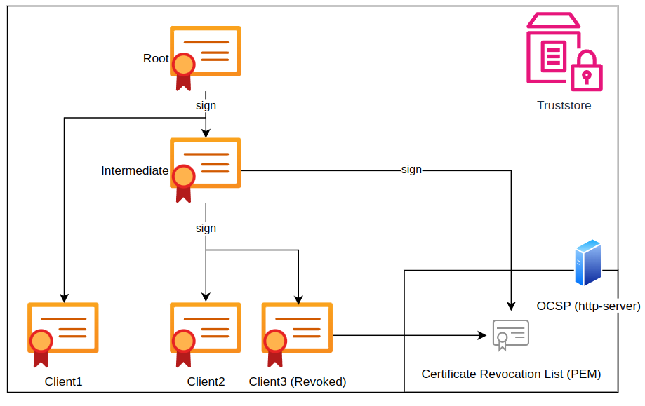

import Tabs from '@theme/Tabs';
import TabItem from '@theme/TabItem';

# Configure mTLS

Mutual Transport Layer Security (mTLS) is a security protocol that enhances the traditional Transport Layer Security (TLS) by requiring both the server and the client to authenticate each other. In a typical TLS handshake, the server is authenticated to the client, but in mTLS, the client also presents a digital certificate for authentication to the server. This mutual authentication adds an extra layer of security, ensuring that both parties can trust each other's identity. Once the authentication is successful, secure communication is established with the encryption of data exchanged between the client and the server.

In the following you are going to create the **root**, **intermediate** and **Client 2** Certificates and keys in order to demonstrate a successful mTLS setup.



<br />

# CloudsHSM - TSBaaS (dedicated instance)

## Initial Setup

As a TSBaaS customer, you must provide the Securosys Support Team with a valid client certificate to establish the initial trust. The following guide shows how to generate a client certificate using OpenSSL. <br/>
**Note** that some organizations may prefer to use their own Public Key Infrastructure (PKI) or certificate utility.

Generating a Client Certificate with OpenSSL:
#### Root
```sh
openssl req -new -x509 -nodes -sha256 -newkey rsa:4096 -days 3650 -subj '/CN=localhost' -keyout ca.key -out ca.crt
```

#### Intermediate
```sh
openssl genrsa -out intermediate.key 4096
openssl req -new -subj "/CN=intermediate" -key intermediate.key -out intermediate.csr
openssl x509 -req -in intermediate.csr -sha256 -CA ca.crt -CAkey ca.key -CAcreateserial -days 3650 -out intermediate.crt
```

#### Client 2 (singed by intermediate cert)
```sh
openssl genrsa -out client-singed-by-inermediate.key 4096
openssl req -new -subj "/CN=client-singed-by-inermediate" -key client-singed-by-inermediate.key -out client-singed-by-inermediate.csr
openssl x509 -req -in client-singed-by-inermediate.csr -sha256 -CA intermediate.crt -CAkey intermediate.key -CAcreateserial -days 3650 -out client-singed-by-inermediate.crt
```

**Action:** Send either the intermediate or client-certificate to Securosys Support Team. We will setup your service accordingly and notify you.

## Revoke Access / Trust a new certificate
To manage (add/remove) trusted client certificates, you have two options:

:::warning

Please note that any security policy change acquired via a support ticket incurs a service fee.
To limit this cost and increase your flexibility, you may use your own OCSP server to manage trust.

:::

<Tabs groupId="trust-management">
    <TabItem value="manualconfig" label="Manual Trust Management" default>
      1. **Create Support Ticket**
          * Submit a support ticket with instructions on adding or removing a client certificate.
          * Use the following Ticket Type: 5 - Change request -> CloudHSM -> Security Policy Change

          **Note:** Only [Security Manager Clouds](https://support.securosys.com/external/knowledge-base/article/12) are authorized to make Security Change requests.

    </TabItem>
    <TabItem value="ocsp" label="OCSP">
    
    The Online Certificate Status Protocol (OCSP) is used to check the revocation status of digital certificates in real-time. This allows TSB to verify whether a client certificate has been revoked or remains valid. Note that this check is executed on each request and may introduce a delay.

    **Setting Up an OCSP Responder**

    You have the following options for deploying an OCSP responder:

      * Deploy your own OCSP responder.
      * Use an OCSP responder from your PKI.
      * Use an OCSP responder provided by AWS.
    
    **Configuring the Client Certificate**<br/>
    Ensure your client certificate includes the following X509v3 extension to specify the OCSP responder:
    ```sh
            X509v3 extensions:
              Authority Information Access: 
                  OCSP - URI:http://<your-ocsp-responder>.com
    ```

    Replace **`<your-ocsp-responder>.com`** with the actual URI of your OCSP responder.

    ---
    ---

    ### Attention

    _*Since the revocation status check (OCSP) is an external service not controlled by Securosys and is performed on every request, the OCSP service is explicitly excluded from the Service Level Agreement (SLA) between Securosys and its clients. Therefore, please ensure you have optimal availability for your OCSP service.*_
  </TabItem>
</Tabs>

---

# On-Premise Deployment

Add the Client Certificate (Public) to Server-TrustStore:

```sh
keytool -importcert -keystore securosys-ska-truststore-server.jks -alias client-signed-by-intermediate-public -file client-singed-by-inermediate.crt -storepass secret
```

1) Copy the generated `securosys-ska-truststore-server.jks` file to the `config-files/tls` folder within the securosys-tsb directory. Create the `**tls**` directory if it does not exist.

2) Modify the following properties in the application-local.yml file:

```yaml
# Trust-Store configuration (m)TLS
server:
  ssl:
    # add client certificates and/or CA's to the trustStore if you want mTLS, otherwise comment out.
    trust-store: 'file:/etc/app/config/tls/securosys-ska-truststore-server.jks'
    trust-store-password: secret # yourTrustStorePassword
    trust-store-type: jks
    # (Enum: `need` [Client authentication is needed and mandatory], `none` [Client authentication is not wanted], `want` [Client authentication is wanted but not mandatory])
    client-auth: need
```

3) Run or restart the Docker container:
```sh
docker-compose down
docker-compose up
```

<br />


### Generating PKCS12 Container for Client Truststore

To facilitate usage with both CURL and web browsers, generate a PKCS12 container for Client2.

```sh
openssl pkcs12 -export -out client-truststore-CLIENT_SIGNED_BY_INTERMEDIATE.p12 -inkey client-singed-by-inermediate.key -in client-singed-by-inermediate.crt -password pass:secret
```

This command creates a PKCS12 container named `client-truststore-CLIENT_SIGNED_BY_INTERMEDIATE.p12`, incorporating the private key (client-signed-by-intermediate.key) and the corresponding certificate (client-signed-by-intermediate.crt). The password for the container is set to `secret`.


# Testing with CURL
:::danger 

Do not use the `--insecure` flag in productive environment, replace it with the `--cacert` flag or use a public CA instead.

:::

```sh
curl -v --insecure --cert-type P12 --cert client-truststore-CLIENT_SIGNED_BY_INTERMEDIATE.p12:secret https://localhost:8080/v1/key
```
