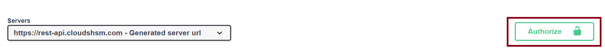
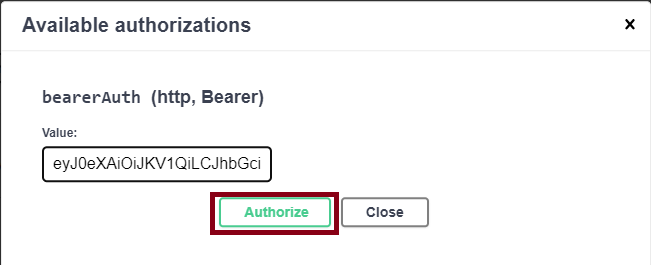

import Tabs from '@theme/Tabs';
import TabItem from '@theme/TabItem';

# Cloud - Quickstart


## Initial Connection

The following HTTP request returns the current software version of the REST-API.

<Tabs groupId="curl">
  <TabItem value="curl" label="CURL" default>

    Replace `<REPLACE_WITH_YOUR_JWT_TOKEN>`.

    You may replace the API-Endpoint `https://primusdev.cloudshsm.com/` in the following by a [TSBaaS - Connectivity Details](/connectivity-details/cloudhsm-connectivity-details) for accurate API-Endpoint URI.

    ```sh
    curl -X "GET" "https://primusdev.cloudshsm.com/v1/versionInfo" -H "accept: application/json" -H "Authorization: Bearer <REPLACE_WITH_YOUR_JWT_TOKEN>"
    ```

    **Response:**
    ```js
    {"Version":"2.1.0"}
    ```

  </TabItem>
    <TabItem value="browser" label="Browser (Swagger-UI)" default>

    You may replace the API-Endpoint `https://primusdev.cloudshsm.com/` in the following by a [TSBaaS - Connectivity Details](/connectivity-details/cloudhsm-connectivity-details) for accurate API-Endpoint URI.

    1) To interact with the Rest-API in your browser navigate to the following URL: **[https://primusdev.cloudshsm.com/swagger-ui/index.html](https://primusdev.cloudshsm.com/swagger-ui/index.html)**
  
    2) Please consider checking you support-ticket for credentials, to get the correct URL and JWT-Token.

    3) To authenticate against the HSM via Rest-API and to access your HSM-Partition, follow the below steps:

    4) Click `Authorize`<br /><br />
    

    5) Enter the `JWT-Token` <br /><br />
    

    6) Click `Authorize` and then `Close`

    7) Navigate to the API-Section `Service Information`

    8) Click on **`/v1/versionInfo`**, **`Try-Out`** and **`Execute`**

    **Response**
    ```js
    {
      "Version": "1.17.1.20231211T114600"
    }
    ```
  </TabItem>
</Tabs>
---

## What's next?

- Follow the instructions to [ Create a Key and use it to encrypt and decrypt a payload](/tsb/Tutorials/Encryption/EncryptDecrypt.md)
- File Encryption [Sample](/tsb/Tutorials/Encryption/FileEncryption.md)
- Sign and Verify a payload [Sample](/tsb/Tutorials/Signing/SignRequest.md)
- More [Tutorials](/tsb/category/tutorial)
