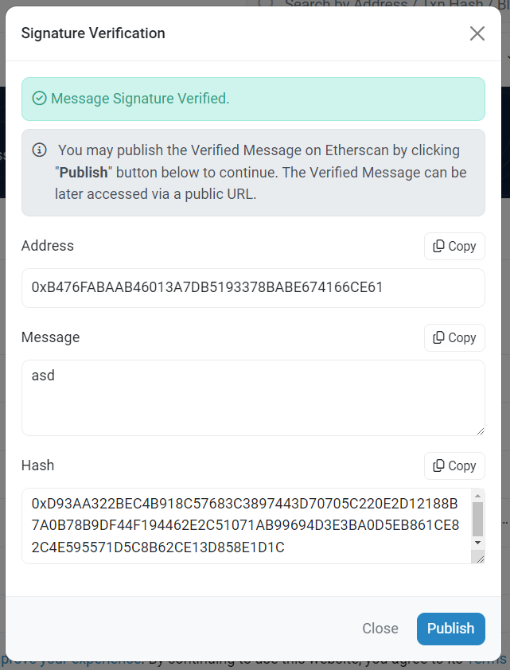

Ethereum has a dedicated signature format which allows to recover the public-key and subsequently the address based on the signature.
This format reduces the payload-size of the Transaction and improves speed, dedicated for the Ethereum Blockchain.

The following example creates a SKA-Key, extracts the wallets address and produces a valid signature.


## Create Key

Creating a Key on the HSM, which is not destroyable (e.g. cannot be deleted), and uses SmartKeyAttributes.

:::tip ADDRESS GENERATION

If your subscription Type includes SmartKeyAttributes, the HSM is generating the Wallet-Address for you, by specifying in the request below.

```js
    "addressFormat": {
        "format": "ETH"
    },
```

If you do not have a [SmartKeyAttributes](/tsb/Tutorials/TransactionSecurityBroker/smart-key-attributes.md) subscription, you must remove the **`policy`** and the **`addressFormat`** from the request below. Be careful, you have to generate the address by yourself!

:::

```js {2,6}
{
    "label": "ether_Transaction_signing_key",
    "algorithm": "EC",
    "curveOid": "1.3.132.0.10",
    "addressFormat": {
        "format": "ETH"
    },
    "attributes": {
        "decrypt": false,
        "sign": true,
        "unwrap": false,
        "destroyable": false,
        "modifiable": true,
        "derive": true,
        "bip32": true
    },
    "policy": {
        "keyStatus": {
            "blocked": false
        }
    }
}
```

The SKA-Policy above is empty, which means the request does not need any approvals. For a more comprehensive policy, checkout [this](/tsb/Tutorials/TransactionSecurityBroker/smart-key-attributes) sample.

## Extract Address

With an SKA License you have three possibilities to get the wallet-address. 

### 1. Create Key Response

Fetch the address from the [Create Key Response](https://primusdev.cloudshsm.com/swagger-ui/index.html?configUrl=/v3/api-docs/swagger-config#/Keys/createKey)

**Response:**
```js
    "addressTruncated": {
      "address": "B476FABAAB46013A7DB5193378BABE674166CE61",
      "format": "ETH"
    },
```

### 2. Get Attributes

Fetch the address from the [Get Key Attributes Response](https://primusdev.cloudshsm.com/swagger-ui/index.html?configUrl=/v3/api-docs/swagger-config#/Keys/getKeyAttributesWithKeyPassword)

**Response:**
```js
    "addressTruncated": {
      "address": "B476FABAAB46013A7DB5193378BABE674166CE61",
      "format": "ETH"
    },
```

### 3. Get the address

Fetch the address from the [Get Address Response](https://primusdev.cloudshsm.com/swagger-ui/index.html?configUrl=/v3/api-docs/swagger-config#/Keys/getKeyAddressWithKeyPassword)

**Response:**
```js
{
  "address": "tHb6uqtGATp9tRkzeLq+Z0FmzmE="
}
```

:::tip Tip

For method 2, 3 you can use [temporary key derivation](/tsb/Concepts/key/Derivation/KeyDerivation.md) to generate addresses and signatures withouth filling the HSM-Storage.

::: 

## Sign a payload

:::tip tip

Use the [Generate a signature](https://primusdev.cloudshsm.com/swagger-ui/index.html?configUrl=/v3/api-docs/swagger-config#/Keys/getKeyAddressWithKeyPassword) with the request-body below to sign a transaction with the HSM-backed private key.

:::

The **`singnatureType`** tells TSB to produce a valid signature for the Ethereum Blockchain. If the Type **`ETH`** is specified the signature must be **`KECCAK256_WITH_ECDSA`** as the ethereum blockchain uses Keccak256 as default.

```js {6,7}
{
  "signRequest": {
    "payload": "YXNk",
    "payloadType": "UNSPECIFIED",
    "signKeyName": "ether_Transaction_signing_key",
    "signatureType": "ETH",
    "signatureAlgorithm": "KECCAK256_WITH_ECDSA"
  }
}
```

## Verify Signature

The signature can be verified with the etherscans verification tool: 

https://etherscan.io/verifiedSignatures# (make sure you have base64 decoded the signature result)

