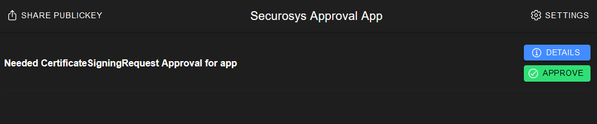

# 2. Certificate Signing Request

## Create key
**POST**: [/v1/key](https://rest-api.cloudshsm.com/swagger-ui/index.html?configUrl=/v3/api-docs/swagger-config#/Keys/createKey)

**Description**: Create sub-key request.

:::tip Approver

We are adding the same approver on the `SUB.approver.securosys.com`. In production the approver on the SUB-Key must be different from the `CA.approver.securosys.com`!

:::

```js {2,30,52,74,96}
{
    "label": "SUB.approver.securosys.com",
    "algorithm": "RSA",
    "keySize": 2048,
    "attributes": {
        "decrypt": false,
        "sign": true,
        "unwrap": false,
        "derive": false,
        "bip32": false,
        "extractable": false,
        "modifiable": true,
        "destroyable": true
    },
    "policy": {
        "ruleUse": {
            "tokens": [
                {
                    "name": "Token1",
                    "timelock": 0,
                    "timeout": 600,
                    "groups": [
                        {
                            "name": "Group1",
                            "quorum": 1,
                            "approvals": [
                                {
                                    "type": "public_key",
                                    "name": "ApproverKey1",
                                    "value": "MIIBIjANBgkqhkiG9w0BAQEFAAOCAQ8AMIIBCgKCAQEApLwHSQM4sd93UtEJ+t6G22sopYmL6roZxQGL0GWn7WAaiogfQ5EOM+sYQyeJgtuLQkdfwDBnScJx7IgBiOKFpXdaM9i08hSljFlbTT7zP0XjojtGD4U27nLuLqGUhmloLtc+6yBK2FL/7QWB2c9tyCgHiIhmXZesBhZRRFdrpwP66XoGIsgxt1AxFjV1z5MG0g7DULfUSqWG7gGOxvwITFwmqDwuA6rh952X5iJ7zopSSmGhrTeFrV/1Io0E8SsJhRM9m7BOdcg/X6X+5iqK5Obp6Js18Y7eddf/Q5amQSzwlXx6mJAyj2//1DnGz0UbacKStqgZZiC0xAhLEwo7XQIDAQAB"
                                }
                            ]
                        }
                    ]
                }
            ]
        },
        "ruleBlock": {
            "tokens": [
                {
                    "name": "Token1",
                    "timelock": 0,
                    "timeout": 600,
                    "groups": [
                        {
                            "name": "Group1",
                            "quorum": 1,
                            "approvals": [
                                {
                                    "type": "public_key",
                                    "name": "ApproverKey1",
                                    "value": "MIIBIjANBgkqhkiG9w0BAQEFAAOCAQ8AMIIBCgKCAQEApLwHSQM4sd93UtEJ+t6G22sopYmL6roZxQGL0GWn7WAaiogfQ5EOM+sYQyeJgtuLQkdfwDBnScJx7IgBiOKFpXdaM9i08hSljFlbTT7zP0XjojtGD4U27nLuLqGUhmloLtc+6yBK2FL/7QWB2c9tyCgHiIhmXZesBhZRRFdrpwP66XoGIsgxt1AxFjV1z5MG0g7DULfUSqWG7gGOxvwITFwmqDwuA6rh952X5iJ7zopSSmGhrTeFrV/1Io0E8SsJhRM9m7BOdcg/X6X+5iqK5Obp6Js18Y7eddf/Q5amQSzwlXx6mJAyj2//1DnGz0UbacKStqgZZiC0xAhLEwo7XQIDAQAB"
                                }
                            ]
                        }
                    ]
                }
            ]
        },
        "ruleUnblock": {
            "tokens": [
                {
                    "name": "Token1",
                    "timelock": 0,
                    "timeout": 600,
                    "groups": [
                        {
                            "name": "Group1",
                            "quorum": 1,
                            "approvals": [
                                {
                                    "type": "public_key",
                                    "name": "ApproverKey1",
                                    "value": "MIIBIjANBgkqhkiG9w0BAQEFAAOCAQ8AMIIBCgKCAQEApLwHSQM4sd93UtEJ+t6G22sopYmL6roZxQGL0GWn7WAaiogfQ5EOM+sYQyeJgtuLQkdfwDBnScJx7IgBiOKFpXdaM9i08hSljFlbTT7zP0XjojtGD4U27nLuLqGUhmloLtc+6yBK2FL/7QWB2c9tyCgHiIhmXZesBhZRRFdrpwP66XoGIsgxt1AxFjV1z5MG0g7DULfUSqWG7gGOxvwITFwmqDwuA6rh952X5iJ7zopSSmGhrTeFrV/1Io0E8SsJhRM9m7BOdcg/X6X+5iqK5Obp6Js18Y7eddf/Q5amQSzwlXx6mJAyj2//1DnGz0UbacKStqgZZiC0xAhLEwo7XQIDAQAB"
                                }
                            ]
                        }
                    ]
                }
            ]
        },
        "ruleModify": {
            "tokens": [
                {
                    "name": "Token1",
                    "timelock": 0,
                    "timeout": 600,
                    "groups": [
                        {
                            "name": "Group1",
                            "quorum": 1,
                            "approvals": [
                                {
                                    "type": "public_key",
                                    "name": "ApproverKey1",
                                    "value": "MIIBIjANBgkqhkiG9w0BAQEFAAOCAQ8AMIIBCgKCAQEApLwHSQM4sd93UtEJ+t6G22sopYmL6roZxQGL0GWn7WAaiogfQ5EOM+sYQyeJgtuLQkdfwDBnScJx7IgBiOKFpXdaM9i08hSljFlbTT7zP0XjojtGD4U27nLuLqGUhmloLtc+6yBK2FL/7QWB2c9tyCgHiIhmXZesBhZRRFdrpwP66XoGIsgxt1AxFjV1z5MG0g7DULfUSqWG7gGOxvwITFwmqDwuA6rh952X5iJ7zopSSmGhrTeFrV/1Io0E8SsJhRM9m7BOdcg/X6X+5iqK5Obp6Js18Y7eddf/Q5amQSzwlXx6mJAyj2//1DnGz0UbacKStqgZZiC0xAhLEwo7XQIDAQAB"
                                }
                            ]
                        }
                    ]
                }
            ]
        },
        "keyStatus": {
            "blocked": false
        }
    }
}
```

## Create a CSR
**POST**: [/v1/certificate/request](https://rest-api.cloudshsm.com/swagger-ui/index.html?configUrl=/v3/api-docs/swagger-config#/Certificate/signCsrWithSkaKey)

**Description**: We are creating a CSR (Certificate Signing Request) for the key `SUB.approver.securosys.com`. This CSR is to be signed by a Root or intermediate-CA `CA.approver.securosys.com`.


```js {3,6,8,11,14}
{
  "csrSignRequest": {
  "signKeyName": "sub.approver.securosys.com",
  "keyPassword": null,
  "signatureAlgorithm": "SHA256_WITH_RSA",
  "validity": 365,
  "standardCertificateAttributes": {
    "commonName": "Approver-Intermediate-SUB"
  },
  "keyUsage": [
    "DIGITAL_SIGNATURE"
  ],
  "extendedKeyUsage": [
    "CODE_SIGNING"
  ]
}
}
```

**Response**

```js
{
  "signRequestId": "60ac4e54-be5a-4521-8cb2-3be8d452bb0e"
}
```

Remember the `signRequestId`, to fetch the result once the approval is given.

---
---
---

## Approve the CSR Request

**1. Open the approval app from securosys:** [https://approver.securosys.com](https://approver.securosys.com/all)

**2. Approve the request: `APPROVE`**



**3. Fetch the result:**

**GET:** [/v1/request/60ac4e54-be5a-4521-8cb2-3be8d452bb0e](https://rest-api.cloudshsm.com/swagger-ui/index.html?configUrl=/v3/api-docs/swagger-config#/Requests/getRequestStatus)

Put the `signRequestId` from before we have remembered: id=`60ac4e54-be5a-4521-8cb2-3be8d452bb0e`

:::note Request Status

If the status of the Request other than `EXECUTED` the approval did not work.

:::

```js {3,10}
{
  "id": "c3f9de5a-0c2b-46d8-b610-01c50bdd457e",
  "status": "EXECUTED",
  "executionTime": "2024-01-23T11:27:12Z",
  "approvedBy": [
    "MIIBIjANBgkqhkiG9w0BAQEFAAOCAQ8AMIIBCgKCAQEApLwHSQM4sd93UtEJ+t6G22sopYmL6roZxQGL0GWn7WAaiogfQ5EOM+sYQyeJgtuLQkdfwDBnScJx7IgBiOKFpXdaM9i08hSljFlbTT7zP0XjojtGD4U27nLuLqGUhmloLtc+6yBK2FL/7QWB2c9tyCgHiIhmXZesBhZRRFdrpwP66XoGIsgxt1AxFjV1z5MG0g7DULfUSqWG7gGOxvwITFwmqDwuA6rh952X5iJ7zopSSmGhrTeFrV/1Io0E8SsJhRM9m7BOdcg/X6X+5iqK5Obp6Js18Y7eddf/Q5amQSzwlXx6mJAyj2//1DnGz0UbacKStqgZZiC0xAhLEwo7XQIDAQAB"
  ],
  "notYetApprovedBy": [],
  "rejectedBy": [],
  "result": "-----BEGIN NEW CERTIFICATE REQUEST-----\nMIICwTCCAakCAQAwJDEiMCAGA1UEAxMZQXBwcm92ZXItSW50ZXJtZWRpYXRlLVNV\nQjCCASIwDQYJKoZIhvcNAQEBBQADggEPADCCAQoCggEBANjDXt9f/RiTP/RTATm7\nhTdx2/js6jKvyl7n2vGgAqTnf7CYgcMJxgAhDMxBp3DTxNGuX8xzmC+8Qa0h273w\nxhk63lYnX4eZQ71Rj2JJgbMN3mkZBKk+B6u3SOzBrm9t6K6KRsrW9mkc+1VQhbq3\nWgPKJj0idq6T7DJd5c2fHnSglCF9dqUoG1WmjZ+QHXDjX6taSONFDP4u62WJmrfg\n852P4QY1DN4+ztPJdzi1ntwTFU5bmMsth+xAQwH0RlSfvYzntuaDlomMLw2d+Unf\nIdGaOmLGexzRAWR8cvcHE0izabFTN4zM1Swwg+memtqI2JlPpIU9YVSYOsGJwruJ\n17ECAwEAAaBYMFYGCSqGSIb3DQEJDjFJMEcwFgYDVR0lAQH/BAwwCgYIKwYBBQUH\nAwMwDgYDVR0PAQH/BAQDAgeAMB0GA1UdDgQWBBRVQ31xCrWXfYZuBDzpZNVGn4S7\nyTANBgkqhkiG9w0BAQsFAAOCAQEAaeZMIUZfiiMKctVSxAxngTS6DdCHYPPArXsy\nuFnpaeBxAk4AegAMf3SVsVFUQX7VFfSwh/sK5Hq6n2ARXiBHqFp7FlDGA8piCq+L\nDhJ7gj0ZEmnrJrdpzHgwF9kEzwscXlev41SNDyANbIglZpXhALNmPZBzeG9Lu6Q7\n9/XDKHkR6b1Klk/V6VPpoWjEqGdIxGg7t6DW2QolRoFdvu5qSB646mRPcmGqgblU\n2kGTS294C9ZhjnZsc6YUP+5/sP9CNCPuZtAgHrP+t52EC7rAk1jRc+XGUp86pXDV\n1nMrBAEQldIqCzXtYhSZKHgHEmi7M719tu+dFnSAVuXZxbfL2g==\n-----END NEW CERTIFICATE REQUEST-----\n"
}
```