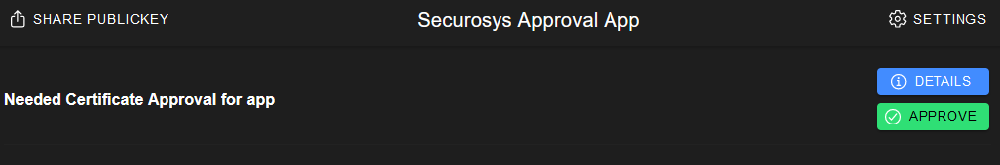

# 3. Issue a Certificate

## Create a sign CSR request
**POST**: [/v1/certificate/sign](https://rest-api.cloudshsm.com/swagger-ui/index.html?configUrl=/v3/api-docs/swagger-config#/Certificate/signCertificateWithSkaKey)

**Description**: Generates a valid x509 Certificate out of a csr-string. Replace the `certificateSigningRequest` property with the result from [CertificateSigningRequest](./CertificateSigningRequest.md).

:::tip Signing CSR

The key `CA.approver.securosys.com` signs the CSR.

:::

Setting the `certificateAuthority` to `false`, should be set if it is a leaf-certificate.

```js {3,6,7}
{
  "signCertificateRequest": {
    "signKeyName": "CA.approver.securosys.com",
    "keyPassword": null,
    "signatureAlgorithm": "SHA256_WITH_RSA",
    "commonName": "Approver-Intermediate-SUB",
    "certificateAuthority": false,
    "certificateSigningRequest": "replace-me_with_csr_value"
    "keyUsage": [
      "DIGITAL_SIGNATURE"
    ],
    "extendedKeyUsage": [
      "ANY_EXTENDED_KEY_USAGE"
    ]
  }
}
```

**Response**

```
{
  "signRequestId": "9dd448e1-6d34-4b98-a05b-3ec006d99fef"
}
```

Remeber the `signRequestId`, to fetch the result once the approval is given.

---
---
---

## Approve the Certificate Request

**1. Open the approval app from securosys:** [https://approver.securosys.com](https://approver.securosys.com/all)

**2. Approve the request: `APPROVE`**



**3. Fetch the result:**

**GET:** [/v1/request/9dd448e1-6d34-4b98-a05b-3ec006d99fef](https://rest-api.cloudshsm.com/swagger-ui/index.html?configUrl=/v3/api-docs/swagger-config#/Requests/getRequestStatus)

Put the `signRequestId` from before we have remembered: id=`9dd448e1-6d34-4b98-a05b-3ec006d99fef`

:::note Request Status

If the status of the Request other than `EXECUTED` the approval did not work.

:::

```js {3,10}
{
  "id": "9dd448e1-6d34-4b98-a05b-3ec006d99fef",
  "status": "EXECUTED",
  "executionTime": "2024-01-23T11:43:43Z",
  "approvedBy": [
    "MIIBIjANBgkqhkiG9w0BAQEFAAOCAQ8AMIIBCgKCAQEApLwHSQM4sd93UtEJ+t6G22sopYmL6roZxQGL0GWn7WAaiogfQ5EOM+sYQyeJgtuLQkdfwDBnScJx7IgBiOKFpXdaM9i08hSljFlbTT7zP0XjojtGD4U27nLuLqGUhmloLtc+6yBK2FL/7QWB2c9tyCgHiIhmXZesBhZRRFdrpwP66XoGIsgxt1AxFjV1z5MG0g7DULfUSqWG7gGOxvwITFwmqDwuA6rh952X5iJ7zopSSmGhrTeFrV/1Io0E8SsJhRM9m7BOdcg/X6X+5iqK5Obp6Js18Y7eddf/Q5amQSzwlXx6mJAyj2//1DnGz0UbacKStqgZZiC0xAhLEwo7XQIDAQAB"
  ],
  "notYetApprovedBy": [],
  "rejectedBy": [],
  "result": "-----BEGIN CERTIFICATE-----\nMIIC8jCCAdqgAwIBAgIBADANBgkqhkiG9w0BAQsFADARMQ8wDQYDVQQDEwZDQS1LZXkwHhcNMjQwMTIzMDAwMDAwWhcNMjQwNDIyMDAwMDAwWjAkMSIwIAYDVQQDExlBcHByb3Zlci1JbnRlcm1lZGlhdGUtU1VCMIIBIjANBgkqhkiG9w0BAQEFAAOCAQ8AMIIBCgKCAQEA2MNe31/9GJM/9FMBObuFN3Hb+OzqMq/KXufa8aACpOd/sJiBwwnGACEMzEGncNPE0a5fzHOYL7xBrSHbvfDGGTreVidfh5lDvVGPYkmBsw3eaRkEqT4Hq7dI7MGub23oropGytb2aRz7VVCFurdaA8omPSJ2rpPsMl3lzZ8edKCUIX12pSgbVaaNn5AdcONfq1pI40UM/i7rZYmat+DznY/hBjUM3j7O08l3OLWe3BMVTluYyy2H7EBDAfRGVJ+9jOe25oOWiYwvDZ35Sd8h0Zo6YsZ7HNEBZHxy9wcTSLNpsVM3jMzVLDCD6Z6a2ojYmU+khT1hVJg6wYnCu4nXsQIDAQABo0IwQDAfBgNVHSMEGDAWgBSIqh0XCn5r6loXgfWz004YMa3vSzAdBgNVHQ4EFgQUVUN9cQq1l32GbgQ86WTVRp+Eu8kwDQYJKoZIhvcNAQELBQADggEBAI5vB0sxjI2Y/LG2sQNajsXM1ZmVilVkx7XSL8x8SBTogD4FgykfWhRA68E1ehwYUPE8Nj49wASZ3e4rSFW8JodjWlUov8vojvNrURlgg/Qn8yBtqBIIQ32NlEMAzCqWBOyTNjGsMNQuj2JoT00oNO5kYj0dWGS8ZRvX6OdPnwdoyPFqtARjZJS4R+W2COljAW/pQ8YOKWudGPhrUUCwdQxYZP7XZ7rlCWBHwYif8+8rdgbgIb7xPeyUXNRovu9lExV9wIrHI7QVKXNSB1Svgt51NHutIypcpW2RZg+Pt/wE/E9Lsfk3/P6jbv6nnFl2P5X6WfQRZW9L8t85H8bgN2Q=\n-----END CERTIFICATE-----"
}
```


## Import certificate

**POST**: [/v1/certificate/import/plain](https://rest-api.cloudshsm.com/swagger-ui/index.html?configUrl=/v3/api-docs/swagger-config#/Certificate/importPlainCertificate)

**Description**: Import a certificate

:::tip Remove OpenSSL content

Importing a certificate has to be a valid base64 encoded String. Remove `-----BEGIN CERTIFICATE-----\n` and `\n-----END CERTIFICATE-----`

:::

```js
{
  "label": "SUB.approver.securosys.com",
  "certificate": "MIIC8jCCAdqgAwIBAgIBADANBgkqhkiG9w0BAQsFADARMQ8wDQYDVQQDEwZDQS1LZXkwHhcNMjQwMTIzMDAwMDAwWhcNMjQwNDIyMDAwMDAwWjAkMSIwIAYDVQQDExlBcHByb3Zlci1JbnRlcm1lZGlhdGUtU1VCMIIBIjANBgkqhkiG9w0BAQEFAAOCAQ8AMIIBCgKCAQEA2MNe31/9GJM/9FMBObuFN3Hb+OzqMq/KXufa8aACpOd/sJiBwwnGACEMzEGncNPE0a5fzHOYL7xBrSHbvfDGGTreVidfh5lDvVGPYkmBsw3eaRkEqT4Hq7dI7MGub23oropGytb2aRz7VVCFurdaA8omPSJ2rpPsMl3lzZ8edKCUIX12pSgbVaaNn5AdcONfq1pI40UM/i7rZYmat+DznY/hBjUM3j7O08l3OLWe3BMVTluYyy2H7EBDAfRGVJ+9jOe25oOWiYwvDZ35Sd8h0Zo6YsZ7HNEBZHxy9wcTSLNpsVM3jMzVLDCD6Z6a2ojYmU+khT1hVJg6wYnCu4nXsQIDAQABo0IwQDAfBgNVHSMEGDAWgBSIqh0XCn5r6loXgfWz004YMa3vSzAdBgNVHQ4EFgQUVUN9cQq1l32GbgQ86WTVRp+Eu8kwDQYJKoZIhvcNAQELBQADggEBAI5vB0sxjI2Y/LG2sQNajsXM1ZmVilVkx7XSL8x8SBTogD4FgykfWhRA68E1ehwYUPE8Nj49wASZ3e4rSFW8JodjWlUov8vojvNrURlgg/Qn8yBtqBIIQ32NlEMAzCqWBOyTNjGsMNQuj2JoT00oNO5kYj0dWGS8ZRvX6OdPnwdoyPFqtARjZJS4R+W2COljAW/pQ8YOKWudGPhrUUCwdQxYZP7XZ7rlCWBHwYif8+8rdgbgIb7xPeyUXNRovu9lExV9wIrHI7QVKXNSB1Svgt51NHutIypcpW2RZg+Pt/wE/E9Lsfk3/P6jbv6nnFl2P5X6WfQRZW9L8t85H8bgN2Q="
}
```

---


## Parse certificate with OpenSSL

**Create a file**
```
nano SUB-Securosys-001.crt
```

Copy content from `/v1/certificate/synchronous/sign` response into file.

:::tip 

replace '\n' with real newlines

::: 

```
-----BEGIN CERTIFICATE-----
MIIC8jCCAdqgAwIBAgIBADANBgkqhkiG9w0BAQsFADARMQ8wDQYDVQQDEwZDQS1LZXkwHhcNMjQwMTIzMDAwMDAwWhcNMjQwNDIyMDAwMDAwWjAkMSIwIAYDVQQDExlBcHByb3Zlci1JbnRlcm1lZGlhdGUtU1VCMIIBIjANBgkqhkiG9w0BAQEFAAOCAQ8AMIIBCgKCAQEA2MNe31/9GJM/9FMBObuFN3Hb+OzqMq/KXufa8aACpOd/sJiBwwnGACEMzEGncNPE0a5fzHOYL7xBrSHbvfDGGTreVidfh5lDvVGPYkmBsw3eaRkEqT4Hq7dI7MGub23oropGytb2aRz7VVCFurdaA8omPSJ2rpPsMl3lzZ8edKCUIX12pSgbVaaNn5AdcONfq1pI40UM/i7rZYmat+DznY/hBjUM3j7O08l3OLWe3BMVTluYyy2H7EBDAfRGVJ+9jOe25oOWiYwvDZ35Sd8h0Zo6YsZ7HNEBZHxy9wcTSLNpsVM3jMzVLDCD6Z6a2ojYmU+khT1hVJg6wYnCu4nXsQIDAQABo0IwQDAfBgNVHSMEGDAWgBSIqh0XCn5r6loXgfWz004YMa3vSzAdBgNVHQ4EFgQUVUN9cQq1l32GbgQ86WTVRp+Eu8kwDQYJKoZIhvcNAQELBQADggEBAI5vB0sxjI2Y/LG2sQNajsXM1ZmVilVkx7XSL8x8SBTogD4FgykfWhRA68E1ehwYUPE8Nj49wASZ3e4rSFW8JodjWlUov8vojvNrURlgg/Qn8yBtqBIIQ32NlEMAzCqWBOyTNjGsMNQuj2JoT00oNO5kYj0dWGS8ZRvX6OdPnwdoyPFqtARjZJS4R+W2COljAW/pQ8YOKWudGPhrUUCwdQxYZP7XZ7rlCWBHwYif8+8rdgbgIb7xPeyUXNRovu9lExV9wIrHI7QVKXNSB1Svgt51NHutIypcpW2RZg+Pt/wE/E9Lsfk3/P6jbv6nnFl2P5X6WfQRZW9L8t85H8bgN2Q=
-----END CERTIFICATE-----
```

**Read Certificate with OpenSSL**

```sh
openssl x509 -in SUB-Securosys-001.crt --text --noout
```

**Response:**

```sh
Certificate:
    Data:
        Version: 3 (0x2)
        Serial Number: 0 (0x0)
        Signature Algorithm: sha256WithRSAEncryption
        Issuer: CN = Approver-Intermediate-CA
        Validity
            Not Before: Jan 23 00:00:00 2024 GMT
            Not After : Apr 22 00:00:00 2024 GMT
        Subject: CN = Approver-Intermediate-SUB
        Subject Public Key Info:
            Public Key Algorithm: rsaEncryption
                Public-Key: (2048 bit)
                Modulus:
                    00:d8:c3:5e:df:5f:fd:18:93:3f:f4:53:01:39:bb:
                    85:37:71:db:f8:ec:ea:32:af:ca:5e:e7:da:f1:a0:
                    02:a4:e7:7f:b0:98:81:c3:09:c6:00:21:0c:cc:41:
                    a7:70:d3:c4:d1:ae:5f:cc:73:98:2f:bc:41:ad:21:
                    db:bd:f0:c6:19:3a:de:56:27:5f:87:99:43:bd:51:
                    8f:62:49:81:b3:0d:de:69:19:04:a9:3e:07:ab:b7:
                    48:ec:c1:ae:6f:6d:e8:ae:8a:46:ca:d6:f6:69:1c:
                    fb:55:50:85:ba:b7:5a:03:ca:26:3d:22:76:ae:93:
                    ec:32:5d:e5:cd:9f:1e:74:a0:94:21:7d:76:a5:28:
                    1b:55:a6:8d:9f:90:1d:70:e3:5f:ab:5a:48:e3:45:
                    0c:fe:2e:eb:65:89:9a:b7:e0:f3:9d:8f:e1:06:35:
                    0c:de:3e:ce:d3:c9:77:38:b5:9e:dc:13:15:4e:5b:
                    98:cb:2d:87:ec:40:43:01:f4:46:54:9f:bd:8c:e7:
                    b6:e6:83:96:89:8c:2f:0d:9d:f9:49:df:21:d1:9a:
                    3a:62:c6:7b:1c:d1:01:64:7c:72:f7:07:13:48:b3:
                    69:b1:53:37:8c:cc:d5:2c:30:83:e9:9e:9a:da:88:
                    d8:99:4f:a4:85:3d:61:54:98:3a:c1:89:c2:bb:89:
                    d7:b1
                Exponent: 65537 (0x10001)
        X509v3 extensions:
            X509v3 Authority Key Identifier:
                88:AA:1D:17:0A:7E:6B:EA:5A:17:81:F5:B3:D3:4E:18:31:AD:EF:4B
            X509v3 Subject Key Identifier:
                55:43:7D:71:0A:B5:97:7D:86:6E:04:3C:E9:64:D5:46:9F:84:BB:C9
    Signature Algorithm: sha256WithRSAEncryption
    Signature Value:
        8e:6f:07:4b:31:8c:8d:98:fc:b1:b6:b1:03:5a:8e:c5:cc:d5:
        99:95:8a:55:64:c7:b5:d2:2f:cc:7c:48:14:e8:80:3e:05:83:
        29:1f:5a:14:40:eb:c1:35:7a:1c:18:50:f1:3c:36:3e:3d:c0:
        04:99:dd:ee:2b:48:55:bc:26:87:63:5a:55:28:bf:cb:e8:8e:
        f3:6b:51:19:60:83:f4:27:f3:20:6d:a8:12:08:43:7d:8d:94:
        43:00:cc:2a:96:04:ec:93:36:31:ac:30:d4:2e:8f:62:68:4f:
        4d:28:34:ee:64:62:3d:1d:58:64:bc:65:1b:d7:e8:e7:4f:9f:
        07:68:c8:f1:6a:b4:04:63:64:94:b8:47:e5:b6:08:e9:63:01:
        6f:e9:43:c6:0e:29:6b:9d:18:f8:6b:51:40:b0:75:0c:58:64:
        fe:d7:67:ba:e5:09:60:47:c1:88:9f:f3:ef:2b:76:06:e0:21:
        be:f1:3d:ec:94:5c:d4:68:be:ef:65:13:15:7d:c0:8a:c7:23:
        b4:15:29:73:52:07:54:af:82:de:75:34:7b:ad:23:2a:5c:a5:
        6d:91:66:0f:8f:b7:fc:04:fc:4f:4b:b1:f9:37:fc:fe:a3:6e:
        fe:a7:9c:59:76:3f:95:fa:59:f4:11:65:6f:4b:f2:df:39:1f:
        c6:e0:37:64
-----BEGIN CERTIFICATE-----
MIIC8jCCAdqgAwIBAgIBADANBgkqhkiG9w0BAQsFADARMQ8wDQYDVQQDEwZDQS1L
ZXkwHhcNMjQwMTIzMDAwMDAwWhcNMjQwNDIyMDAwMDAwWjAkMSIwIAYDVQQDExlB
cHByb3Zlci1JbnRlcm1lZGlhdGUtU1VCMIIBIjANBgkqhkiG9w0BAQEFAAOCAQ8A
MIIBCgKCAQEA2MNe31/9GJM/9FMBObuFN3Hb+OzqMq/KXufa8aACpOd/sJiBwwnG
ACEMzEGncNPE0a5fzHOYL7xBrSHbvfDGGTreVidfh5lDvVGPYkmBsw3eaRkEqT4H
q7dI7MGub23oropGytb2aRz7VVCFurdaA8omPSJ2rpPsMl3lzZ8edKCUIX12pSgb
VaaNn5AdcONfq1pI40UM/i7rZYmat+DznY/hBjUM3j7O08l3OLWe3BMVTluYyy2H
7EBDAfRGVJ+9jOe25oOWiYwvDZ35Sd8h0Zo6YsZ7HNEBZHxy9wcTSLNpsVM3jMzV
LDCD6Z6a2ojYmU+khT1hVJg6wYnCu4nXsQIDAQABo0IwQDAfBgNVHSMEGDAWgBSI
qh0XCn5r6loXgfWz004YMa3vSzAdBgNVHQ4EFgQUVUN9cQq1l32GbgQ86WTVRp+E
u8kwDQYJKoZIhvcNAQELBQADggEBAI5vB0sxjI2Y/LG2sQNajsXM1ZmVilVkx7XS
L8x8SBTogD4FgykfWhRA68E1ehwYUPE8Nj49wASZ3e4rSFW8JodjWlUov8vojvNr
URlgg/Qn8yBtqBIIQ32NlEMAzCqWBOyTNjGsMNQuj2JoT00oNO5kYj0dWGS8ZRvX
6OdPnwdoyPFqtARjZJS4R+W2COljAW/pQ8YOKWudGPhrUUCwdQxYZP7XZ7rlCWBH
wYif8+8rdgbgIb7xPeyUXNRovu9lExV9wIrHI7QVKXNSB1Svgt51NHutIypcpW2R
Zg+Pt/wE/E9Lsfk3/P6jbv6nnFl2P5X6WfQRZW9L8t85H8bgN2Q=
-----END CERTIFICATE-----
```