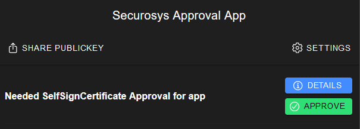

# 1. Self Signed Certificate

## Create SKA-Key (Smart Key Attributes)
**POST**: [/v1/key](https://rest-api.cloudshsm.com/swagger-ui/index.html?configUrl=/v3/api-docs/swagger-config#/Keys/createKey)

**Description**: Create key request to be used as Root-CA key.

```js {2,13,30,52,74,96}
{
    "label": "CA.approver.securosys.com",
    "algorithm": "RSA",
    "keySize": 2048,
    "attributes": {
        "decrypt": false,
        "sign": true,
        "unwrap": false,
        "derive": false,
        "bip32": false,
        "extractable": false,
        "modifiable": true,
        "destroyable": true
    },
    "policy": {
        "ruleUse": {
            "tokens": [
                {
                    "name": "Token1",
                    "timelock": 0,
                    "timeout": 600,
                    "groups": [
                        {
                            "name": "Group1",
                            "quorum": 1,
                            "approvals": [
                                {
                                    "type": "public_key",
                                    "name": "ApproverKey1",
                                    "value": "MIIBIjANBgkqhkiG9w0BAQEFAAOCAQ8AMIIBCgKCAQEApLwHSQM4sd93UtEJ+t6G22sopYmL6roZxQGL0GWn7WAaiogfQ5EOM+sYQyeJgtuLQkdfwDBnScJx7IgBiOKFpXdaM9i08hSljFlbTT7zP0XjojtGD4U27nLuLqGUhmloLtc+6yBK2FL/7QWB2c9tyCgHiIhmXZesBhZRRFdrpwP66XoGIsgxt1AxFjV1z5MG0g7DULfUSqWG7gGOxvwITFwmqDwuA6rh952X5iJ7zopSSmGhrTeFrV/1Io0E8SsJhRM9m7BOdcg/X6X+5iqK5Obp6Js18Y7eddf/Q5amQSzwlXx6mJAyj2//1DnGz0UbacKStqgZZiC0xAhLEwo7XQIDAQAB"
                                }
                            ]
                        }
                    ]
                }
            ]
        },
        "ruleBlock": {
            "tokens": [
                {
                    "name": "Token1",
                    "timelock": 0,
                    "timeout": 600,
                    "groups": [
                        {
                            "name": "Group1",
                            "quorum": 1,
                            "approvals": [
                                {
                                    "type": "public_key",
                                    "name": "ApproverKey1",
                                    "value": "MIIBIjANBgkqhkiG9w0BAQEFAAOCAQ8AMIIBCgKCAQEApLwHSQM4sd93UtEJ+t6G22sopYmL6roZxQGL0GWn7WAaiogfQ5EOM+sYQyeJgtuLQkdfwDBnScJx7IgBiOKFpXdaM9i08hSljFlbTT7zP0XjojtGD4U27nLuLqGUhmloLtc+6yBK2FL/7QWB2c9tyCgHiIhmXZesBhZRRFdrpwP66XoGIsgxt1AxFjV1z5MG0g7DULfUSqWG7gGOxvwITFwmqDwuA6rh952X5iJ7zopSSmGhrTeFrV/1Io0E8SsJhRM9m7BOdcg/X6X+5iqK5Obp6Js18Y7eddf/Q5amQSzwlXx6mJAyj2//1DnGz0UbacKStqgZZiC0xAhLEwo7XQIDAQAB"
                                }
                            ]
                        }
                    ]
                }
            ]
        },
        "ruleUnblock": {
            "tokens": [
                {
                    "name": "Token1",
                    "timelock": 0,
                    "timeout": 600,
                    "groups": [
                        {
                            "name": "Group1",
                            "quorum": 1,
                            "approvals": [
                                {
                                    "type": "public_key",
                                    "name": "ApproverKey1",
                                    "value": "MIIBIjANBgkqhkiG9w0BAQEFAAOCAQ8AMIIBCgKCAQEApLwHSQM4sd93UtEJ+t6G22sopYmL6roZxQGL0GWn7WAaiogfQ5EOM+sYQyeJgtuLQkdfwDBnScJx7IgBiOKFpXdaM9i08hSljFlbTT7zP0XjojtGD4U27nLuLqGUhmloLtc+6yBK2FL/7QWB2c9tyCgHiIhmXZesBhZRRFdrpwP66XoGIsgxt1AxFjV1z5MG0g7DULfUSqWG7gGOxvwITFwmqDwuA6rh952X5iJ7zopSSmGhrTeFrV/1Io0E8SsJhRM9m7BOdcg/X6X+5iqK5Obp6Js18Y7eddf/Q5amQSzwlXx6mJAyj2//1DnGz0UbacKStqgZZiC0xAhLEwo7XQIDAQAB"
                                }
                            ]
                        }
                    ]
                }
            ]
        },
        "ruleModify": {
            "tokens": [
                {
                    "name": "Token1",
                    "timelock": 0,
                    "timeout": 600,
                    "groups": [
                        {
                            "name": "Group1",
                            "quorum": 1,
                            "approvals": [
                                {
                                    "type": "public_key",
                                    "name": "ApproverKey1",
                                    "value": "MIIBIjANBgkqhkiG9w0BAQEFAAOCAQ8AMIIBCgKCAQEApLwHSQM4sd93UtEJ+t6G22sopYmL6roZxQGL0GWn7WAaiogfQ5EOM+sYQyeJgtuLQkdfwDBnScJx7IgBiOKFpXdaM9i08hSljFlbTT7zP0XjojtGD4U27nLuLqGUhmloLtc+6yBK2FL/7QWB2c9tyCgHiIhmXZesBhZRRFdrpwP66XoGIsgxt1AxFjV1z5MG0g7DULfUSqWG7gGOxvwITFwmqDwuA6rh952X5iJ7zopSSmGhrTeFrV/1Io0E8SsJhRM9m7BOdcg/X6X+5iqK5Obp6Js18Y7eddf/Q5amQSzwlXx6mJAyj2//1DnGz0UbacKStqgZZiC0xAhLEwo7XQIDAQAB"
                                }
                            ]
                        }
                    ]
                }
            ]
        },
        "keyStatus": {
            "blocked": false
        }
    }
}
```

---
---
---

## Create a self-signed certificate
**POST**: [/v1/certificate/selfsign](https://rest-api.cloudshsm.com/swagger-ui/index.html?configUrl=/v3/api-docs/swagger-config#/Certificate/selfSignCertificateWithSkaKey)

**Description**: Creates and attaches a self-signed certificate to the keypair.

Setting the `certificateAuthority` to `true` adds the BasicConstraint `BC:CA:TRUE`, should be set for intermediate and CA Authorities.

```js {3,10}
{
  "selfSignCertificateRequest": {
    "signKeyName": "CA.approver.securosys.com",
    "keyPassword": null,
    "validity": 3650,
    "signatureAlgorithm": "SHA256_WITH_RSA",
    "commonName": "Approver-Intermediate-CA",
    "certificateAuthority": true,
    "keyUsage": [
      "DIGITAL_SIGNATURE",
      "KEY_CERT_SIGN"
    ],
    "extendedKeyUsage": [
      "ANY_EXTENDED_KEY_USAGE"
    ]
  }
}
```

**Response:**

```
{
  "signRequestId": "1c82583f-2cd2-486d-8b03-63f91aad9b7a"
}
```

Remember the `signRequestId`, to fetch the result once the approval is given.

---
---
---

## Approve the Self-Signed Request

**1. Open the approval app from securosys:** [https://approver.securosys.com](https://approver.securosys.com/all)

**2. Approve the request: `APPROVE`**



**3. Fetch the result:**

**GET:** [/v1/request/1c82583f-2cd2-486d-8b03-63f91aad9b7a](https://rest-api.cloudshsm.com/swagger-ui/index.html?configUrl=/v3/api-docs/swagger-config#/Requests/getRequestStatus)

Put the `signRequestId` from before we have remembered: id=`1c82583f-2cd2-486d-8b03-63f91aad9b7a`

:::note Request Status

If the status of the Request other than `EXECUTED` the approval did not work.

:::

**Response:**
```js {3,10}
{
  "id": "bb65ec3e-e6c2-4368-9994-188a2c444cee",
  "status": "EXECUTED",
  "executionTime": "2024-01-23T10:54:43Z",
  "approvedBy": [
    "MIIBIjANBgkqhkiG9w0BAQEFAAOCAQ8AMIIBCgKCAQEApLwHSQM4sd93UtEJ+t6G22sopYmL6roZxQGL0GWn7WAaiogfQ5EOM+sYQyeJgtuLQkdfwDBnScJx7IgBiOKFpXdaM9i08hSljFlbTT7zP0XjojtGD4U27nLuLqGUhmloLtc+6yBK2FL/7QWB2c9tyCgHiIhmXZesBhZRRFdrpwP66XoGIsgxt1AxFjV1z5MG0g7DULfUSqWG7gGOxvwITFwmqDwuA6rh952X5iJ7zopSSmGhrTeFrV/1Io0E8SsJhRM9m7BOdcg/X6X+5iqK5Obp6Js18Y7eddf/Q5amQSzwlXx6mJAyj2//1DnGz0UbacKStqgZZiC0xAhLEwo7XQIDAQAB"
  ],
  "notYetApprovedBy": [],
  "rejectedBy": [],
  "result": "true"
}
```

