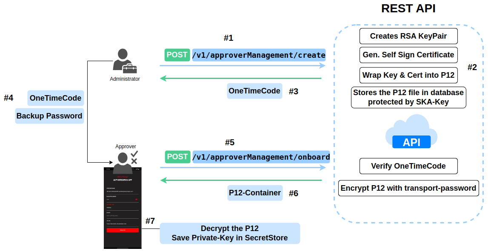

import Tabs from '@theme/Tabs';
import TabItem from '@theme/TabItem';

# Approver Management - API

In this article, we will introduce the process flow for an API-based approver management system, focusing on the creation of RSA **Approver KeyPairs** in conjunction with Smart Key Attributes. We will guide you through the necessary steps to prepare for using the [Securosys Authorization App](https://play.google.com/store/apps/details?id=com.securosys.authorization.app&hl=en-US&pli=1), available for download on the Google Play Store.

The approvers private key is created ephemerally on the HSM, and its transfer to the Securosys Authorization App is encrypted, password-protected, and accompanied by certificate generation. The following image outlines the essential steps to successfully onboard (create) an approver and ensure all required information is available for setting up the Securosys Authorization App. Notably, the approver key generated on the HSM is not stored in the HSM keystore; it is generated ephemerally, securely wrapped and stored in the database.

## License Requirements
The `TSB_ENGINE` license is required to create and use ApproverManagement endpoints.
This feature is restricted for TSB Service Package: **Platinum or onPremise.**


## Roles Description
|Role|Description|
|--|--|
|Approver Manager|Responsible for managing the entire pool of approvers within TSB.|
|Approver|Utilizes either the mobile or desktop application to interact with TSB for approval-related tasks.|
|HSM-Partition|Ensures the security of cryptographic operations by securely storing private keys generated within the Hardware Security Module (HSM) with True Random Number Generator (TRNG), along with public keys and self-signed certificates.|



1. The process begins when the **Approver Manager** sends a `POST` request to the endpoint `/v1/approverManagement/create`. This creates a new **Approver** KeyPair and Certificate. The response of the request is a `oneTimeCode` generated.
2. The REST-API persists the PKCS#12 container in it's database. Before doing so, it wrapps the container with the `approver-mgmt-backup-key-rsa-wrapping` (a key generated upon statup of TSB).
**Note:** The rsa-wrapping key can be equipped with SKA, to control unwrapping procedures (in case of forgetting the `backupPassword` and enforcing the recovery with an Quorum)
3. After the **create** process is completed, the system returns a `OneTimeCode` to the **Approver Manager**. This code will be used to validate the onboarding process.
4. The **Approver Manager** shares the `OneTimeCode` and `BackupPassword` with the **Approver**. The backup password might be used later for secure operations or recovery -> store it savely.
5. The **Approver** sends a request to the REST-API with the `OneTimeCode` and `backupPassword` to begin the onboarding process using the `/v1/approverManagement/onboard` endpoint.
6. Upon successful validation of the OneTimeCode, the REST-API: 
  -   The system checks the validity of the `OneTimeCode`.
  -   The system encrypts the .p12 file with a transport password for secure transfer.
  -   The encrypted .p12 is then returned to the Approver as a P12-Container.
7. The Approver decrypts the P12-Container using the `transport-password` and the `backupPassword`.
The private key from the .p12 is then stored securely in a SecretStore of the Authorization App, completing the onboarding process.

## Step-by-step Tutorial (Onboarding process)

:::info Authorization App

The steps below are not relevant if you are using the [Securosys Authorization App](/AuthorizationApp/overview), but might be relevant if you are implementing your own Approval Terminal.

:::


### Create Approver Key
**Approver Manager** initiates the creation of an `approver-key` with HSM-Randomness.

**POST**: [/v1/approverManagement/create](https://tsb-demo.cloudshsm.com/swagger-ui/index.html?configUrl=/v3/api-docs/swagger-config#/Approver%20Management/create)

:::warning KeyPassword

Many programming languages (Go, OpenSSL, Python) and PKCS12 wrappers lack support for distinguishing between the key password and the PKCS12 container password. As a workaround, we set the `keyPassword` to be the same as the PKCS12 container password `backupPassword`, simplifying the process and ensuring compatibility.

:::

<Tabs groupId="device-setup">
  <TabItem value="swagger" label="Swagger" default>
    ```js
{
  "approverName": "finance-officer@securosys.com",
  "algorithm": "RSA",
  "keySize": 2048,
  "backupPassword": [ "2","a","l","1","5" ],
  "validity": 3650
}
```

**Response:** Response is a `oneTimeCode` to be sent to the **approver** to fetch the approver-key
```js
{
  "oneTimeCode": "410447"
}
```
  </TabItem>
  <TabItem value="curl" label="CURL" default>
```js
curl -X PUT -H "X-API-KEY: tsb-x-token_07..." -H "Content-Type: application/json"
 https://integration-test.cloudshsm.com/v1/approverManagement/create -d '{
  "approverName": "devops-sebastianfernandez@securosys.com",
  "algorithm": "RSA",
  "keySize": 2048,
  "backupPassword": [ "6","s","e","1","Q" ],
  "validity": 3650
}'
```

**Response:** Response is a `oneTimeCode` to be sent to the **approver** to fetch the approver-key
```js
{
  "oneTimeCode": "410447"
}
```
  </TabItem>
</Tabs>

### Onboard Approver

**Approver** retrieves the `approver-key`, authenticates using the one-time password, and provides a `transport-password`.

**POST**: [/v1/approver/onboard](https://tsb-demo.cloudshsm.com/swagger-ui/index.html?configUrl=/v3/api-docs/swagger-config#/Approver%20Management/onboard)

Replace `oneTimePassword` from the request above and choose `transportPassword` for which the PKCS12-Container shall be encrypted. 
```js
{
  "approverName": "finance-officer@securosys.com",
  "oneTimeCode": [ "4","1","0","4","4","7" ],
  "transportPassword":  [ "A","n","M","r","g","9","H","o","5","P","L","q","q","R","8","k","m","H","h","f","g","s","v","p","8","i","T","2","O","l","p","W" ]
}
```

:::note transport-password

The `transportPassword` is used to encrypt the `approver-key` (PKCS12), it must be **16** or **32** bytes long.

**Encryption Specification:**
```java
private static final String CIPHER = "AES/GCM/NoPadding";
private static final String ENCRYPTION_ALGORITHM = "AES";
private static final int ENCRYPTION_TAG_BITS = 128;
```

:::


**Response** Response is a encrypted and password protected PKCS12-Container. Containing Private-Key, Public-Key and a self-signed certificate.

```js
{
  "encryptedPayload": "w1iyC+eWHyJetIjJJ2zCfilPr9EjueLZugsj7/wtz2phDKJ+mmzBKZpoRiybTPQkRXTyJOT85S1MdfH06hRoInbTsbNk+M8iEnJhXCSFKK/HhOsCZtdBx/8DzVzIM52Aac5VTSbfN+23A3f9EXE4VMFqy88FgBv2uuK8kmU8cSO1UstscmzJa/njsQN0Dv4ZWodSO1S6B74P+Qv1N0zFmabHR4bDHxm1da2AkW2Mc9PsKXdxNjT8KDfox9Q/HSFnwJuErtVBoAzgheggQg5Y/z0oXR5qDOxPZ3M2hfodmb5eA/KlLptHfxZ6aomNF3IISY1EiQViNunKd9tkTN/53tZzSuJeghQaBBurYIYOaj3Grmoiq71Dp7+JFACtBzC97+ER7yFeXM/i06PEbhZVhh+C45+tNyOraw4ZonbPHR9OlLKvtkxFWMlKltfL3w7JBa3uIeD/8ig09KCt7EdJHZ7e/fcXUINTxAzN1pZxU6GNKErdU1jnMmw8wSl38YlsD94IGKqUtnpUraVURNHG2CuvQ2rytGVK5eXiUA7aKGnNttlFKZ3SNIqMuIsETbqsogk0OTx3zTrp5AQ1AWORvdJEuqsj0e+6LjTXk4WQ6kURJ91/6Ku3QTkdGiAP1oUjAAwxfufWkAj0yxxzuCHFEdKPiGlTo8EAsKoRy7OZapo60DOP639Q2oWYicT3eoAFdZiyCS+qpPaFqXMI7jNcdOJhOTx5be4NUNQ/6mLBfi4Rwl9VIxKg1WesFkCOiBbIxLUtuj9CAsDZciFYeorrih9RKn02w1Rn82KzyfAYsW3ejgjFvWMbTGCCHNZOFhQXcENuBegd46WrsYkfMMZVFXa8f+QMxpCGekefJ72HCm1Q19z6jYiMbyhJCFp8nA9aXdVEd4h0oczdHVKfvyjkLvEhdUTepQ2QWy06d2dYqqtPwq8CXXQ1Q3vZbdEE06uV/jmS2iMPUBKjvB4/nTudjF1721i+9BycCFhsBp5EHzprDzMzgmSy+t4a1/x9wmSF22tS6oocPPJ4sBiCSBjxvH3uMmy7SbpFccOmx8hduGRyD7Al2Cu2iN+tn5Ill1CUGZh1loKbbXvilFPLzhVKHl0khbPI5gpePMWs257GFRkzjexQoCmT6OLiXfBTuQwnVf4kXAlwLLDlUNFqg/TLLpH0XMrnYPI4TlfEwOgcaFwNvVkVSFaK+rNGcokeMAii+d4hdvlNYtWvAO/zgPMgDiShm9K+h2AC6hICZEFXmdPfhlP/58LorwwDctFOBscozc1LFz7qI/VcOhrjegC5MTzoLvp/LKgtTR80K8yi9mxkwZx1g1qOd+jADxop4YFHi+2UfKA0ODTLXiaIGg3vbc5NGbgwORRKDa1L9cxxApB04SNP+rU8O/G3qSAMXtSOLS4QWo5xuRcybUHbsrJkYzkHRqT51tHTlDXtm/VOwKkfRAbd6bDQ5EEURM6eofE43dKar05OGTn8ydPhena/DRGEa41rW91smQUu8ii2hGeBAptcRT8z2EVvUaww8aRcGYF02t9FV6GhTl2Tin0LrjsM9KTrn4LjyvrakG7QahhaHlYhp1pZysf8nrzQ/t4Omn/PI1MqGCtT7BgLE2iyEgKzwU3K5haVRP1KxPJJ/3zB7HxNpRLVRNhIrmZyiY3ADcYU0SXNVSD8vW6TTtKWHtaB0TzMnhtYs0nrikxvTdnf/iovkWwss5z57pKbBxs9U2QtmeORSu0rKyzFj2ZgEvjsN1qVoLXNTc9trhYZqwlxaVk23lW5u3gOe+eNLzbkZAnTxz4ysPn+6C+QylLRO+ASHu60UgZYIh2zuEjs1huJCDsADhXVauDAGT0dsGg1fp5TEtnmfNqnEirXA3hI+RvdHXm0pnf5ZVIcPdps6jVRyifPDS77+G7KHSrv+LqztkFU38+eXLm+QSn3Tji/hyou2HgQ81JspRQoGnfxaGpB8kxVSSkYnMQDk6cTPIcLj0yDO+K7TubM59APmjMcWbDO6BaNg3mU/y8LNm97RDcYDJQQ1R34a2u977tvy8lSbdU8IJonzoMgDjpVs+sE2MPugOxe4JgsZq0Leq0c30z/yxgTCgz5W2KabGNFl4u9zbrSXsBQQAlbQNe4tcLWHb7axbyM66yZRf2e4WG/HbHWg3DjHa8nPQjLeraD+ajQfIBOCYdDFYpUHDI++yWOv/iq26LeZlg/XvxUOW5WZMk5ipbSMklB1i1WRFvbpZowM+EqHSwxsyWxMdJ+cwvGuovdBCQeRQ0xQ0w1NJRgxOI2J5ksN0OySZbtxJq5b6Om23K4OqzmTZBia93XKMTLFA9DbWLo1yce9vU5DnqaUkam7RoG4XZuzXkqvUvex3u3pXfhq/q+ZX3+rOQwufC8xFhjvCN/RTkry+bA7FuQgmdnfWC4I8YBRM1RFF60WaHeBMWXdzvzKHZLu4ImDv+hzzN9MSPFQpOxeo22EVe4VD44l2Hw76bYaIpbO3V1NNQVLwo+oOs4EokkUjOYF/wIMSadW3miehe2kpRdXMXIoDSrdOkkeM0Nde2/Zn/EI+bZ4UjIJriIGxqmSMbzcIfWQ25k9IBsuYz3RFSOfoWhnSpkhLuAzXB/kX1lEdMkt4eIZZcDDNGx+7l9yqPngLQVfNDBtR8fbCjaZW2xaJTjShC14uVJr1Yr3CCzmO5DTtrQ8GYJS6DHByzgRGsXbk7JlbaYGoFSwX7PlpyfSJt4QMgBGPaBjg/+QWynBSGFyvNqFiRd10yj3aef+3IBj8sfJRYm8nqCcVSYyCczGdh0AGvJRX2ilrar2db8nlGem/pj7YWEb1RUAGSdd7DJpRxgzrfNNL4ayXb0TzKRsgiWw1r3Nof993OQX+IhGzlNwxxSGQGEPEWTuKEm788Jj8Mh9ZSf11MOIuvxc3S/3hzuoetBj0tv7jM9TGLauqwi2Un4Dd9vWRKg4UxHnwEEQuqoJGOCSQ0LW4U/XKgatlw6myRFRvIgforEwB9CP9DOrmw74NaQzM8cysMdGs0OHHMLzWdhxfsEUM16WT0u6nOqG9kbXVAsHE92YTrdhNiMvglNdkjKTQRnD1giXtKANWj7OAFOXregYbkaBJBsWHWuyKLaPxfWkzdmiZm1DofqvI5Y9F7rgTNyNBXOM4XMPovmGqu7v20u4BN2r+pcmO3QspHllwEGsVUfxj4HdG7TRJLTCZ1iqZONvuZ6D0WS6wW06cPwWUgQpBrinBMlumAbjdRhwTeZLHLtoyQ5ygrjR1uas3iygxoSOeaUA9aeHfGtoqKfgfXjI9iei/S5qlJLVS5NpI4VcrjW7kIGn5PU3PDskkLyBYTAwzF0fPg0ctutPvkF9Lcrk9/BaP9OL6UxJbXQTn3WU+cSAKNPjM2aOq/3fHZOBK5aAyVddoWVlj5XdRf1+IkOIRdtIOKRPwxE0eSMGqHzowIqWJ2jFw75bFb8D9xyp6MIRcV1ByjTA3BktYLdbGdo1MX/7a1UgznHMxyZB//qMQaNVDNfmYdPs6A3qXUxJcC05F2Ypd7Smg3KaOJoLtMOHBDThLBnhvCOyuZxgcya4sd3PN3Z1I9ccOtu1LnFRGo555VuhMlUBn5qtNwd6WLHdcqIRlG2PljEq/JApm8vWqWMlEZYY5AoHnFEjJwsaVj3cMVSubj756R4uQLiBapVZjo6j9HCypCwu5wkfFoRr+F6pDGX/6C/RlU0drK+metcnYO9T4bOV2ZT2h9C4SlFZnFfhKbvHx4gHdm5PA8DlX9mP0tABxuc6QKszVyDJtwbiEWkLkSR4y3DS7hCeAJykBZ9PjdA0JcBN/Y6B419LOb2RvE0Ub82INjnHjP2ZtWXr2CG6S0EFF82J89jiVQirgSVdw458R0nOkJ69B8weImnMqz53m/I/R1KjiP1Xfzy/yND+ml+bqAL8fART5+u1/BMMndpE3DO7WW/G9u3cCYtcf9r7h79Hrj/DNyVSaWizXyD/OA8XNbSVbtfjYBlxMY+u8JterOtVq0xJw7sPD8L2U/9HCB3MxJVR0eE2/sn6gzZZyo2fBRn4PWvCAfyIlNpgaWhkdbnx8F5xGxD8bLIdOXqRnDIePvHxpBwU+R1TgaV2SzUJ9SpBHyxrl5TrHNhuRnuDg5RIUJFLFaMd7+X7gYGc4zS3gYQKqYvAjyWu84SMi60DRDfsg0jILz7mvp1VR2vdQLn9xP16fmRb/f4CVowQa0Yreoo042J0NwUouCjfpTTF/CSIJ88XpL/CBhO6uvn4bFfqHdA4HjuTjYtgunpSAG+rHGTeYdYfY5qf8j/VVk4rw6DwBbqjIitvbCmSznDfLu464kDOQyW/kk3zdxx2LD/m1y8VLvxmMrKc5vedzl5AVChBVX3I9NZdgIcZSim15ansdgTQGQY0m4uTX8EAFLqzE08Lm367OwgzoCxr5DkQ57l0/CxZTsps5/lkkqbZaS6OXeYUmmWn4rdTjawGW3tGAx4Gfu465yhW/0mhd1tEptUnHm4CbKgn587oe6JT+btYOlwSt9jg1Lf4Tx48AkUH0g99NAWRWBpZrW2z2hACwBzNkkU12qZr3SWFkIOQJa7vGZRcIS8J8hx4QHQOQmHurj8QiucjyKs5ts+f7TcoYtJm91IR5ZOzVXZOTFVHrZMQ/EAjwisEeImW+NZLRyahOYvDp3KrZx8AJE7E2ODl4WQuMLN4t7VlLsyHCC+/kmoiJpXQ97K5XOkPKpIzYg4BqIsnT77DUQplCktIA67dCfe3pRmG5XPFAn9PCamXyu0ylklIvUbEA2yNYRanATasIlhxbMlRJEmJPfqrqXSP/diDaOeLsKnQgi5No8TdJmBiM/CeaPtKnVjwvvMwL49IG+cmTicV/DQfzR+QSA2Ra/IGojb32wsDSAxdR+VRCr8Lh/q+gqasQj+SgYnnxcjbsnR+3iJVVV7mCo4LVFPa5rptI+M83t5x80UKggY1HrBWqxeW+gKqg09LLn3EFx19kSyGiFhsHLZpQzKTzsRUls1CQPuoxVKj7JuZQiqXNERtNCVPBteHMs2oqMGfEnhcM+aEYQKDDbLi9JV9hfJORX2YcjTp3wLZxRGTBbXafKtgVGXSlfPEJ0TsS0FGXASBmEWn695Ge7ErRXKFilUKb1/ELjCmHT174DlcuEU1bfFdlzSNYVnY5sTADDhhnlho6AY9y6248QiQRogtmP5LJdKYzsw1JoS1mh2H7/mujHVFDAGYe4Ep3xqNm6tjiO/BYC53lnpDeuMmcPnR2pGsDcizF4udla8uvqhnPDov7tlduljju5oq1fLXT5YQJn5oOCg6vdUDXXqM5FEYGm6jCShXJqvROkoAnAFX6oLETEbjPXjUWKrXah6OnqVptUL1oRikM6jNNbAw3R1FzSWDlYMQEiDOOf73XDRr1iRpR4h36Xyh8ygkfGZAAe1Ic/QFE1BkKt1sbWzonup+SVHcDualq3OuHnfFuHvqezPTRfrfvZUeDaUB1pKAGFbJAtXMUqzQtbDmgzJ1aslXpsCYP8h/fqeGMHVdF9eyzO5UvCAOHYU1yYoH67AAGDvW06XZDMOvBgK3i3jLykOZQbMty5e2mGIO1A7/FRDe0vDAz5RFH0+mnVPTdjwttKHDDnTi5Yuau6RD/oShZxWfp29TsYSxS79292uBrrSZBaqANviMCDXWNFccpr73BlRUdHTDyErj8IQ8wrtToUDaA9H5U1C0N0qRUU0CgOCOYUvQAL9ZsqnXNt7k+XWbsi7R9eCDQBfSFhag4emRnvoLUhHwcibQorsSa9v9HFmvYVl0jSfrOnEtoPI4fLk6fGZIXQ8Xt1IW26PRl3uOgZq/LWuoJVX0DQUP1VUGA==",
  "initializationVector": "jRo2Ler2Stfi2tGS"
}
```

### Parse PKCS12 (Get Approver-Key and Certificate)

To get the private-key and certificate we need to decrypt the pkcs12 container and then get the private-key and certificate.

Make sure you replace `encryption_key`, `encrypted_user_secret_base64`, `init_vector_base64`

<Tabs groupId="key-provider">
    <TabItem value="Python" label="Python" default>

    Execute the following file with `python main1.py`, replace the `encryption_key`, `init_vector_base64` & `encrypted_user_secret_base64` first.
```py
import base64
from Crypto.Cipher import AES
from cryptography.hazmat.backends import default_backend
from cryptography.hazmat.primitives import serialization
from cryptography.hazmat.primitives.serialization.pkcs12 import load_key_and_certificates

def decrypt_secret(encrypted_user_secret, encryption_key, init_vector):
    cipher = AES.new(encryption_key, AES.MODE_GCM, nonce=init_vector)
    decrypted_data = cipher.decrypt(encrypted_user_secret, None)  # Ignore authentication tag
    return decrypted_data

def parse_private_key_and_certificate_from_pkcs12(pkcs12_data, password):
    try:
        private_key, certificate, additional_certs = load_key_and_certificates(pkcs12_data, password.encode(), default_backend())
        private_key_pem = private_key.private_bytes(
            encoding=serialization.Encoding.PEM,
            format=serialization.PrivateFormat.TraditionalOpenSSL,
            encryption_algorithm=serialization.NoEncryption()
        )
        certificate_pem = certificate.public_bytes(encoding=serialization.Encoding.PEM)
        return private_key_pem, certificate_pem, additional_certs
    except ValueError as e:
        print("Error parsing PKCS12 data:", e)
        raise

def main():
    # Provided encryption key, encrypted user secret, and init vector
    encryption_key = b'AnMrg9Ho5PLqqR8kmHhfgsvp8iT2OlpW'
    init_vector_base64 = "jRo2Ler2Stfi2tGS"
    encrypted_user_secret_base64 = "w1iyC+eWHyJetIjJJ2zCfilPr9EjueLZugsj7/wtz2phDKJ+mmzBKZpoRiybTPQkRXTyJOT85S1MdfH06hRoInbTsbNk+M8iEnJhXCSFKK/HhOsCZtdBx/8DzVzIM52Aac5VTSbfN+23A3f9EXE4VMFqy88FgBv2uuK8kmU8cSO1UstscmzJa/njsQN0Dv4ZWodSO1S6B74P+Qv1N0zFmabHR4bDHxm1da2AkW2Mc9PsKXdxNjT8KDfox9Q/HSFnwJuErtVBoAzgheggQg5Y/z0oXR5qDOxPZ3M2hfodmb5eA/KlLptHfxZ6aomNF3IISY1EiQViNunKd9tkTN/53tZzSuJeghQaBBurYIYOaj3Grmoiq71Dp7+JFACtBzC97+ER7yFeXM/i06PEbhZVhh+C45+tNyOraw4ZonbPHR9OlLKvtkxFWMlKltfL3w7JBa3uIeD/8ig09KCt7EdJHZ7e/fcXUINTxAzN1pZxU6GNKErdU1jnMmw8wSl38YlsD94IGKqUtnpUraVURNHG2CuvQ2rytGVK5eXiUA7aKGnNttlFKZ3SNIqMuIsETbqsogk0OTx3zTrp5AQ1AWORvdJEuqsj0e+6LjTXk4WQ6kURJ91/6Ku3QTkdGiAP1oUjAAwxfufWkAj0yxxzuCHFEdKPiGlTo8EAsKoRy7OZapo60DOP639Q2oWYicT3eoAFdZiyCS+qpPaFqXMI7jNcdOJhOTx5be4NUNQ/6mLBfi4Rwl9VIxKg1WesFkCOiBbIxLUtuj9CAsDZciFYeorrih9RKn02w1Rn82KzyfAYsW3ejgjFvWMbTGCCHNZOFhQXcENuBegd46WrsYkfMMZVFXa8f+QMxpCGekefJ72HCm1Q19z6jYiMbyhJCFp8nA9aXdVEd4h0oczdHVKfvyjkLvEhdUTepQ2QWy06d2dYqqtPwq8CXXQ1Q3vZbdEE06uV/jmS2iMPUBKjvB4/nTudjF1721i+9BycCFhsBp5EHzprDzMzgmSy+t4a1/x9wmSF22tS6oocPPJ4sBiCSBjxvH3uMmy7SbpFccOmx8hduGRyD7Al2Cu2iN+tn5Ill1CUGZh1loKbbXvilFPLzhVKHl0khbPI5gpePMWs257GFRkzjexQoCmT6OLiXfBTuQwnVf4kXAlwLLDlUNFqg/TLLpH0XMrnYPI4TlfEwOgcaFwNvVkVSFaK+rNGcokeMAii+d4hdvlNYtWvAO/zgPMgDiShm9K+h2AC6hICZEFXmdPfhlP/58LorwwDctFOBscozc1LFz7qI/VcOhrjegC5MTzoLvp/LKgtTR80K8yi9mxkwZx1g1qOd+jADxop4YFHi+2UfKA0ODTLXiaIGg3vbc5NGbgwORRKDa1L9cxxApB04SNP+rU8O/G3qSAMXtSOLS4QWo5xuRcybUHbsrJkYzkHRqT51tHTlDXtm/VOwKkfRAbd6bDQ5EEURM6eofE43dKar05OGTn8ydPhena/DRGEa41rW91smQUu8ii2hGeBAptcRT8z2EVvUaww8aRcGYF02t9FV6GhTl2Tin0LrjsM9KTrn4LjyvrakG7QahhaHlYhp1pZysf8nrzQ/t4Omn/PI1MqGCtT7BgLE2iyEgKzwU3K5haVRP1KxPJJ/3zB7HxNpRLVRNhIrmZyiY3ADcYU0SXNVSD8vW6TTtKWHtaB0TzMnhtYs0nrikxvTdnf/iovkWwss5z57pKbBxs9U2QtmeORSu0rKyzFj2ZgEvjsN1qVoLXNTc9trhYZqwlxaVk23lW5u3gOe+eNLzbkZAnTxz4ysPn+6C+QylLRO+ASHu60UgZYIh2zuEjs1huJCDsADhXVauDAGT0dsGg1fp5TEtnmfNqnEirXA3hI+RvdHXm0pnf5ZVIcPdps6jVRyifPDS77+G7KHSrv+LqztkFU38+eXLm+QSn3Tji/hyou2HgQ81JspRQoGnfxaGpB8kxVSSkYnMQDk6cTPIcLj0yDO+K7TubM59APmjMcWbDO6BaNg3mU/y8LNm97RDcYDJQQ1R34a2u977tvy8lSbdU8IJonzoMgDjpVs+sE2MPugOxe4JgsZq0Leq0c30z/yxgTCgz5W2KabGNFl4u9zbrSXsBQQAlbQNe4tcLWHb7axbyM66yZRf2e4WG/HbHWg3DjHa8nPQjLeraD+ajQfIBOCYdDFYpUHDI++yWOv/iq26LeZlg/XvxUOW5WZMk5ipbSMklB1i1WRFvbpZowM+EqHSwxsyWxMdJ+cwvGuovdBCQeRQ0xQ0w1NJRgxOI2J5ksN0OySZbtxJq5b6Om23K4OqzmTZBia93XKMTLFA9DbWLo1yce9vU5DnqaUkam7RoG4XZuzXkqvUvex3u3pXfhq/q+ZX3+rOQwufC8xFhjvCN/RTkry+bA7FuQgmdnfWC4I8YBRM1RFF60WaHeBMWXdzvzKHZLu4ImDv+hzzN9MSPFQpOxeo22EVe4VD44l2Hw76bYaIpbO3V1NNQVLwo+oOs4EokkUjOYF/wIMSadW3miehe2kpRdXMXIoDSrdOkkeM0Nde2/Zn/EI+bZ4UjIJriIGxqmSMbzcIfWQ25k9IBsuYz3RFSOfoWhnSpkhLuAzXB/kX1lEdMkt4eIZZcDDNGx+7l9yqPngLQVfNDBtR8fbCjaZW2xaJTjShC14uVJr1Yr3CCzmO5DTtrQ8GYJS6DHByzgRGsXbk7JlbaYGoFSwX7PlpyfSJt4QMgBGPaBjg/+QWynBSGFyvNqFiRd10yj3aef+3IBj8sfJRYm8nqCcVSYyCczGdh0AGvJRX2ilrar2db8nlGem/pj7YWEb1RUAGSdd7DJpRxgzrfNNL4ayXb0TzKRsgiWw1r3Nof993OQX+IhGzlNwxxSGQGEPEWTuKEm788Jj8Mh9ZSf11MOIuvxc3S/3hzuoetBj0tv7jM9TGLauqwi2Un4Dd9vWRKg4UxHnwEEQuqoJGOCSQ0LW4U/XKgatlw6myRFRvIgforEwB9CP9DOrmw74NaQzM8cysMdGs0OHHMLzWdhxfsEUM16WT0u6nOqG9kbXVAsHE92YTrdhNiMvglNdkjKTQRnD1giXtKANWj7OAFOXregYbkaBJBsWHWuyKLaPxfWkzdmiZm1DofqvI5Y9F7rgTNyNBXOM4XMPovmGqu7v20u4BN2r+pcmO3QspHllwEGsVUfxj4HdG7TRJLTCZ1iqZONvuZ6D0WS6wW06cPwWUgQpBrinBMlumAbjdRhwTeZLHLtoyQ5ygrjR1uas3iygxoSOeaUA9aeHfGtoqKfgfXjI9iei/S5qlJLVS5NpI4VcrjW7kIGn5PU3PDskkLyBYTAwzF0fPg0ctutPvkF9Lcrk9/BaP9OL6UxJbXQTn3WU+cSAKNPjM2aOq/3fHZOBK5aAyVddoWVlj5XdRf1+IkOIRdtIOKRPwxE0eSMGqHzowIqWJ2jFw75bFb8D9xyp6MIRcV1ByjTA3BktYLdbGdo1MX/7a1UgznHMxyZB//qMQaNVDNfmYdPs6A3qXUxJcC05F2Ypd7Smg3KaOJoLtMOHBDThLBnhvCOyuZxgcya4sd3PN3Z1I9ccOtu1LnFRGo555VuhMlUBn5qtNwd6WLHdcqIRlG2PljEq/JApm8vWqWMlEZYY5AoHnFEjJwsaVj3cMVSubj756R4uQLiBapVZjo6j9HCypCwu5wkfFoRr+F6pDGX/6C/RlU0drK+metcnYO9T4bOV2ZT2h9C4SlFZnFfhKbvHx4gHdm5PA8DlX9mP0tABxuc6QKszVyDJtwbiEWkLkSR4y3DS7hCeAJykBZ9PjdA0JcBN/Y6B419LOb2RvE0Ub82INjnHjP2ZtWXr2CG6S0EFF82J89jiVQirgSVdw458R0nOkJ69B8weImnMqz53m/I/R1KjiP1Xfzy/yND+ml+bqAL8fART5+u1/BMMndpE3DO7WW/G9u3cCYtcf9r7h79Hrj/DNyVSaWizXyD/OA8XNbSVbtfjYBlxMY+u8JterOtVq0xJw7sPD8L2U/9HCB3MxJVR0eE2/sn6gzZZyo2fBRn4PWvCAfyIlNpgaWhkdbnx8F5xGxD8bLIdOXqRnDIePvHxpBwU+R1TgaV2SzUJ9SpBHyxrl5TrHNhuRnuDg5RIUJFLFaMd7+X7gYGc4zS3gYQKqYvAjyWu84SMi60DRDfsg0jILz7mvp1VR2vdQLn9xP16fmRb/f4CVowQa0Yreoo042J0NwUouCjfpTTF/CSIJ88XpL/CBhO6uvn4bFfqHdA4HjuTjYtgunpSAG+rHGTeYdYfY5qf8j/VVk4rw6DwBbqjIitvbCmSznDfLu464kDOQyW/kk3zdxx2LD/m1y8VLvxmMrKc5vedzl5AVChBVX3I9NZdgIcZSim15ansdgTQGQY0m4uTX8EAFLqzE08Lm367OwgzoCxr5DkQ57l0/CxZTsps5/lkkqbZaS6OXeYUmmWn4rdTjawGW3tGAx4Gfu465yhW/0mhd1tEptUnHm4CbKgn587oe6JT+btYOlwSt9jg1Lf4Tx48AkUH0g99NAWRWBpZrW2z2hACwBzNkkU12qZr3SWFkIOQJa7vGZRcIS8J8hx4QHQOQmHurj8QiucjyKs5ts+f7TcoYtJm91IR5ZOzVXZOTFVHrZMQ/EAjwisEeImW+NZLRyahOYvDp3KrZx8AJE7E2ODl4WQuMLN4t7VlLsyHCC+/kmoiJpXQ97K5XOkPKpIzYg4BqIsnT77DUQplCktIA67dCfe3pRmG5XPFAn9PCamXyu0ylklIvUbEA2yNYRanATasIlhxbMlRJEmJPfqrqXSP/diDaOeLsKnQgi5No8TdJmBiM/CeaPtKnVjwvvMwL49IG+cmTicV/DQfzR+QSA2Ra/IGojb32wsDSAxdR+VRCr8Lh/q+gqasQj+SgYnnxcjbsnR+3iJVVV7mCo4LVFPa5rptI+M83t5x80UKggY1HrBWqxeW+gKqg09LLn3EFx19kSyGiFhsHLZpQzKTzsRUls1CQPuoxVKj7JuZQiqXNERtNCVPBteHMs2oqMGfEnhcM+aEYQKDDbLi9JV9hfJORX2YcjTp3wLZxRGTBbXafKtgVGXSlfPEJ0TsS0FGXASBmEWn695Ge7ErRXKFilUKb1/ELjCmHT174DlcuEU1bfFdlzSNYVnY5sTADDhhnlho6AY9y6248QiQRogtmP5LJdKYzsw1JoS1mh2H7/mujHVFDAGYe4Ep3xqNm6tjiO/BYC53lnpDeuMmcPnR2pGsDcizF4udla8uvqhnPDov7tlduljju5oq1fLXT5YQJn5oOCg6vdUDXXqM5FEYGm6jCShXJqvROkoAnAFX6oLETEbjPXjUWKrXah6OnqVptUL1oRikM6jNNbAw3R1FzSWDlYMQEiDOOf73XDRr1iRpR4h36Xyh8ygkfGZAAe1Ic/QFE1BkKt1sbWzonup+SVHcDualq3OuHnfFuHvqezPTRfrfvZUeDaUB1pKAGFbJAtXMUqzQtbDmgzJ1aslXpsCYP8h/fqeGMHVdF9eyzO5UvCAOHYU1yYoH67AAGDvW06XZDMOvBgK3i3jLykOZQbMty5e2mGIO1A7/FRDe0vDAz5RFH0+mnVPTdjwttKHDDnTi5Yuau6RD/oShZxWfp29TsYSxS79292uBrrSZBaqANviMCDXWNFccpr73BlRUdHTDyErj8IQ8wrtToUDaA9H5U1C0N0qRUU0CgOCOYUvQAL9ZsqnXNt7k+XWbsi7R9eCDQBfSFhag4emRnvoLUhHwcibQorsSa9v9HFmvYVl0jSfrOnEtoPI4fLk6fGZIXQ8Xt1IW26PRl3uOgZq/LWuoJVX0DQUP1VUGA=="

    # Convert base64 strings to bytes
    encrypted_user_secret = base64.b64decode(encrypted_user_secret_base64)
    init_vector = base64.b64decode(init_vector_base64)

    # Decrypt the secret
    decrypted_data  = decrypt_secret(encrypted_user_secret, encryption_key, init_vector)
    print("Decrypted Data:", base64.b64encode(decrypted_data))
    print('')

    # Load PKCS12 data and extract certificate
    pkcs12_password = '2al15'
    private_key_pem, cert_pem, _ = parse_private_key_and_certificate_from_pkcs12(decrypted_data, pkcs12_password)    
    print("Private Key PEM:", private_key_pem)
    print('')
    print("Certificate Data:", cert_pem)
    print('')

if __name__ == "__main__":
    main()
```
    </TabItem>
    <TabItem value="Java" label="Java" default>

    Execute the following file, replace the `sampleTransportEncryptedBase64 `, `init_vector_base64` & `encryption_key` first.

```java
package normalJce;

import javax.crypto.BadPaddingException;
import javax.crypto.Cipher;
import javax.crypto.IllegalBlockSizeException;
import javax.crypto.NoSuchPaddingException;
import javax.crypto.spec.GCMParameterSpec;
import javax.crypto.spec.SecretKeySpec;
import java.io.ByteArrayInputStream;
import java.io.InputStream;
import java.nio.charset.StandardCharsets;
import java.security.InvalidAlgorithmParameterException;
import java.security.InvalidKeyException;
import java.security.KeyStore;
import java.security.NoSuchAlgorithmException;
import java.security.PrivateKey;
import java.security.Signature;
import java.security.cert.Certificate;
import java.util.Base64;
import java.util.UUID;

public class PKCS12Sample {

    private static final String CIPHER = "AES/GCM/NoPadding";
    private static final String ENCRYPTION_ALGORITHM = "AES";
    private static final int ENCRYPTION_TAG_BITS = 128;

    public static byte[] decryptSecret(byte[] encryptedUserSecret, byte[] encryptionKey, byte[] initVector) throws Exception {
        try {
            Cipher cipher = Cipher.getInstance(CIPHER);
            SecretKeySpec secretKeySpec = new SecretKeySpec(encryptionKey, ENCRYPTION_ALGORITHM);
            GCMParameterSpec gcmParamSpec = new GCMParameterSpec(ENCRYPTION_TAG_BITS, initVector);
            cipher.init(Cipher.DECRYPT_MODE, secretKeySpec, gcmParamSpec);
            return cipher.doFinal(encryptedUserSecret);
        }
        catch (NoSuchAlgorithmException | IllegalBlockSizeException | BadPaddingException | NoSuchPaddingException |
                InvalidKeyException | InvalidAlgorithmParameterException e) {
            throw new Exception("Could not decrypt user secret", e);
        }
    }
    public static void main(final String... args) throws Exception {
        // sample transport encrypted PKCS#12 data, generated with TSB /v1/approverManagement endpoints
        final byte[] sampleTransportEncryptedBase64 = Base64.getDecoder().decode("w1iyC+eWHyJetIjJJ2zCfilPr9EjueLZugsj7/wtz2phDKJ+mmzBKZpoRiybTPQkRXTyJOT85S1MdfH06hRoInbTsbNk+M8iEnJhXCSFKK/HhOsCZtdBx/8DzVzIM52Aac5VTSbfN+23A3f9EXE4VMFqy88FgBv2uuK8kmU8cSO1UstscmzJa/njsQN0Dv4ZWodSO1S6B74P+Qv1N0zFmabHR4bDHxm1da2AkW2Mc9PsKXdxNjT8KDfox9Q/HSFnwJuErtVBoAzgheggQg5Y/z0oXR5qDOxPZ3M2hfodmb5eA/KlLptHfxZ6aomNF3IISY1EiQViNunKd9tkTN/53tZzSuJeghQaBBurYIYOaj3Grmoiq71Dp7+JFACtBzC97+ER7yFeXM/i06PEbhZVhh+C45+tNyOraw4ZonbPHR9OlLKvtkxFWMlKltfL3w7JBa3uIeD/8ig09KCt7EdJHZ7e/fcXUINTxAzN1pZxU6GNKErdU1jnMmw8wSl38YlsD94IGKqUtnpUraVURNHG2CuvQ2rytGVK5eXiUA7aKGnNttlFKZ3SNIqMuIsETbqsogk0OTx3zTrp5AQ1AWORvdJEuqsj0e+6LjTXk4WQ6kURJ91/6Ku3QTkdGiAP1oUjAAwxfufWkAj0yxxzuCHFEdKPiGlTo8EAsKoRy7OZapo60DOP639Q2oWYicT3eoAFdZiyCS+qpPaFqXMI7jNcdOJhOTx5be4NUNQ/6mLBfi4Rwl9VIxKg1WesFkCOiBbIxLUtuj9CAsDZciFYeorrih9RKn02w1Rn82KzyfAYsW3ejgjFvWMbTGCCHNZOFhQXcENuBegd46WrsYkfMMZVFXa8f+QMxpCGekefJ72HCm1Q19z6jYiMbyhJCFp8nA9aXdVEd4h0oczdHVKfvyjkLvEhdUTepQ2QWy06d2dYqqtPwq8CXXQ1Q3vZbdEE06uV/jmS2iMPUBKjvB4/nTudjF1721i+9BycCFhsBp5EHzprDzMzgmSy+t4a1/x9wmSF22tS6oocPPJ4sBiCSBjxvH3uMmy7SbpFccOmx8hduGRyD7Al2Cu2iN+tn5Ill1CUGZh1loKbbXvilFPLzhVKHl0khbPI5gpePMWs257GFRkzjexQoCmT6OLiXfBTuQwnVf4kXAlwLLDlUNFqg/TLLpH0XMrnYPI4TlfEwOgcaFwNvVkVSFaK+rNGcokeMAii+d4hdvlNYtWvAO/zgPMgDiShm9K+h2AC6hICZEFXmdPfhlP/58LorwwDctFOBscozc1LFz7qI/VcOhrjegC5MTzoLvp/LKgtTR80K8yi9mxkwZx1g1qOd+jADxop4YFHi+2UfKA0ODTLXiaIGg3vbc5NGbgwORRKDa1L9cxxApB04SNP+rU8O/G3qSAMXtSOLS4QWo5xuRcybUHbsrJkYzkHRqT51tHTlDXtm/VOwKkfRAbd6bDQ5EEURM6eofE43dKar05OGTn8ydPhena/DRGEa41rW91smQUu8ii2hGeBAptcRT8z2EVvUaww8aRcGYF02t9FV6GhTl2Tin0LrjsM9KTrn4LjyvrakG7QahhaHlYhp1pZysf8nrzQ/t4Omn/PI1MqGCtT7BgLE2iyEgKzwU3K5haVRP1KxPJJ/3zB7HxNpRLVRNhIrmZyiY3ADcYU0SXNVSD8vW6TTtKWHtaB0TzMnhtYs0nrikxvTdnf/iovkWwss5z57pKbBxs9U2QtmeORSu0rKyzFj2ZgEvjsN1qVoLXNTc9trhYZqwlxaVk23lW5u3gOe+eNLzbkZAnTxz4ysPn+6C+QylLRO+ASHu60UgZYIh2zuEjs1huJCDsADhXVauDAGT0dsGg1fp5TEtnmfNqnEirXA3hI+RvdHXm0pnf5ZVIcPdps6jVRyifPDS77+G7KHSrv+LqztkFU38+eXLm+QSn3Tji/hyou2HgQ81JspRQoGnfxaGpB8kxVSSkYnMQDk6cTPIcLj0yDO+K7TubM59APmjMcWbDO6BaNg3mU/y8LNm97RDcYDJQQ1R34a2u977tvy8lSbdU8IJonzoMgDjpVs+sE2MPugOxe4JgsZq0Leq0c30z/yxgTCgz5W2KabGNFl4u9zbrSXsBQQAlbQNe4tcLWHb7axbyM66yZRf2e4WG/HbHWg3DjHa8nPQjLeraD+ajQfIBOCYdDFYpUHDI++yWOv/iq26LeZlg/XvxUOW5WZMk5ipbSMklB1i1WRFvbpZowM+EqHSwxsyWxMdJ+cwvGuovdBCQeRQ0xQ0w1NJRgxOI2J5ksN0OySZbtxJq5b6Om23K4OqzmTZBia93XKMTLFA9DbWLo1yce9vU5DnqaUkam7RoG4XZuzXkqvUvex3u3pXfhq/q+ZX3+rOQwufC8xFhjvCN/RTkry+bA7FuQgmdnfWC4I8YBRM1RFF60WaHeBMWXdzvzKHZLu4ImDv+hzzN9MSPFQpOxeo22EVe4VD44l2Hw76bYaIpbO3V1NNQVLwo+oOs4EokkUjOYF/wIMSadW3miehe2kpRdXMXIoDSrdOkkeM0Nde2/Zn/EI+bZ4UjIJriIGxqmSMbzcIfWQ25k9IBsuYz3RFSOfoWhnSpkhLuAzXB/kX1lEdMkt4eIZZcDDNGx+7l9yqPngLQVfNDBtR8fbCjaZW2xaJTjShC14uVJr1Yr3CCzmO5DTtrQ8GYJS6DHByzgRGsXbk7JlbaYGoFSwX7PlpyfSJt4QMgBGPaBjg/+QWynBSGFyvNqFiRd10yj3aef+3IBj8sfJRYm8nqCcVSYyCczGdh0AGvJRX2ilrar2db8nlGem/pj7YWEb1RUAGSdd7DJpRxgzrfNNL4ayXb0TzKRsgiWw1r3Nof993OQX+IhGzlNwxxSGQGEPEWTuKEm788Jj8Mh9ZSf11MOIuvxc3S/3hzuoetBj0tv7jM9TGLauqwi2Un4Dd9vWRKg4UxHnwEEQuqoJGOCSQ0LW4U/XKgatlw6myRFRvIgforEwB9CP9DOrmw74NaQzM8cysMdGs0OHHMLzWdhxfsEUM16WT0u6nOqG9kbXVAsHE92YTrdhNiMvglNdkjKTQRnD1giXtKANWj7OAFOXregYbkaBJBsWHWuyKLaPxfWkzdmiZm1DofqvI5Y9F7rgTNyNBXOM4XMPovmGqu7v20u4BN2r+pcmO3QspHllwEGsVUfxj4HdG7TRJLTCZ1iqZONvuZ6D0WS6wW06cPwWUgQpBrinBMlumAbjdRhwTeZLHLtoyQ5ygrjR1uas3iygxoSOeaUA9aeHfGtoqKfgfXjI9iei/S5qlJLVS5NpI4VcrjW7kIGn5PU3PDskkLyBYTAwzF0fPg0ctutPvkF9Lcrk9/BaP9OL6UxJbXQTn3WU+cSAKNPjM2aOq/3fHZOBK5aAyVddoWVlj5XdRf1+IkOIRdtIOKRPwxE0eSMGqHzowIqWJ2jFw75bFb8D9xyp6MIRcV1ByjTA3BktYLdbGdo1MX/7a1UgznHMxyZB//qMQaNVDNfmYdPs6A3qXUxJcC05F2Ypd7Smg3KaOJoLtMOHBDThLBnhvCOyuZxgcya4sd3PN3Z1I9ccOtu1LnFRGo555VuhMlUBn5qtNwd6WLHdcqIRlG2PljEq/JApm8vWqWMlEZYY5AoHnFEjJwsaVj3cMVSubj756R4uQLiBapVZjo6j9HCypCwu5wkfFoRr+F6pDGX/6C/RlU0drK+metcnYO9T4bOV2ZT2h9C4SlFZnFfhKbvHx4gHdm5PA8DlX9mP0tABxuc6QKszVyDJtwbiEWkLkSR4y3DS7hCeAJykBZ9PjdA0JcBN/Y6B419LOb2RvE0Ub82INjnHjP2ZtWXr2CG6S0EFF82J89jiVQirgSVdw458R0nOkJ69B8weImnMqz53m/I/R1KjiP1Xfzy/yND+ml+bqAL8fART5+u1/BMMndpE3DO7WW/G9u3cCYtcf9r7h79Hrj/DNyVSaWizXyD/OA8XNbSVbtfjYBlxMY+u8JterOtVq0xJw7sPD8L2U/9HCB3MxJVR0eE2/sn6gzZZyo2fBRn4PWvCAfyIlNpgaWhkdbnx8F5xGxD8bLIdOXqRnDIePvHxpBwU+R1TgaV2SzUJ9SpBHyxrl5TrHNhuRnuDg5RIUJFLFaMd7+X7gYGc4zS3gYQKqYvAjyWu84SMi60DRDfsg0jILz7mvp1VR2vdQLn9xP16fmRb/f4CVowQa0Yreoo042J0NwUouCjfpTTF/CSIJ88XpL/CBhO6uvn4bFfqHdA4HjuTjYtgunpSAG+rHGTeYdYfY5qf8j/VVk4rw6DwBbqjIitvbCmSznDfLu464kDOQyW/kk3zdxx2LD/m1y8VLvxmMrKc5vedzl5AVChBVX3I9NZdgIcZSim15ansdgTQGQY0m4uTX8EAFLqzE08Lm367OwgzoCxr5DkQ57l0/CxZTsps5/lkkqbZaS6OXeYUmmWn4rdTjawGW3tGAx4Gfu465yhW/0mhd1tEptUnHm4CbKgn587oe6JT+btYOlwSt9jg1Lf4Tx48AkUH0g99NAWRWBpZrW2z2hACwBzNkkU12qZr3SWFkIOQJa7vGZRcIS8J8hx4QHQOQmHurj8QiucjyKs5ts+f7TcoYtJm91IR5ZOzVXZOTFVHrZMQ/EAjwisEeImW+NZLRyahOYvDp3KrZx8AJE7E2ODl4WQuMLN4t7VlLsyHCC+/kmoiJpXQ97K5XOkPKpIzYg4BqIsnT77DUQplCktIA67dCfe3pRmG5XPFAn9PCamXyu0ylklIvUbEA2yNYRanATasIlhxbMlRJEmJPfqrqXSP/diDaOeLsKnQgi5No8TdJmBiM/CeaPtKnVjwvvMwL49IG+cmTicV/DQfzR+QSA2Ra/IGojb32wsDSAxdR+VRCr8Lh/q+gqasQj+SgYnnxcjbsnR+3iJVVV7mCo4LVFPa5rptI+M83t5x80UKggY1HrBWqxeW+gKqg09LLn3EFx19kSyGiFhsHLZpQzKTzsRUls1CQPuoxVKj7JuZQiqXNERtNCVPBteHMs2oqMGfEnhcM+aEYQKDDbLi9JV9hfJORX2YcjTp3wLZxRGTBbXafKtgVGXSlfPEJ0TsS0FGXASBmEWn695Ge7ErRXKFilUKb1/ELjCmHT174DlcuEU1bfFdlzSNYVnY5sTADDhhnlho6AY9y6248QiQRogtmP5LJdKYzsw1JoS1mh2H7/mujHVFDAGYe4Ep3xqNm6tjiO/BYC53lnpDeuMmcPnR2pGsDcizF4udla8uvqhnPDov7tlduljju5oq1fLXT5YQJn5oOCg6vdUDXXqM5FEYGm6jCShXJqvROkoAnAFX6oLETEbjPXjUWKrXah6OnqVptUL1oRikM6jNNbAw3R1FzSWDlYMQEiDOOf73XDRr1iRpR4h36Xyh8ygkfGZAAe1Ic/QFE1BkKt1sbWzonup+SVHcDualq3OuHnfFuHvqezPTRfrfvZUeDaUB1pKAGFbJAtXMUqzQtbDmgzJ1aslXpsCYP8h/fqeGMHVdF9eyzO5UvCAOHYU1yYoH67AAGDvW06XZDMOvBgK3i3jLykOZQbMty5e2mGIO1A7/FRDe0vDAz5RFH0+mnVPTdjwttKHDDnTi5Yuau6RD/oShZxWfp29TsYSxS79292uBrrSZBaqANviMCDXWNFccpr73BlRUdHTDyErj8IQ8wrtToUDaA9H5U1C0N0qRUU0CgOCOYUvQAL9ZsqnXNt7k+XWbsi7R9eCDQBfSFhag4emRnvoLUhHwcibQorsSa9v9HFmvYVl0jSfrOnEtoPI4fLk6fGZIXQ8Xt1IW26PRl3uOgZq/LWuoJVX0DQUP1VUGA==");
        final byte[] init_vector_base64 = Base64.getDecoder().decode("jRo2Ler2Stfi2tGS");
        final byte[] encryption_key = "AnMrg9Ho5PLqqR8kmHhfgsvp8iT2OlpW".getBytes(StandardCharsets.UTF_8);
        final byte[] pkcs12Data = decryptSecret(sampleTransportEncryptedBase64, encryption_key, init_vector_base64);
        final char[] password = "2al15".toCharArray();
        final String keyName = "financeOfficer1@securosys.com";

        // load bag as Java PKCS12 keystore
        final KeyStore bagKeyStore = KeyStore.getInstance("pkcs12");
        try (InputStream is = new ByteArrayInputStream(pkcs12Data)) {
            bagKeyStore.load(is, password);
        }

        // retrieve key and certificate
        final PrivateKey key = (PrivateKey)bagKeyStore.getKey(keyName, password);
        assert key != null;
        final Certificate certificate = bagKeyStore.getCertificate(keyName);
        assert certificate != null;

        // test signing with HSM
        final Signature signature = Signature.getInstance("SHA256withRSA");
        signature.initSign(key);
        final byte[] message = UUID.randomUUID().toString().getBytes();
        signature.update(message);
        final byte[] signatureBytes = signature.sign();

        // test verifying locally
        final Signature verifySignature = Signature.getInstance("SHA256withRSA");
        verifySignature.initVerify(certificate);
        verifySignature.update(message);
        final boolean verified = verifySignature.verify(signatureBytes);
        assert verified;

    }

}
```
    </TabItem>
    <TabItem value="JavaScript" label="JavaScript" default>

    Execute the following file, replace the `sampleTransportEncryptedBase64 `, `init_vector_base64` & `encryption_key` first.

```js
import forge from "node-forge";

export default {
  decryptAndGetP12Data: async function (
    encryptedPayload,
    initializationVector,
    backupPassword,
    transportPassword
  ) {
    try {
      const encryptedData = Uint8Array.from(atob(encryptedPayload), (c) =>
        c.charCodeAt(0)
      );
      const iv = Uint8Array.from(atob(initializationVector), (c) =>
        c.charCodeAt(0)
      );
      const result = await this.decryptAesGcm(
        encryptedData,
        iv,
        transportPassword
      );
      const binaryString = String.fromCharCode.apply(
        null,
        new Uint8Array(result)
      );

      const asn1 = forge.asn1.fromDer(binaryString);
      const p12 = forge.pkcs12.pkcs12FromAsn1(asn1, false, backupPassword);

      const keybags = p12.getBags({
        bagType: forge.pki.oids.pkcs8shroudedkeybag,
      });
      const bag = keybags[forge.pki.oids.pkcs8shroudedkeybag][0];

      const privatekey = bag.key;
      const privateKeyPem = forge.pki.privateKeyToPem(privatekey);

      const certBags = p12.getBags({ bagType: forge.pki.oids.certBag });
      const certBag = certBags[forge.pki.oids.certBag]
        ? certBags[forge.pki.oids.certBag][0]
        : null;
      const certificatePem = forge.pki.certificateToPem(certBag.cert);
      const publicKeyPem = forge.pki.publicKeyToPem(certBag.cert.publicKey);

      return {
        error: false,
        message: "",
        result:{
            "privateKey":privateKeyPem,
            "publicKey":publicKeyPem,
            "certificate":certificatePem,
        }
      };
    } catch (ex) {
      return {
        error: true,
        message: ex,
        result:{}
      };
    }
  },

  decryptAesGcm: async function (encryptedData, iv, transportPassword) {
    // Import your key and IV (Initialization Vector) from a secure source
    const key = await crypto.subtle.importKey(
      "raw",
      new TextEncoder().encode(transportPassword),
      { name: "AES-GCM" },
      false,
      ["decrypt"]
    );

    try {
      const decryptedData = await crypto.subtle.decrypt(
        {
          name: "AES-GCM",
          iv: iv,
          tagLength: 128,
        },
        key,
        encryptedData
      );

      return decryptedData;
    } catch (error) {
      console.error("Decryption failed:", error);
      return null;
    }
  },
};

```
    </TabItem>
    <TabItem value="OpenSSL" label="OpenSSL" default>
    Make sure you decrypted the `encryptedPayload` previously.

    OpenSSL does not support `enc: AEAD ciphers not supported`
```sh
openssl pkcs12 -in k.p12 -out key.pem -nodes -passin pass:2al15
```
    </TabItem>
</Tabs>

---
---
---

## Additional Endpoints

- **Approver Manager** restores the `approver-key` from a backup stored in the TSB-Database (encrypted). `/v1/approverManagement/restoreFromBackup`
- **Approver Manager** renews the one-time code. `/v1/approverManagement/renewOneTimeCode`
- **Approver Manager** checks the status of all Approvers (onboarded or pending). `/v1/approverManagement/onboarding/status`
- **Approver Manager** deletes the `approver-key`, removing the encrypted key from the database. `/v1/approverManagement/delete`

### Restore from Backup
**POST**: [/v1/approverManagement/restoreFromBackup](https://primusdev.cloudshsm.com/swagger-ui/index.html?configUrl=/v3/api-docs/swagger-config#/Approver%20Management/restoreFromBackup)

:::note Optional Backup password

If the approver still knows the backup-password, the `newBackupPassword` must not be set.

Please note, only the PKCS12-Container `backupPassword` is changed, not the `keyPassword`!

:::

```js
{
  "approverName": "finance-officer@securosys.com"
}
```

**Response**
```js
{
  "oneTimeCode": "802110"
}
```

### Restore from Backup if P12-Password forgotten
**POST**: [/v1/approverManagement/restoreFromBackup/forgotPassword](https://primusdev.cloudshsm.com/swagger-ui/index.html?configUrl=/v3/api-docs/swagger-config#/Approver%20Management/restoreFromBackupForgotPkcs12Password)

The approver-p12 container is protected by the SKA-Key `hsm.backupKeyName`. Initially this key does not have a SKA-Policy defined.
That means all recover operations are approved automatically. To fetch the `oneTimeCode` (to be sent to the approver) use the endpoint: [`/v1/reuest/{id}`](https://primusdev.cloudshsm.com/swagger-ui/index.html?configUrl=/v3/api-docs/swagger-config#/Requests/getRequestStatus)

```js
{
  "approverName": "finance-officer@securosys.com",
  "newBackupPassword": [ "a", "b", "c", "d" ]
}
```

**Response**
```js
{
  "unwrapRequestId": "1cff5cb9-bd40-4c7d-b56f-19f683f38c11"
}
```

#### Fetching the OneTimeCode
**GET**: [/v1/request/1cff5cb9-bd40-4c7d-b56f-19f683f38c11](https://primusdev.cloudshsm.com/swagger-ui/index.html?configUrl=/v3/api-docs/swagger-config#/Requests/getRequestStatus)

The `id` parameter is the result from previous request `unwrapRequestId`

**Response**
The `result` holds the oneTimeCode to be sent to the approver for onboarding
```js {8}
{
  "id": "71eddfed-53b9-4dd6-8b6a-209f92d1951f",
  "status": "EXECUTED",
  "executionTime": "2024-03-12T12:09:39Z",
  "approvedBy": [],
  "notYetApprovedBy": [],
  "rejectedBy": [],
  "result": "622276"
}
```


### Renew oneTimeCode

The **Approver Manager** initiates the creation of approver keys using the REST API by following the steps outlined below, either through Swagger or CURL.

**POST**: [/v1/approverManagement/renewOneTimeCode](https://tsb-demo.cloudshsm.com/swagger-ui/index.html?configUrl=/v3/api-docs/swagger-config#/Approver%20Management/renewOTP)

<Tabs groupId="device-setup">
  <TabItem value="swagger" label="Swagger" default>
    ```js
{
  "approverName": "financeOfficer1@securosys.com"
}
```

<details>
    <summary>Parameter Description</summary>
|Parameter|Description|
|---|---|
| **approverName**  | The email address of the Approver, e.g., `devops-sebastianfernandez@securosys.com` for which a new OneTimeCode shall be generated. |
</details>

**Response:** Response is a `oneTimeCode` to be sent to the **approver** to fetch the approver-key
```js
{
  "oneTimeCode": "410447"
}
```
  </TabItem>
  <TabItem value="curl" label="CURL" default>
```js
curl -X POST -H "X-API-KEY: tsb-x-token_07f..." -H "Content-Type: application/json" https://integration-test.cloudshsm.com/v1/approverManagement/renewOneTimeCode -d '{
  "approverName": "devops-sebastianfernandez@securosys.com"
}'
```

<details>
    <summary>Parameter Description</summary>
|Parameter|Description|
|---|---|
| **approverName**  | The email address of the Approver, e.g., `devops-sebastianfernandez@securosys.com` for which a new OneTimeCode shall be generated. |
</details>

**Response:** Response is a `oneTimeCode` to be sent to the **approver** to fetch the approver-key
```js
{
  "oneTimeCode": "410447"
}
```
  </TabItem>
</Tabs>


```

```

**Response**
```js
{
  "oneTimeCode": "674776"
}
```

### Get Approver(s) Onboarding Status

This function fetches the onboarding status of approver(s). Approver(s) who have registered on the Authorization App, are listed under the `onboarded` category, while those who haven't are listed under `pending`.

**GET**: [/v1/approverManagement/onboarding/status](https://tsb-demo.cloudshsm.com/swagger-ui/index.html?configUrl=/v3/api-docs/swagger-config#/Approver%20Management/onboardingStatus)


**Response**

```js {2,12}
{
  "onboarded": [
    {
      "approverName": "financeOfficer@securosys.com1",
      "approverCertificate": "-----BEGIN CERTIFICATE-----\nMIIREgIBAzCCELwGCSqGSIb3DQEHAaCCEK0EghCpMIIQpTCCClwGCSqGSIb3DQEHAaCCCk0EggpJMIIKRTCCCkEGCyqGSIb3DQEMCgECoIIJwDCCCbwwZgYJKoZIhvcNAQUNMFkwOAYJKoZIhvcNAQUMMCsEFAHEkZbE3YcLw1r2i1Lz7Y+79oYlAgInEAIBIDAMBggqhkiG9w0CCQUAMB0GCWCGSAFlAwQBKgQQXDrWq7uA0t6dmr6lFvZXGASCCVABL6YYaLFDj3HNet3CGZAeU0+Jfgx6C136+tNNfDmsE7SS8lZIyN4wkYzRq0MQnqI8qjfuQn3uHcYsu/3kv5klWrcmNb0Bqfn3NaYJwDMQkf+NUx67dw08POyWyQRdd/976U0zxYqxj3AIHRi4H0IClJQczEl8xHrXUNCEpGzT6ui4Om7K/BSywf4yP4q/fOfhekmTTYlp+l086xCPj+9PPN1WAlMxGEsHdghNQuiIjvR9RcMvyPiVL0Hw+uRr+QUebYxzrId5N574pD599XEFpCTpnWu/AaF7stncEZFLKoGIHUEm9Tf2RO8FTENFasaIlwN0NASq25KvleGiOf4hqiN4L7KOHujgtW+chyBJ0KLp13YRhMMXUQziC4gUunTRsKXrwMmnZOAceAfTrC+woRzHQMKSo/T75OK63nj7Vp9IDSW5xvG85eHgnz4g5EdJzFpZWsXYWt0Thn/EI0zcpLnE1MeG0JdIg0MCKP6p3IFCROTNm1nPEYwG+mshbkL0CxeaWqYnAcDca3JOE1wpz19DqaDu+HmGDQt9i2MzTfWpk9zctx8QJ7Y6Yf/Zj++qCL5Z/sbQRMGj/uMrGF79WtgutCSaZTh8GDwDYjDYztNVitEH0OP+lEfTg/eNveR5mzEYNlrHhZ5xRo6qcflBOXz3aAWhCyUvbm3R4qNLzoNRsIkH5YEnlMPSykgVg7GWusVEiiGqdNSmSkBNsHD/GNFMY6pMHCmjaRcjHp/gpmvGlB37NKvRLsLKSkoAf3b03Eqeco8vJbIoW9sqMtT3eKfu0SYyedCTh3otCJFbsLICN4yoq8/8tK2iw8mECi+KKTXb0HHV0WWpRn2ia3Z/6L/abXD/stjiiZpPTZOIsQNYXD7Hs9YBBr+s6kWIjr980x1HHnaUNUlbRppA0gcBxDae8SzZfL0PAvcrrXuMDT+E0488o6gAcApTAUA1WG4PKBwThbFDBt6xpHxAn8pu46C71JRhbEJ3f/1GMXxhDFcVCvTh+//CAi4CNGiI1flApJlzc2YPhMTn30KFV0g1IrpjEY0R23joP7t1y9vKG7TAOP+fmQECPlxdhj4AVNQU3P6vUdgFp7NKVihNbk5LfszbwDGvX8Jg4imfx4RqkbN4S2dpppMw1eem4syQN8iH+LZgYFMdBOR6gj3pkymBTN8HwqXY8DeaARFO/thSsEKfm1kNwB4SK2dzhMhXuWOwQG0fSa5kLp0GhlDwkRPDjHYzbbi/d7BIKJC3MEaLMgTacYJ+mo0OFpML5ahVGA4SnIV6KW9Et9IdvGH2Ow4UqsOjMFk4JLGoNIJZ/+6439QC7oy++28b8i/EIBKnZmPpslcSyhPTPDBS96XtQO9QZszsqeBFz7NrRrAc/snxg+1Ryd/U7ZiQRebTk6+TySvLgR0U84LlN1N75tNmd5PCdd0Jef3+tc2kBltH645c0OcEkU2SF1Oj4IkTT+YSBdnZ8xbq7injx2WvZZ3SxB/+5+eo3gq5oDN8AhVH9Q4MeOG+9uDVqNSAjCKqwwS+P65MWCaxL5c6oUha2mrNzZQ82nFuM4mi6qyG/H9z1SHd5jqWnDbAKnf9pnjo0RDHCL8VuE58R6fPk7USmoaE7POX8A2GspxShpGA1i+4niyEKf8phQFYbNrR8ucLpvu1e5GhLYw9txpCzOzRm4Fc4GA0wlEygZ+eGvCVNfHzgR2kOqa3cqX8mZLeLKVs85skqF4HoEIT38qlsItNb2Do2RdfiA6qcj14UyOu/7r/hG3VUTWdmV9q7z8eSiTnNaFmtkVfYdrpJr+ULWJk7yQPOVyMd4T5FdqwfRAEmffNZ2684gE7dfHsygmJATI2CL3zdE0AnYa1S5X27bZK+dURnfezh2mBzaQdqKZcDqT/wKqsCmfy5FUYMWM4az8ENw+O6K70oBytPjcBj4YB6yldKWmBjGrrF+MNTKNfkV1TMWyUnojP/X6AHqdw3d8ilHGjA5D435a7/QZshqHuBzWYOk2No5VkWj9MJdQHEguc3k3pH2Y8vNgAz+HAxAyY5UMXpgInrt5uPW3K13uSClVHd1V7HgIG+1PyDxtLZZGEDrr4AggG1mb5+YvcuIbUR5wHLnJXrDOGiN7eVSPwD/osGZSYR56TOhWX4EU8lkMGoUPpdYtir2J5uczJ5NJh8Pr8DZvATrhZ3hiGzQnNpf0k5+H74SuhcorhVCiyY1rgP8mtj2w1LXs3ggocx9NvzZZqRzQiGFNMqBKMoyTz0aBxvaqNBm/M6Irq9lPb3Um4O6fW9GYGQFoKHOdGGIaMZywMHR9t3Y2i4+1cn87FncVP9DLiwCjiZRl3nzHpPEO15swTbNh9DOo3yvCuZQb/6MkaRawerfLwrl8GHTu9C/KlmLXDgR38mffD+HOfUbmetqiaTn4vbZNHznR9mlDPFajAZZASWIpXMFA996DW73GibNFomtNr4O90OZy/vyzVXULyDpRLKsYty3hT8N4ajSiuWpQrenDsPDgJaobmTyMAzewVheG4lJrjzito9HWDtFIyj4C9+tCXkaLHqd7eoHW8Mp5880buz/UwwSQeEt2EyMBHagHd2Yt1T7xmVA0slCI04G7bnWMv25w2jnebKd1SkLVUNJV0PN6ysGBA/XB6tWfQfe1JgHj51LTyOKHbUNPK1Cjh54Q3MpecG5VFK7lNNUXW0zwwiX9DzSlTbcziUnNbt5UX1EgNsvxOnCp5gkrt5xhtRg1pPUNR7HdUCACJFwl/TcbPqtEJoz9v5o/r8xo1kYsFsaEvgP02Y6DnSKEOcxDoxdA2NV0Zeun+LXQAUkJa7zpJsm1fj6jjIRUZx1a/uWrXUpQiavkmRGOL/iNgFVfE4EzJdmvsG0Br1njEgTDshrPzZHpQzgpO3sp+XYVVnpaxg1dSEx4cvD+ap0Mj8jYeFeWi0UC+mmWN18Q79VgAz9t+/t6kiAv9molbsBWO8Kc2xXuyax9JwRpTEWfzNmZ8e651dQD5IS36pmjTDO+ZOTk++dCXtynVIWypzRX1+MPGEAZzAydlcIBUWPDQaps1xlbTmOlyEj+uUAHpiTWESi5zxCdR/vpPiM9YPzEsZ57iELUO6GfPGPwrGl3FxRGpi8mKDa83rjmjxzCmIKQRdE5k/DbqLYWaPlcmI5pnjADRZgabWPB0rZghR1Q0vzFuMEkGCSqGSIb3DQEJFDE8HjoAZgBpAG4AYQBuAGMAZQBvAGYAZgBpAGMAZQByAEAAcwBlAGMAdQByAG8AcwB5AHMALgBjAG8AbQAxMCEGCSqGSIb3DQEJFTEUBBJUaW1lIDE3MDgxMTQzNDk5MzgwggZBBgkqhkiG9w0BBwagggYyMIIGLgIBADCCBicGCSqGSIb3DQEHATBmBgkqhkiG9w0BBQ0wWTA4BgkqhkiG9w0BBQwwKwQUxlD1qD9ft4bolUfKvOpnZGt5/sYCAicQAgEgMAwGCCqGSIb3DQIJBQAwHQYJYIZIAWUDBAEqBBA1o0Jysx7+6fqQVVoAdG0mgIIFsNQhyTo04uCxfeXY7/uIUdyGMFqDXu36nhm28WXVRthCOKQlht5LxCMzRdm8AcRP9oz2Lv/8N057Cjp9IJKZrDHTe1VVhJAx+o00jDO1ipScu65m7hEr/VsGD6Ck4p60JZhD6vh96zoERUZAcXq6OLRgStq9vXismk6oqSNNJ+q50CtRioo2yoM4nH17FHw0RIZfvWeGThzK4tt4liYdSXCg3av4PGYYJz/le3XfTeHGslOoYAK2OjhMKuhsiqK8ybO8DShZlyQtSRbj/mfkV3ehR5oUjflwldAt7A78YltiyWGc0zVP6R9yChmLk1rc/n/y4IjD+uzc/l2QRHsvMnLRVrNZlaRyb18jnXaBgs9KRouH27TG9QJU+pKi+cDU9MrzafReZm3cV09cmoyQ3kqDf+dnTBSpIIEKbspRx41NMZdAxjn9tm9B2YSdqn4iIgt6WMQxHsoWUgFqIgjM0ONodpkNgyd/9GoHqvpcKxd2jb4/Vy+RPsKwNqHjgF1oxNroz30jCkDdSg1K4nnZ7mXlcxsTXwCTqSZ3073hTl+oJXu09HoAHTJVol2OlsZbRMe4zIj/7Twwd/0yThE8nCMbJxChQnjmzEBvRSaXbKMjjMjYx1LwFigbl7kkaHuGWniaEzZtuylfrjPJKLpeIgz3zi2KeIAVmJlXzkecRykj+Dg38+RMPdIGCIDeD1v3ZdZ9ab1vJlogOEutbJK2aX8ufvZalJ1AKHGa/Nt9j6S26zntm1Pg+P4ftpDDxBUswHtNlT1XkFGLem6w0SnM0kw/tJm7NBxC7wO5cs5hVZ44BE1bC6gJ1LLSy9/i1z7CS8bEObCdFjH0DQcmPT+WbdMOmGh+tGEeNYuPD8RlkakIyqmSC6vEdIJ5AwBejx/HefzcxsHaQZviAwXwhLuiQHItci/GJ71nTgfJBLOb2Ddvu0n//eAClfWJ5eWX0NJ0aJkuZEbn6lkrgBG7DEj00S8KphLzZ/BrIF2rM+McFaiJ6x9TUUpyshvWSWgZ6gmJ55jiSvr0bMTNsoCT/NSQVL0JlgKsKIobdloaX8cfXSdm+PMUifVxNpQ0zInmEB4F7T61CPrq9DpSm+gcXRGJtQ4Q7qZ/rwCyFWO7fG47CdxoldiyI174B+OKglYoz6ypTYbi+8Y1Q8Zw2bADTJwTuKaxZAXxpglhLlzhd/2HQrQ2LomRmXND2NQYT009BzN+LDCSXdmpQdDCAitVwTBLU87j5YwF0ZkmlC5664nLKvEkV+MtxqqeQ8mvLg6AiAnS51cArfTEEJWzS/I+hq1N2304vEEXjoH2ExVhG40ZOdpyKyEPolbV0b8HVLJrj3kLhw/llhrxEHt/mxQDTfXQhCibCr07Et5byTgkFHV/E4Lcc0v07+wE0UsVgxvDs79ky6QiQAAwEssuOdRmoxD58rhExOhhlBmTXD12syidkxyzlEfiVKfbZ/PvLBsfz6f/F++wnSXtxN8OX+Ig2tKzBsJSt1q5CZebLvQcU0VDNgHuFV6eFBcZLSbQUFYEnYdDpLl+jFWLYOmlifPheZ7AV32vIDCIZpZBw3HnqwPYrtZHu8yAc75hv1qMo1Xsm54Wb2Qzb369+QqWS30WdIpBeONFMiQ6IPBPMrFi6EMf40DjQiwQoRTiSzRMG2vTfTSy1Rw6R7b41Dqti+ZsNpJoj/5ncYjZCmLTT0arVNT4Q4Or4j4+RwY33u/KqEcchr/UgflMyk34TPCaeLJGz0dWR0p9p1bg1/n17sYNmECXMej4tSlo2f4i4MMRK5c/NGMZJSC0tZxZaZeWM+QA0ZlKIQgR88lOJE5pOMGWd3VRX6hPOVNYq4bp/oP9rJ7NEPpGEvxU5/Z15bcIll2GaIgUC5JOz/lc+lFalj2zrKrcNAuhmtP39veL7eUKCoFFK/sTz9kK+gR+YIy/g9r78F6BRcEwTTAxMA0GCWCGSAFlAwQCAQUABCCp9XsVQ3x1qA4VAwY0s3JtOHYBm730+ibuz1LXqI191wQUdbq//VeThdeT3+tSUBXW2Crp3mMCAicQ\n-----END CERTIFICATE-----"
    },
    {
      "approverName": "financeOfficer@securosys.com",
      "approverCertificate": "-----BEGIN CERTIFICATE-----\nMIIREAIBAzCCELoGCSqGSIb3DQEHAaCCEKsEghCnMIIQozCCCloGCSqGSIb3DQEHAaCCCksEggpHMIIKQzCCCj8GCyqGSIb3DQEMCgECoIIJwDCCCbwwZgYJKoZIhvcNAQUNMFkwOAYJKoZIhvcNAQUMMCsEFDiIkQGPEBHnTYC/dGPOlVEGKtGoAgInEAIBIDAMBggqhkiG9w0CCQUAMB0GCWCGSAFlAwQBKgQQOukeLkGftLdGTPVid5hLSQSCCVBKNaDGFZm5zhQ7UrQd3D69+EiEPapRDxo67aWQ9MuQyOSapKH8n4XjUrYlJpbwJWW6RA6S3Ow2Q3UrilNTXkekSU3HLTqs5vSdrZ0inZ/Lstc6pbTItUkAkPv2D1HFD3BY0QSaWHzDdEHm+R5i4Pve7URIFDLG8vjvzRF+NaQYmeHdjDAE5Q87GRbEW+OH3+qrDUgetnO+8OviATiiKDIvIHGToeYN6XDnCIVqx53Av8o6I7WHWVD9o6GMx3y1mVhNzwGI23tNc47ol5m/qqDT1RYpa7g9qButFRHARhNyHfQAN+25yzxY/vG+kJQcgI8OJFxya9aTrWC4jZpTl078FfeSySgCS4C9E9CF7B3aQEn0znSj0knOBdj9lHDj8bkKGoAt4iXoEINJF4Gx6D8u6HoUXavgDLYHCzhYAwmATc18okbI+gjDrNZZjBKi8cd+gxwZ62KkOGVyqNBUurPwGDOUDJ/QyzdSgdS5S5RaJbAcWTOzTwxiVwRYMED9NM6FpU3QnzI+Fg/5WqGbjoz1KaSCshQ1dUX9GDwooLSrXJxsFU1cX10h/ByZPcz+UK9NeuPXEmjBX+ZEzkiszE4hgEDtmm4KrSEZFnzButdczNuCQ3fIMkEDpuI5mn6YSwO3QNeKdrpJc+pWAsPFp7g1aEEiVcNPvY8F/69KOtlfR5ngukt/5sg/g2frSbgF/hD6l7+Rb1als0RXHG4iHTOrRGD+2o0UCHlJ7SXpoAeCXponf/nCd7UC5qAO2hEGL2vItLz7+avwO/xIKzG4lDt2UtIEtPO7VnqF5vAvoe80tB6nPSMOxjKtKa0cby9xtYWEMxiQj04zljoDWZGaa06EoY6p+hYJJ/bwW7YQGDjlFU+G+T3hxNVeIR9lHJr7CsEQo7V/d/VT7EigzsC5TfVMPPc0ymS1gpwhq04IFBbqVxvGVtJZHTG9/GbHSFo7wuJS6ebT4V7gbA+gAZUc/baAQ/dp9KjdFLlJu2z6KLJEloS1MyJ+06usmcOjjUgfUFBnBx0hHZIqx+17pAn3o43VA0hCCZHvg75PCvZiXSG7IYoDsOrGd7YEhOqobt/1QerOh7vvOwBWzWU5aOvr6/UyHL+BbbdZ2UledqaAG9BsN3Nm9Jw7+H4a2fuzXcmzT6Qm5d3QbqnCm7b4RDx7rMQHI1DWzM/6h0BZBuSPswliQIj3aEvfDAK7zt7cDtQwDG1VDrscxvUF0AtBkr+c0Ugyo0Cxgmcbj3BQA8TNWzINK5CVTXk/yERBrGGe4D93VdQCiyswqgUBTT7IJv6zZU7nGygZiI+eqVuLp/6lrjSaEsKzicfGfA11THpdyWVl5p7TUcP3PgyDesALDsr4R2HfJL4edj51sAbV+bwf6Iya2xSu6ktZbxORWXcEGJXbA6E/5jo6yU9jpQi4XFrnPPkliBoRVdqx/jleuqJVEasKlekG7ttKEJuGsl/S58sAdml+MeBqETzX/K19nHpdfsoax2k0cXqSjyJzXgNG5xBzW3CArsXHhxgOXZooZNH9AgMoSdMgqZjJS8RVYD2YaJfDouuYexetNbh8PFSiYr500qvvWoUdR76bhhsgKlOw21mN8S0iDppXlt9aczN5CXGPz5qzjzdAwjPYHIAb5puCNoI1Aag3tsR43wJRPTPztwbGxuubX20nCEpRYnpdl+itOVSY3k/kMHWkSwg2iznDW+P2h0c64eIPgyf/5ZbwpEkZaLjqMqz8RY+vBj9gZzETna0uIEHenyhviByAG5wRE4v44FTjyEyQ24QlnotVtEr/9FIeR6LK2wXTpYhhQvFKyxZnChYvLJl4MQqF6pBC7ZaRPs4Qen99XUO/WijpUrVmyIr52VtTQenoqNv5DzlE8y0EHaWBnCNquTCv4na8w43hZpRVp+frpxqAhiyHbyjbP/jpxvEhk54JNedeOEjtkATxerW+AXM/s7PMM07h2eriocK5f8C/ypz3GGf0xpcW/Z4UxZQLfZRQ4n0+swmFYYoqNBi6xzzdcpypp37YEu2bFkK/8eWFQiUrxZLJovtN4zTnEVbRbIDeGjGJumTMsNtjxF2j9lfh8EJWvp9dhqE131Du5ZONRZJWTjHop6rJ8dk6fEVl12t/9kuonWjULjRK30Ary4X/OI0kv3plNbcC1ZGxV1saJTQsg6KrJ6AfsdgksIFe1bQbujzlhdwsaF4xoRkVsYFqr5FavYL5HifxgQi1HpbXjnh9bxCjx47IMmGttriOJqYhcff38LIs1FCc91HeUr5dDJivW/ozIYYi+sv3t3EgR2DBYsDO3P3l7S5jArxk1tFdiAA6Iksp0Hu9jK5UR4JZa60YxR8KcQ83I2rsZQ62+BMXfxZDbUMb8QCPEpaZ7norKS04UpUy5XBA5psA5ScbtWea0Ju20PMGTLsOfWjE/LA3eXOgpgiMi8n0q74n0ifItkmflU60jUwJRNmrFwgmJis2E0gsV1WVRyIcb0GhOaFIzSUMImvaywOaSmRCkBzXCjuh/mPpv/ETaUb8SVp/shXOSuCo6peIisXvuOhXIkaE13Lwa8ln07IN6kyMaDUyvXPRZi52euhPguFOWSiacGLZVT7Kg9AM54YxrJHlXyygHPNFW26kphbSkANn8F3hiSC+x7BGT/io+6bbeBdjqr4u0rMcnu8FeljlZbeafHSdxuyFhhDTn8MhMFz3/+ezUHTwgwcjyWUr2g+dWdb0LX8oUN7RoA0lFe5rIuASGZfmtCJ/F6v+NAwiB1jCR+j1clVMfWmkkho5iaEpZ8/kmIUUCzLfVQ59Iva+vVBKKXaZFd8jg02tMxpbT6hhHkwFZMsQkQ5S7otlVoFR9RvDuvf1qBL8CAnaw6BIuN54b5zZpuntvMcFmBlKJNqJBJyQ5CZCmlU/e055sg0ZWJ6Qs35K4eZvbRkOBNBElnCPCqNjCBnOpdXGGmq9iwJgslIBU/OsTUyZ/cyCdGG37ZXxgy1dsr8cOKzZFDQB7akZntvc1mgyMNnxlqoweXWcTKYi8vPHp2Fk22n4lB6/Fn6apht+YOzZtGVy7PGYLEE1Fd2gocRIM/h/NaSDPArdQWSY0xt+EkAePAlOsLtNwwmKIx8wNb7EqSSf+lL7HRAVAKiVsgIdj7DuZW7moeA9bpVqtlVefCfvcr+A9QLT5T1DDfzbWFDAETFsMEcGCSqGSIb3DQEJFDE6HjgAZgBpAG4AYQBuAGMAZQBvAGYAZgBpAGMAZQByAEAAcwBlAGMAdQByAG8AcwB5AHMALgBjAG8AbTAhBgkqhkiG9w0BCRUxFAQSVGltZSAxNzA4MTEyOTE3NTMyMIIGQQYJKoZIhvcNAQcGoIIGMjCCBi4CAQAwggYnBgkqhkiG9w0BBwEwZgYJKoZIhvcNAQUNMFkwOAYJKoZIhvcNAQUMMCsEFGLEuq1dnwLI8CderzS7I4r1qgYxAgInEAIBIDAMBggqhkiG9w0CCQUAMB0GCWCGSAFlAwQBKgQQjZHFxoRTaUbCRUEy6ZACu4CCBbCaNafgXghcW9gq3sPEelq8wWlHZ0Bd4oLBG5m6aYv5EvuhX+NEffNLBrZZxm89dgvPnyjml0/+nzraUE1PhskgZ6hPE/OcbM7784XQY4qTzq2IEkewK8l3h3/DvxZrtmlBrr0nefOPqWhll0f27i2bkQy/7I8M7xw4KZ7nU+8/EWlR2ZL636DuD2QX8IFnfoeKFfGQ9zjYuYx84AqaLHWfHJIKqgUpOtJ4fTFNgZRXHXJiN+yO9OSmmZo7g3T5MhdjqJKXVzFZWu+atbgm9cBOVhWmqVGP8oCxNcbV9yZIueqsm4neLu95sYEt3PKD6QHRTDojMpNrxF7nmmZfXo1o6t0wf+GVmlcFZBjHvgKhpeYMmxsiOxnQt7UT9XL2KNEdZ4Vumt0TN2HtT83zLuiTNVtj5BY9TgGIWHD5cbSb32Rdmpq6NO/npKs81dLY0yCdDJYZdW8WD5qqHmsKhmaL00CeAORQl28k1NCNGOJMl7xIuFQc5q71f2LrC0OlYpzykz0jdAQps3P9+6yy0VotNgKEeFsP5rWPCaa1ecFkxFdtypg3xMbGsCNIqy/3RDHV2O/KQSKy5/x1AcYZs08cq3lxqhu+EBxBZyduvMlCkI2A+ypOvA/KylzJ94h2H5+7jTEpK1Ehylyp5Ypaslv/lvygICxSKJKYiT3lw/Rf142vmYHFn79PZt2O7xnJiQmk1Cow3TWIVEjrvNhdFuq3eRHD0DxMvlkFD20UKMUyi0tvvd4sy6JAiAw/nwK5GFZfUbrCOIHshmxA1WvqD9wBAayeE8Eres/tarN/p35WpOZE6B8yCKcqVUqhllQQyl77E/Qraj2JJ/Kk6pgc84L2f7Hke6I8aOyapJQg1xaObIxgSGlcvsxm7XlIItaSA6HBU97TRe7dhpWysTd7Q6ON2443H4lUkJXIOJlsQhWlnk5F8krqbRUVUYnnwTayLgdo8zTTZcvlFw1+iO9HQVY/sQVWajVoD4/z0wZl4X7dcNy3TfUmU/Wny+gxJjtUloosIUHZlqj3s+a9eXfhlHjK57VdpQo1WGh5lW7NlKi/Vycl4nKm2PqBoTl2GXc17rAviFMHJtnr7IbymZ23MGH6YWCU3e+mXk+1ltK0XQxPTatyMUG2RIP4pIXvH/MU0we4RFo0tHX5K2gIb7SI/MwzThLtqKhbFFquGrbs805rSN3XiTi8dSrONoLIy19Ux07Ki1v7YE1LqXBpCjl8FjCOW3t8tRE7qQeyXWoekHSNN1fbYRUdt2d+ERTDrUoxZlfrpXSGUtRpIU2RpY/ojwCsiY/Ats1rawU/wdONqXmysx8mvcU4nUsVMEp52eDPYLHIkWFAIQ8ExPUQcLqIZqd+g04PjglIRUg5qR1GWQJnsKTBbqwlzFyT6HaweFFa/UWOnTGbn+HRsgluriAq1wWKm6aFGTyvVmzWWoq+iMWD4urTnQ7WajAxKMJKfi6nQ1h56H6b22XGpS3PnBv/p+qKRhTx1ZJlxr5oUQN1Wim9bRZNHv8LUt4V8ULLhoJgk1IAuIxWKMSAriSzx6KZh7x2sckJcuRPcAlinpOccoEH/BAlJZtNaKuv4Fk6qktZgly0jZy9aGTNvyJ16jqon1VdxqqNDIigEfhLVQRInV6lyuw8dA2ntVsEDgiQAuaHF+hCDVs4PC2BaKLFMvNQXLJjAulVyAwSjDSrbw4uiFK5EtUr9HoIMhmvm5VKJ9b5JSC57nW+qDws0a4QMfNz/VEmpU8fQZ/9TcQfKz4kDRBhBBRcrvPLQYN6tF/VNUJkO9QSinwJShJzDeX2WHXdLjjvAKHF/Y3xdBv1u7dSLjTjApEqzpbxhrMQ50seY7boqpua1trIpwksV99S0vfV/W5dMRBgFalHTMJVj2lwXnY38u5KXkYtgxNXddWpoCd/Ki6LmIGDuHWot540vemYiYnOME0wMTANBglghkgBZQMEAgEFAAQgB6NrJd6tAgU9MRd77symGgWHLjEDhp65xbInWgPl0C8EFCOrCM1VG9h9s5sJHZ89X7N6JZyDAgInEA==\n-----END CERTIFICATE-----"
    }
  ],
  "pending": [
    {
      "approverName": "financeOfficer1@securosys.com",
      "approverCertificate": "-----BEGIN CERTIFICATE-----\nMIIREgIBAzCCELwGCSqGSIb3DQEHAaCCEK0EghCpMIIQpTCCClwGCSqGSIb3DQEHAaCCCk0EggpJMIIKRTCCCkEGCyqGSIb3DQEMCgECoIIJwDCCCbwwZgYJKoZIhvcNAQUNMFkwOAYJKoZIhvcNAQUMMCsEFDoXAqY16jbTZmGzJ84dRnWKa/shAgInEAIBIDAMBggqhkiG9w0CCQUAMB0GCWCGSAFlAwQBKgQQy4xB03KdHREwLc+V0c0FhgSCCVAdOIvu0ganJTMooF+lw3AL/QVjuu1X7DwHzODMlgOwGnjVL84TCjSoS0Le/yNlsIGfswqsMqemTXzJDMnkXrrAyNubmUtw7X/Thrq7k76ziLorKqqWlfl2i/dzfTt7uAGlgkHLcTvLDEhCtrAlC6L05K5ZVNSyBHLSDth7ccokKqsfEmHCKGZAlLpcR+iE42+jkmIofeBLAMB7wMiTyBH4QbxuGU8IADNzkNPFINFSwQMN6OfvTlHADXVY0CINc06gHVDNOYw27toOLdL0bf8ZQzApiDTWylr0oRVqK07V2cKPZIAK8d7kkF0m/vyZ3quC2mYhaH/deS2BI/bbH1xJdCUq2AZd8G2NEbKzQHolrLRRpMF4n1inOcBPu7rDdxoe5jcdBQVt4cFj8bI/lASP4rZhk4nqV2OaEFavKvId3Io+PILnRY8xeI7zWPtnerPfN81onaMXxdXbrxZgqSk1Mtaf1jNwFQOMY0reiXf6ERIELbBXlnFQo0VbZ1T9IVHj9ijsKlSFOPOT+VPrTBvfXojKt5XtRvQowL1SNXoxMxKyQASJ75mJQLvwBXlkHOOkZVKOGccyNPscdcJtfLSkBfYCJMtvQphjnvqtbVzKsBA94ddPi4hwbl2SkmkajgaZni8OiEWaV33uLLrTNfCzrzLgQXe16rKdPcaTYwMwv1dRX8rmWGNKMV9IpNAkvnaQPcWUaoG9iK0guDY4aiLFX1a/rRjeZCDaMR8uAxfaXJRmo+0WDzbzfX1H8esoYWUzPOy2ahO2NR4j1hxqWYx2S6uEuCJSNE2wiW8dTsS5sBCYTGFsxDUO6GiBe4SiUFxzvAtkYEoyR3bNw4K+opZd6Rlp9WwZvEufzKzKpEG2s7sztAqotr0TwUacdpgJ1RsnuKqZDZojvHrxc/CJ1HFOYwwQhg96o2KR/azKpqCkCqdhhrVc9ddt7NmWRF4FUqoWnZPoEneLm+5PZb1os10d538wHjs6b65XKHdsRExN5z55Q4jo+aEds28lxSNz93f5Astb3AHxqbTnNGoX39ceaMyQEmAlz7WdWzFDf/q+GsZvXlx0wNRfHV7Zhv++9egregJr3LLn1vlytNxU5vp+2WUgBPPaXb+UzyzBDVMvaKJ6PFQnm25u1jN3TO9EUBRpNGiGqOflpkJiztMa3sKYxh7fXPw4/rn+UJWuV+wPxwmsG+tST/JNxQl3mEwFKCkbtH3qcFm2m6IDWM3HY8YQBBeI0E9JjTQAytHWrsQpz3PVgKFxd+HsTni6Vo2bltjyBfr0/Uh9XgvTtRoZnal6AdQfQGVJcrh6Ra/rmZjeFHc2mmYt4PKegFS1DOB5RjAZv0cM25en1d1R78RDb15Z7wire6IA0OmbzmnzReLa51t8HOrUkJtmxmHEdkx4jXvunXP1NOAdz6ZyfCdktgiZSXSB21MRV4tBiBtByxtCCfotu4HtOPUSn0IbHn7W9EZdUoF4HwTB5S21bMS7gJ3DPcWesRKYrzRxWskcLTvzjniLfyskQKhFo51vNmCcvlyHQBRXxogRMT4I63FZTfL3pR5exKAxrIXtbPs1ibQ8I7PBU0g/Ixo0JeLExPYv8HdCTfhKBqox1oEpDFGN+2/m4yydPrX1UxJMgpncC7hITP81QEQe+h4LoYszq5mTdXIXmaYM4NfzzxUduZDyytMCQ0U8yGb+lbcLtDCgXq2yzapiB+3Wr9+UHcn2A+FIDxArfBEYcBmutZfAI/ula7UZR/guWuYoW5Ym7ppe5f2MjBVsVuw5C/gO9LR8g5tnx2lSd4W6gQ2FbP6z9hV44hT0QacKQlpmY0LyszmyGGeTYI3fIU07oRrvvMI1G4mW99Qm2xGDtgetwG/I0zRqwL3cM4v8IAxCjvha7mdIlghkPExkKHf7hmek9S2kpcksjChJsbPfpy3g0v3du+f5HpRJrj4O7z+JSBDJEtgNr428EgdbJ6RMqW91vlkMMFKoIXBAkX3hXn3s0t2ZNZ/kExr3hi1yh63rtKCo1GB+0YTXpBYMQ4G+XomPsC+Oe61XOEaNjTQjJEcBVt+I+5WXquDrxBN1PH5gJGZ4Nk8hJj9OBi5pPRREOhS5fuCj9+nmUFKTy3Q06nmakxA8pfqCxvAy1H0qGqN2UBugMszpAazTQVRBrsY8L92M6VSsNXMKY9bJJxL9Uyfx21Mia73mivWUWGsj+Ydq6Z0VBop+j6ilelwVHP7d9mSEBNF8SR7PS+mGSSdIR+pDNMeTEqdALIEG9jeh2HOBoiJFLGOnHYqQKbYM1LlaVI73BBB/ncdpjAhxgSvNPazQn9+6iKRbOJ9sSc7p8WgSiSNYBuwENqWAILkm7sFFyGhF76d9m9NfLyOa9uSNELnA4ZmZ0uyAxndwjsiN8cGd7Na5IccFU/SBdCLFtlxqliqqhsZx3F2OxihjX6jID87/1PhEmCRKh5Se4XR/tXiajc5ThuannRFg2NhRZaOQzfZkCwDwKW/MoadGmkS6Nnj3XWBMNqnU961vVzJWFtPvM8F+3MhoYwmVVjqtbfRT/L92Uq4J/HbaZ36VYT1U5DZE+4rZzO1WkFSFQP063WkP4HNIstP5mEOsldD0uVWpTZHZUHfeD2e4WdaWBzGti1mQFR0NKY6wPr6qY5ZPDPfuXV2OfbfFnOZ3zIITn7LInQpvWPaf5R1/7174sFZBP7NdKXGEUMQRcP3w4pc52qxV8muQvB90Lob/By6Vj8V9W702qo3Zc8sP55qcaw8kSbTKqDprvLHFDtOxr7ElVx3JJwtuQr0xQCB9VYuXNBK2Vk2qi1UDWQtELZZp7LOypMzpl/0efWeCeWS6cyKiridV9DWP+nioejNx94doYv4WVJGvFqFYwXXG8c/WNIh02DAn1h+w4zE4cPdCEiiD9DIwYf51zYdy7T7BLSC6CT+eVuZTUBo1Dx7cD/qX4MKgJ1qr7EhQkeYOVy01xBrZTfPBQfIricNhYu58jR7gCo2U4V/HduD1xIJ/80gD1S5s0ovQL4PcmN4fpc0baATOcmoUN57ABWCPFHLv7uCZ2MQtWmvHyTvzg/ViPhRDmdqLRuhwwgvwjXYIOIFKNk+xUJH63XLQcXkiS9Z7EIboDJArAHQyHz2r+qQ8NmdpruART0LBZp4Nmb2cjAmJMEeV18C3OGyzp8hFuaXg/zFuMEkGCSqGSIb3DQEJFDE8HjoAZgBpAG4AYQBuAGMAZQBvAGYAZgBpAGMAZQByADEAQABzAGUAYwB1AHIAbwBzAHkAcwAuAGMAbwBtMCEGCSqGSIb3DQEJFTEUBBJUaW1lIDE3MDgxNTg3OTE1NjYwggZBBgkqhkiG9w0BBwagggYyMIIGLgIBADCCBicGCSqGSIb3DQEHATBmBgkqhkiG9w0BBQ0wWTA4BgkqhkiG9w0BBQwwKwQUDGZqTktMD7JyYeVPrKfnM0iRnrECAicQAgEgMAwGCCqGSIb3DQIJBQAwHQYJYIZIAWUDBAEqBBAlBKH9G+iSryBF1NOx8O7SgIIFsCU4HvSB/rOH8XoHPy2Zzya5BVBH/b3gnnJqWaUVMZpk/YHxwPkCyxeZ/WGrUEHw63pHlt2YR7hJXzIO1gazqMtddl8j8tKctpmQyk7PMLLFA01mEGxjZWODAVdToKkA9wlRJBoi1JOmOCU0UyL829KKMhWYWNEKyIvFOqMZKmcWTU/9HRPDqOFe7jqonmpaGD1VDvwVS8TKo0tG+kzeh7WlqkyuGC704ZE6EC+xJc0bdc+dKadFUdsKwJLrb4yXdajAqqRy9xq1CF0c9+fFe8xFvfe7krb1UQgygKiYL8NQTxGBbX2iqf8GIje83Avo32swc2Qnyl9zC1FnnUk8lZWj9y+aODo5GUcYFKbbokcxYeRpvfm2wP9/HMFFKMEy9CzCFapF6kv800HI49PFx3l2t8/1Gt8PNmqr6OpGz68pC/fA1Le0k6NnprJTEf6cXECWy7aIslzUYXhpUuZX9rrqmOqAZsV91SJ/YHJInyWF75PuCS12Gv9+eI1ZCXmmzT8tWUO5+JGek5tVTpdjjYj2JO963jV1A8FzuSIq0DpO6p5dPq665towP1IDz97p4ByNwepyNARifRAMDlnGLZI4KFq7a/c9EUhjZI4RySEp7uziG5Ux16ri2rEX741wuDXk/XvgVVUj+b7j6d8PoAWCIbXqpYoP0V1TzpV9v1ANHnEyVZ8cgR/J1EpP//ShfwcggkPmISrWcLTiN/QOXvfqXCRWNKfJ1Sq/YUb84I5TPUP4wTmYHTxB2aCEM7/L48sD4CixTLisOqoGRzIqyUIgz7LLMjU/ilp6PfDltJDLJjRmMOV4WMqWBBVeKFrqPsGy+6xIaxfLgRezPWct0hCtELZcoLbKZ32M1UZTb45Cct5hqYEuubXeBaySBAd/a/4d7yuATgpB2tixXM8/arNg3XZhXSRlqChhaXS9kn5LAK9zeIsAQ22lpU3v9fpKAh9klIFMCAalUDb4EnEZVo4ED9UOlOhamt4TLyTCmr4ZExTYkbW69ZYN4TJ2elCpqjuRuJ3baYqGwBNCyZAs8r4OKEFP1oEjHaJtnro7lcUhSKnAkmTJdfYVljKIon5QaTK1xwfqE5kLtLB+kG9RqatC5HDATITSXxoDQG8GTwefrzbcvNFRmlK0sXdmyuKD/KsSZwCPYdIBhqEtaeNifm7OPiZxy26Mw5BPy24oSZJlIQILFAYevErU4DUdlWre/waD5YhSXKF5DRxyL2z5cNMfekDoqIWNhQ40Ml8HrKEVQTtyv81tBg3MIsG8b94P+VtHmwpq01gT5gJt7tJA3WP5pwj81Mem1XMSflKhwTQwikeqhWbZaziSoFq1YdbqX1zo3VBQaedFxdq6LPSqfqmVFnb0Xkh4eJNrrhrN8ofpb8amN/X56oW2rueyMW575Mk2L3UEvlf540WNl8w1eVHXq58mjisSX7JSuv8Rm15ymccOKWPh8S76DS88i5FHuHvRUiAf/wPoX87b/SR0N0iGXkJV/57pKmf//7bY2GC/7c8FqbEndhVmYxRhp72Te1wBUYQHxNm4HsGYUIRWQpTuq9scVFDBvylVYjYtCmOZw6fDugyJRUN3EHjykJZ4B14rwuaba6hEfgSdbGq/+yQEz5SGlrNjA4ODWB5u1rsjsgo9BLiHvu4H9bt20wkOyN3al9F8zisaO0m769JvRzX2Ryy1kd/s4YauqRqrdYSsV+dCmS8xG1xd3wZjmMSWYtLQkDo+cJ/9nFYyvOjUFvjWEF7tK5g1uxqAhsYTQ6+t+LJ08PJeiypzzOhpXWgcik62o46nhCnkp6BwIklEX+CtgjJN9Jo71vBtGV8wmD+FOLBN5ULB3nBDd3V93TeOPsNvsU2s+ZsvUjaaTRY/3DsX5DF+p6bGSzJPeJsFmnMX+lj48wuq5W7Vm1hCH2T1TJynTN+7/w8n5WsKeDHsC8kwTTAxMA0GCWCGSAFlAwQCAQUABCAz8L1EJMT/oKR4XWNYH/p01Qu7kB/qRDvT1pdy0qFoewQU9h3izyRaUuIUROQg2/4jy7LS02MCAicQ\n-----END CERTIFICATE-----"
    }
  ]
}
```

### Delete Backup
**DELETE**: [`/v1/approverManagement/delete/{approverName}`](https://tsb-demo.cloudshsm.com/swagger-ui/index.html?configUrl=/v3/api-docs/swagger-config#/Approver%20Management/delete)

Deletes the approver from the database.
