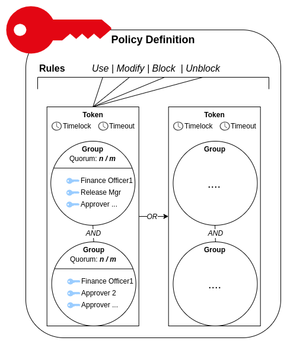

import Tabs from '@theme/Tabs';
import TabItem from '@theme/TabItem';

# Smart Key Attributes

Securosys Smart Key Attributes - enabling true multi-authorization, rules and more for private key usage, for more information visit [**Patent SKA Technology - Smart Key Attributes**!](https://www.securosys.com/securosys-smart-key-attributes-enabling-true-multi-authorization-rules-and-more-for-private-key-usage)

## Smart Key Attribute - Policy

The following approval criteria can be defined:

The criteria are combined in a token and there can be multiple tokens for each rule. The rules define the criteria for all actions with the key:

-	**Usage** (The rule usage defines the usage of the key, e.g. signature-operation, decryption-operation), **Key block / unblock** (in case of a Security Incident), **Modify** Change of the authorization attributes (rules)
- **Groups and quorums** - **N** out of **M** authorization is required and combined in any number of groups;
-	**Delay (TimeLock)** - the minimum time between when the HSM receives the authorization requests and when it can sign the payload;
-	**Timeout** - the maximum time between raising the request and its authorization;  

# What's next?
Now you understand the Policy concept on a key, you are ready to take action and create your first SKA-Key.

- [Create Policy-enabled Key with Smart Key Attributes](/tsb/Tutorials/TransactionSecurityBroker/samples/step-by-step/create-policy-based-key)

## Glossary

| Term | Description |
|---|---|
| Signature Key | HSM Key used for signing a payload (e.g. cryptocurrency transaction) |
| Key Action | One of the following actions with the Signature Key:   • Using the key to sign a payload (use)   • Blocking the key from performing signature operations (block)   • Unblocking the blocked key (unblock)   • Modifying the Key Attributes (modify) 
| Approval Key | Key used to approve signature Key Actions   Supported Approver Key-Pairs: **RSA, EC, ED, DSA, BLS**|
| Quorum | Required number of Approval Keys to perform an Action.   __Note: When working with SKAs directly, it is necessary to maintain the state of the approval request and submit it when the quorum is met. Transaction Security Broker maintains the state for the business application automatically.__
| Group (of Approval Keys) | List of keys from which a quorum is required to perform an Action. Multiple groups, each with its own quorum can be defined with AND relationship. |
| Timelock | Minimum time between a timestamp obtained for a Key Action from the HSM and submitting an approval for the Action.   Note: When working with SKAs directly, it is necessary to obtain the timestamp and submit the approval at the right time manually. Transaction Security Broker manages the re- quests and timelocks automatically. |
| Timeout | Maximum time between a timestamp obtained for a Key Action from the HSM and submitting an approval for the Action. |
| Token | Set of requirements to perform a Key Action. Includes Timelock, Timeout, and Groups. Multiple Tokens can be defined with OR relationship |
| Rule | Multiple tokens defined for a key operation. | 
| SKA Policy | Set of rules for each Key Action |
| Approval Request | A request to sign a Key Action with an Approval Key |
| Approval Client | A device using Approval Keys to sign Approval Requests |