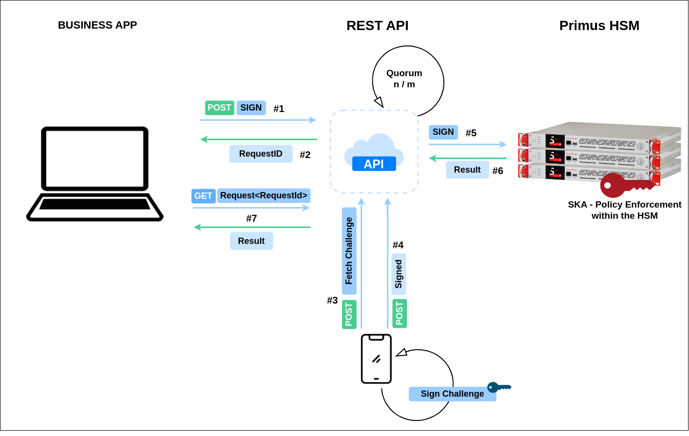

import Tabs from '@theme/Tabs';
import TabItem from '@theme/TabItem';

# Introduction

## Transaction Security Broker

Securosys Hardware Security Modules (HSM) are not only optimized for the physical protection of private key material like most legacy HSMs; Securosys HSMs provide control of the keys usage with specific and sophisticated authorizations, which is essential for the security of modern financial applications.

### How it's done
Todays' financial and digital assets applications require the possibility of implementing fine-grained policies to allow for different actions on transactions to be done. With keys that are based on groups, quorums and maybe also time restrictions - or any combination of them. [Securosys Smart Key Attributes (SKA)](https://www.securosys.com/securosys-smart-key-attributes-enabling-true-multi-authorization-rules-and-more-for-private-key-usage) helps enforce such policies and rules.

To make the implementation of SKA's easier, the Securosys Transaction Security Broker provides a REST API and internal state management. It is a standalone engine, which connects to an external database instance and integrates the SKA-enabled Securosys HSM - and is thus uncritical for security, since all security relevant operations are carried out in the HSM.

TSB integrates Securosys REST API with the SKA workflow engine, simplifying HSM operations with language-agnostic tools.

### Multi-Authorization Workflow
**1.** A business application requests an approval for a signature with a specific key from the TSB **`/v1//sign`**

**2.** The TSB records a Signature Request and returns its ID

**3.** The approval clients can retrieve their pending approval tasks with all information necessary to approve them **`/v1/filteredSignApprovalTask`**

**4.** The approval client sends an approval of the signature request **`/v1/approval`**

**5.** The TSB waits for the rules to be met, then sends the required authorization data along with the payload to the HSM.

**6.** The HSM checks the authorization data against the key attributes and the specific payload. If the criteria are met, the HSM signs the payload and returns the signature to the TSB

**7.** The TSB makes the signature available for the business application to fetch **`/v1/request/<request_id>`**

# What's next?
- An introduction to Smart Key Attributes is provided under [What are Smart Key Attribtues?](/tsb/Tutorials/TransactionSecurityBroker/smart-key-attributes)
- **Creating** a Policy enabled **key** is provided under [TSB - Create Key with Policy](/tsb/Tutorials/TransactionSecurityBroker/samples/step-by-step/create-policy-based-key)
- Please download the Securosys Solution Brief for [financial applications](https://www.securosys.com/hubfs/Securosys_TSB_Fintech_SB-E01.pdf) or  [crypto assets](https://www.securosys.com/hubfs/Securosys_TSB_Crypto_Assets_SB-E01.pdf) to get more information on this.
