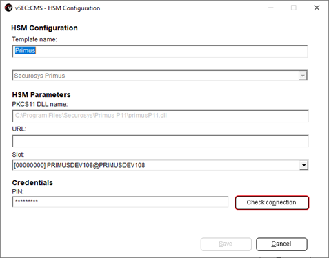
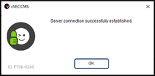
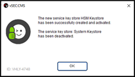
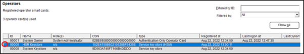
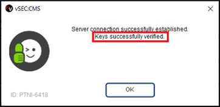
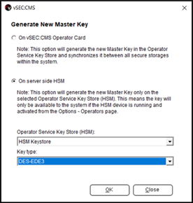
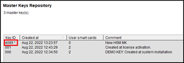
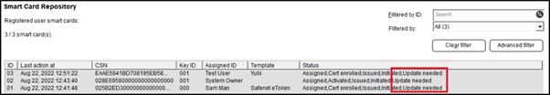

# Configure Versasec CMS with Securosys HSM

The vSEC:CMS makes use of the PKCS#11 interface available in the HSM to utilize the benefits of the HSM key storage and generation. Follow the below shown steps to configure Versasec vSEC:CMS to work with Primus HSM or CloudHSM.

:::warning
It is expected at this point that the Primus HSM PKCS#11 provider is installed and configured to connect to the HSM on the server where the vSEC:CMS is installed. See [Primus HSM PKCS#11 Provider](/versasec-cms/Installation/Provider) for more information. vSEC:CMS will search in the system path for the PKCS#11 module.
:::

:::info
Visit [vSEC:CMS HSM Support](https://support.versasec.com/hc/en-us/articles/115000851714-HSM-Support) on the Versasec online documentation for more details.
:::

1. From `Options - Connections` click the `Configure` button. Make sure that the `Hardware Security Module (HSM)` is in the selected window.
2. Click `Hardware Security Module (HSM)` and click the `Add` button to setup a template. 
    - Enter a template name and from the drop-down list select the Securosys Primus HSM.Moin

    

3. The PKSC#11 module will be automatically detected and populated into the `PKCS11 DLL name` field. The URL will be read from the configuration file that is  included as part of the Primus HSM PKCS#11 provider configuration file. 
    - Select the `SLOT`, where the master key will reside in, from the available slot list in the drop-down list. See [Primus HSM PKCS#11 Provider - Configuration - Section Slots](/pkcs/Installation/pkcs11_provider_configuration#section-slots) on more information about PKCS#11 slots.
    - Enter the PKCS#11 PIN credential for the user who has access to the slot and click `Check connection` to test connectivity. If connectivity to the HSM is successful a success dialog will pop-up.

    :::info
    Obtain the PKCS#11 Password (PIN) from your HSM administrator. In case of CloudHSM subscription the PKCS#11 credentials are provided during the on-boarding procedure. See [Primus HSM PKCS#11 Provider - Primus HSM Configuration - Preparing the PKCS#11 Password (PIN)](/pkcs/Installation/primus_hsm_settings#preparing-the-pkcs11-password-pin).
    :::

Example successful connection pop-up:

Click `Save` to save and close the configuration.

4. Once the connection is setup it will be necessary to create an `Operator Service Key Store` (OSKS). Navigate to `Options - Operators` and click the `Add service key store` button. Enter a name in the `Store name `field and click `Add`. 

All vSEC:CMS master keys will be copied to the HSM during this process and at the end you will get a success dialog.

From the Operators table you can see that the HSM is now used as key store as indicated by the `*` character.

Additionally, if you go back to `Options - Connections - Hardware Security Module (HSM)` and select your `HSM connector` and `Edit`, then click the `Check connection` button you should see more information in the success dialog indicating that the master key used by vSEC:CMS was found in the slot on the HSM.

5.	It is strongly recommended to generate a new master key. From `Options - Master Key` click the `Generate new master key` button to start the process.

:::caution 
It is important to remember that any new credential administration key will be diversified from the newly generated master key. Any credential administration key diversified from older master key(s) of the vSEC:CMS application will remain operable. However, it is recommended to re-register those credentials issued from the older master key(s) of the vSEC:CMS. This will update the user's credential administration key so that it is diversified from the new master key.
:::

6.	Select the option `On server side HSM` and from the drop-down list 3 options are available, `DES-EDE3`, `AES128` and `AES256`. Select the appropriate key type and size as required for your environment.

:::note
It is recommended to select `AES` for key type as `DES` has been withdrawn as a standard by the National Institute of Standards and Technology. From version 6.5 of vSEC:CMS it is possible to migrate from `DES` managed master keys to `AES`.
:::

Click `Ok`. A dialog will popup informing you about the change to the system. Click `Yes` to complete the setup.

7.	Navigate to `Repository - Master keys` and you will see the entry. The `*` character indicates which master key is to be used by vSEC:CMS.

Additionally, from `Repository - Smart Cards` you will see that credentials managed by older master keys will have an Update needed message. 

:::caution
Once the HSM master key is generated it will not be possible to roll back to use an earlier master key. For any credential that was previously managed by the vSEC:CMS with an older master key that was not generated by the HSM it will be possible to continue to manage these credentials, but it is recommended to update these credentials so that they will be managed by the newly created master key.
:::

Credentials whose master key needs to be updated can be done as described below:
- From vSEC:CMS `Admin console` navigate to `Actions - Smart Card Update` and attach a credential that needs to be updated and click the `Execute` button;
- From a client host that has vSEC:CMS User installed and configured for updates, navigate to the `Update` tab to perform the update.

## Additional Information

Any master key added to the HSM will have a label starting with `CMS MK` on the HSM. Depending on whether the master key is generated only on the HSM or was a key created and stored on a full-featured operator card and synced with the HSM, the label will have a different value depending on which option is selected.
For a master key generated only on the HSM the label on the HSM will be: `CMS MK 4099` (this is a hex value), if this was the first key. Any additional key(s) would be incremented by one; therefore, a second master key would have a value of `CMS MK 4100` and so on.
For a master key created and stored on a full-featured operator card and synced with the HSM the label on the HSM will be: `CMS MK 00`, if this was the first key. Any additional key(s) would be incremented by one; therefore, a second master key would have a value of `CMS MK 01` and so on.
