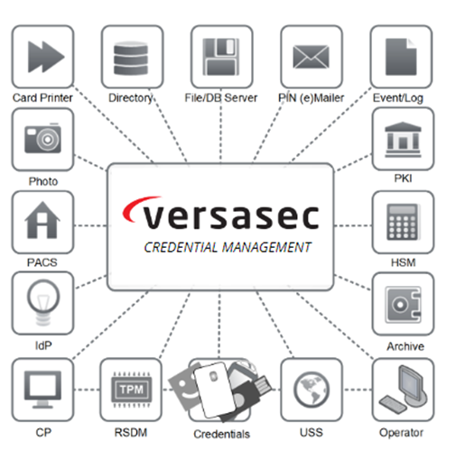

import Tabs from '@theme/Tabs';
import TabItem from '@theme/TabItem';

# Versasec Credential Management System vSEC:CMS

In the present day, cyberattacks are becoming more common and more successful. Public Key Infrastructure (PKI) authentication solution effectively delivers encryption and decryption algorithms that secure and build **Zero Trust architecture**.

It is essentially a set of hardware and software components that work together to produce the desired result. Versasec and Securosys are technology partners for a long time and offer organizations PKI hardware-based solution that gives companies the ability to build their enterprise authentication strategy that fits them best. The solution is available on-premises, as SaaS, or to host in the organisation’s own virtual private cloud. 

Key benefits of implementing Versasec CMS with Securosys Hardware Security Modules (HSMs):
- The ability to securely generate, store and protect the master key(s) in a HSM used when performing administration key operations with the vSEC:CMS.
- The options of having either an on-premises HSM solution or a managed cloud based HSM as a service solution.
- The ability to easily migrate, either partly or completely, into the cloud and stay in possession and control of your own keys.
- The advantages that come with a modern scalable HSM platform, like automatic key synchronization between HSMs in a cluster to address HA/FO.

This document will describe how you can configure vSEC:CMS to be used with an on-premises
Hardware Security Module (HSM) or a CloudHSM (as a service) from Securosys, to store the
master key(s) used when performing administration key operations with the vSEC:CMS such as
registering a credential or PIN unblock operations.
The vSEC:CMS makes use of the PKCS#11 interface available on the Securosys HSMs.

## Target Audience

This document is intended for Securosys Primus HSM or Versasec vSEC:CMS administrators. 

For on-premises HSM deployed operation administrative skills are required for Securosys Primus HSMs.

## Support Contact

If you encounter a problem while installing/configuring the provider or
integrating the HSM with Versasec vSEC:CMS, make sure that you have read the
referenced documentation. If you cannot resolve the issue, please
contact Securosys Customer Support. For specific requests regarding
Securosys integration with Versasec vSEC:CMS, the Securosys
Support Portal is reachable under https://support.securosys.com.

## Get started with Versasec CMS

For a smooth start integrating your Primus HSM with Versasec vSEC:CMS using the Primus CNG/KSP Provider:
- Consult the [Quickstart](./quickstart) section for a comprehensive task listing.
- For detailed installation and configuration instructions, follow the [Installation](/versasec-cms/Installation/Prerequisites) section.
