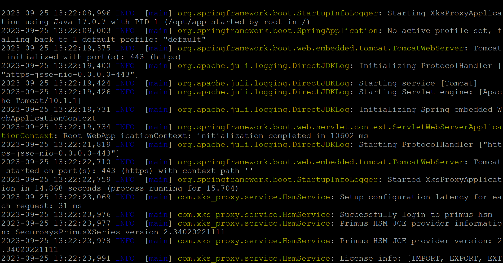

import Tabs from '@theme/Tabs';
import TabItem from '@theme/TabItem';

# Installing the Securosys XKS Proxy
### AWS KMS & Securosys HSM - Integration Guide

:::info Prerequisites
This page assumes that you have already:
- [Installed Docker on EC2](./ec2-docker-installation.md)
- [Configured your HSM](./hsm-device-setup-xks.md) (on-premises only)
:::

For a sample KMS External Key Store configuration please see [this](./ec2-docker-installation.md) guide.

### 1. Load Balancing

It is recommended to establish redundancy in your environment. For more information on Securosys XKS proxy redundancy please refer to AWS documentation [Creating a network load balancer](https://docs.aws.amazon.com/kms/latest/developerguide/vpc-connectivity.html#xks-nlb).

This chapter focuses on the deployment of Securosys XKS Proxy within the AWS EC2 instance which is deployed in the Customer VPC in AWS.


*Figure 1: AWS EC2 instance deployed Securosys XKS Proxy architecture with either Securosys Network CloudHSM or on-premises PrimusHSM*


### 2. Download the proxy

Download the Securosys XKS proxy from the [download section](../downloads.md) (login required).

### 3. Generate TLS Certificate (Java Key Store)

:::tip Tip

There are multiple ways to generate a **.jks** file. In this example we are using openssl and keytool utilities. It is required to have these utilities preinstalled on the device where the **.jks** file will be created.

:::

A prerequisite step for this example is to generate a certificate for your domain. For the next steps you will require your *.ca, *.crt files and a private key (or simply using a self-signed certificate).
  - To generate a **.jks** from these files you need to combine your *.crt and *.ca files. Manually copy all data from *.ca into *.crt, and then you can use the following command. When prompted provide a password for the newly generated .p12 file.

```
openssl pkcs12 -export -in ca.crt -inkey ca.key -out keystore.p12
```


### 4. Configure the Securosys XKS proxy


Here is the default ```application.yaml``` file. Please adapt the blue marked parameters according to your environment:

```yaml
# All necessary credentials from hsm
hsm:
  attestationKeyName: 'attestation-key'
  # Make sure you allowed an outbound firewall rule, to allow traffic to the HSM
  # Hosts should be entered sequentially using the list as in the example below
  host:
    - 'your-proxy_host'
    - 'another-proxy_host'
  #Ports should be entered sequentially using the list just like hosts
  port:
    - 'your-proxy_port'
    - 'another-proxy_port'
  user: 'replace-me_hsm-username'
  setupPassword: 'replace-me_hsm-setupPassword'
  proxyUser: 'replace-me_proxy-username'
  proxyPassword: 'replace-me_proxy-password'

# All necessary credentials from AWS
aws:
  host: 'replace-me_domain-name'
  regionName: 'replace-me_aws-region-name'
  accessKeyID: 'replace-me_keyId'
  secretAccessKey: 'replace-me_secretAccessKey'
  #These parameters should not be modified
  serviceName: 'kms-xks-proxy'
  httpMethodName: 'POST'
  debug: 'false'

# Your dns credentials
server:
  port: 443
  address: 0.0.0.0
  ssl:
    key-store: file:/etc/app/config/keystore.p12
    key-store-password: replace-me_keystore-password
    key-alias: replace-me_keystore-keyname

# Logging configuration
logging:
  config: /etc/app/config/log/logback.xml

#Do not modify!
spring:
  mvc:
    throw-exception-if-no-handler-found: true
```

'hsm' parameters: Change the ```host```, ```port```, and ```user``` parameters to match your own HSM client configuration:

| **HSM Configuration Parameters** | **Description** |
| --- | --- |
| AttestationKeyName: ' **attestation-key**' | Specify the attestation key name. If no attestation key has been created, a new one will be generated when running the Securosys XKS proxy image. |
| Host: - ' **your-proxy\_host**'- ' **another-proxy\_host**' | Specify the host dns or IP of your on premiese Primus HSM or CloudHSM, example: a-api.cloudshsm.comFor high availability (HA) list multiple hosts in seperate lines with "-" |
| Port: - ' **your-proxy\_port**'- ' **another-proxy\_port**' | Specify the JCE port parameter. |
| User: ' **replace-me\_hsm-username**' | Specify your hsm user (parition) name to be used with the AWS services. |
| Setup Password: ' **replace-me\_hsm-setupPassword**' | Specify the setup password of your HSM partition, example: ```B7GSW-2WjB3-eZZjN-zHnGx-2Sdoc```. Once the first connection is established, the connection credentials are stored in a hidden encrypted ```.secret``` file |
| proxyUser: ' **replace-me\_proxy-username**' | Comment or delete the line if not connecting to CloudHSM. When connecting to your CloudHSM partition specify the proxy username from your CloudHSM credentials. |
| proxyPassword: ' **replace-me\_proxy-password**' | Comment or delete the line if not connecting to CloudHSM. When connecting to your CloudHSM partition specify the proxy password from your CloudHSM credentials. |

Configure the 'aws' parameters:
  - Adjust the 'host' parameter to reflect your DNS hostname.
  - Update the 'regionName', 'access-KeyID', and 'secretAccessKey' parameters to correspond with your AWS KMS configuration for the external key store.
  - If not changed leave the parameters for 'serviceName', 'httpMethodName' and 'debug' as default.:

| **Configuration Parameters for aws:** | **Description** |
| --- | --- |
| host:' **replace-me\_domain-name**' | Replace with your domain name. |
| regionName: ' **replace-me\_aws-region-name**' | Replace with the region where the XKS proxy will be deployed, example eu-central-1. |
| accessKeyID: ' **replace-me\_keyId**' | Replace with the KeyID of your AWS KMS External key store. |
| SecretAccessKey: ' **replace-me\_secretAccessKey**' | Replace with the secret access key created with your AWS KMS External key store. |
| ServiceName: 'kms-xks-proxy' | Do not change this parameter. Specifies the service name for AWS. |
| httpMethodName: 'POST' | Do not change this parameter. |
| debug: 'false' | Do not change this parameter. |

Specify the 'server' parameters. Within the 'ssl' parameters, provide your DNS credentials.:

| **Configuration Parameters for server:** | **Description** |
| --- | --- |
| port | Leave the port at port 443. |
| address | Keep the server IP address at 0.0.0.0. |
| ssl: key-store: file: **/etc/app/config/replace-me\_server.jks** | Adapt the path to your domain credentials .jks file to match your environment |
| ssl: key-store-password: **replace-me\_keystore-password** | Insert your keystore password for the .jks file |
| ssl: key-alias: **replace-me\_keystore-keyname** | Insert your key store alias |

Logging parameters:

| **Configuration Parameters for logging:** | **Description** |
| --- | --- |
| config: **/etc/app/config/log/logback.xml** | Adapt the path to the logback.xml file to match your environment |

### 5. Run the Docker Image

Run the docker image with the following command, replace the **variables** according to your configuration:

```js
docker run [-d]-name <NameOfContainer> --add-host <YourHostDomain> :127.0.0.1 \
 --network=host -v /home/ec2-user/securosys\_xks\_1.0.0/config-files:/etc/app/config/ \
 securosys.jfrog.io/external-xks/securosys-xks:1.0.0.20230706T1936Z
```
Parameters for running the docker image:

| Command parameters | Command and parameter description |
| --- | --- |
| [-d] | Optionally use the -d parameter when the xks proxy is desired to be ran in the background. |
| --name \<NameOfContainer\> | Sets a name for the running container. Replace \<NameOfContainer\> with the file name of the compressed container image. |
| --add-host \<YourHostDomain\>:127.0.0.1 | Adds an entry to the container's /etc/hosts file, mapping \<YourHostDomain\> to 127.0.0.1 (localhost). Replace \<YourHostDomain\> parameter with your host domain (used when creating the VPC). The IP address should point to localhost (127.0.0.1 ) |
| --network=host | Configures the container to use the host's network stack instead of creating a separate network namespace. |
| -v **/home/ec2-user/securosys\_xks\_1.0.0/** config-files:/etc/app/config/ | Mounts the directory home/ec2-user/securosys\_xks\_1.0.0/config-files from the host machine to /etc/app/config/ inside the container.Replace the path **/home/ec2-user/securosys\_xks\_1.0.0/** config-files to match your environment path to Securosys XKS proxy configuration files |
| securosys.jfrog.io/external-xks/securosys-xks:1.0.0.20230706T1936Z | Link to Securosys jfrog repository for Securosys XKS proxy |

Example command:

```js
docker run [-d]-nameSecurosysXKSproxy--add-host xks.securosys.com:127.0.0.1 \
 --network=host -v /home/ec2-user/securosys\_xks\_1.0.0/config-files:/etc/app/config/ \
 securosys.jfrog.io/external-xks/securosys-xks:1.0.0.20230706T1936Z
```

### 6. Verify the Setup

If the command is successful, the Securosys XKS proxy will be started. If not already present, a new attestation key will be generated. The logs from the boot will output a healthy status:

```js
2023-07-05 05:56:58,280 INFO [https-jsse-nio-0.0.0.0-443-exec-2] com.xks\_proxy.controller.HealthController: AWS REQUEST: HealthStatusRequest(kmsRequestId=1e967d20-9e, kmsOperation=KmsHealthCheck)

2023-07-05 05:56:58,299 INFO [https-jsse-nio-0.0.0.0-443-exec-2] com.xks\_proxy.controller.HealthController: HEALTH STATUS: HealthStatusResponse(xksProxyFleetSize=1s, xksProxyModel=Securosys XKS Proxy 1.0, ekmVendor=Securosys Group, ekmFleetDetails=[EkmFleet(id=hsm-id-1, model=GRIMSEL RX-2.11.2-T, healthStatus=ACTIVE)])
```
Example boot of the Securosys XKS proxy:


## More content

- [Download the Securosys XKS Proxy for AWS](../downloads) (login required)
- [Example - Creation of an XKS in AWS KMS](../Tutorials/Examples/Example-AWS-KMS.md)
- [Example - Generating a .jks domain file](/xks/Tutorials/Examples/Example-jks.md)