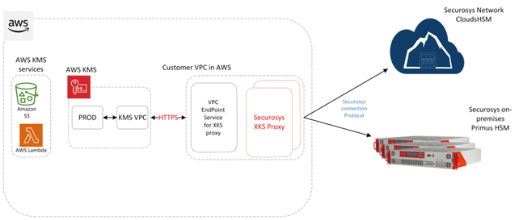

import Link from '@docusaurus/Link';

# Installing Docker on Amazon EC2
### AWS KMS & Securosys HSM - Integration Guide

:::caution Prerequisites
This page assumes that you have already configured and deployed an EC2 instance on your AWS account and have configured it with the AWS VPC. [How to deploy an EC2 instance?](https://docs.aws.amazon.com/AWSEC2/latest/UserGuide/EC2_GetStarted.html).
:::


To install Docker on your instance, follow the steps below.

This example uses the **Amazon Linux 2023 AMI**, commands may vary if you are using different Linux distributions:
  - Connect to your AWS EC2 instance via a SSH client, example connection command:

```
ssh -i "XKS_proxy_key.pem" ec2-user@ec2-1-2-3.eu-central-1.compute.amazonaws.com
```

  - Replace the "XKS_proxy_key.pem" with your EC2 private key file.
  - Replace the "ec2-user@ec2-1-2-3.eu-central-1.compute.amazonaws.com” parameter with your instance public DNS.

For more options on how to connect to your EC2 instance, see [Connect to your Linux instance](https://docs.aws.amazon.com/AWSEC2/latest/UserGuide/AccessingInstances.html).

Execute the following commands to download and install Docker:
  - Apply pending updates using the yum command:
  ```
  yum update
  ```
  - To install docker, run the following command:
  ```
  yum install docker
  ```
  - Start docker service:
  ```
  systemctl start docker.service
  ```
  - Optionally enable docker service at AMI boot time by executing the following command:
  ```
  systmctl enable docker.service
  ```

After successfully installing Docker, it’s advisable to configure the Docker groups and assign users according to your company’s specifications.



## More content

- [Getting Started with XKS Proxy for AWS](../Quickstart/quickstart.md)
- [Download the Securosys XKS Proxy for AWS](../downloads) (login required)
- [Example - Creation of an XKS in AWS KMS](../Tutorials/Examples/Example-AWS-KMS.md)
- [Example - Generating a .jks domain file](/xks/Tutorials/Examples/Example-jks.md)