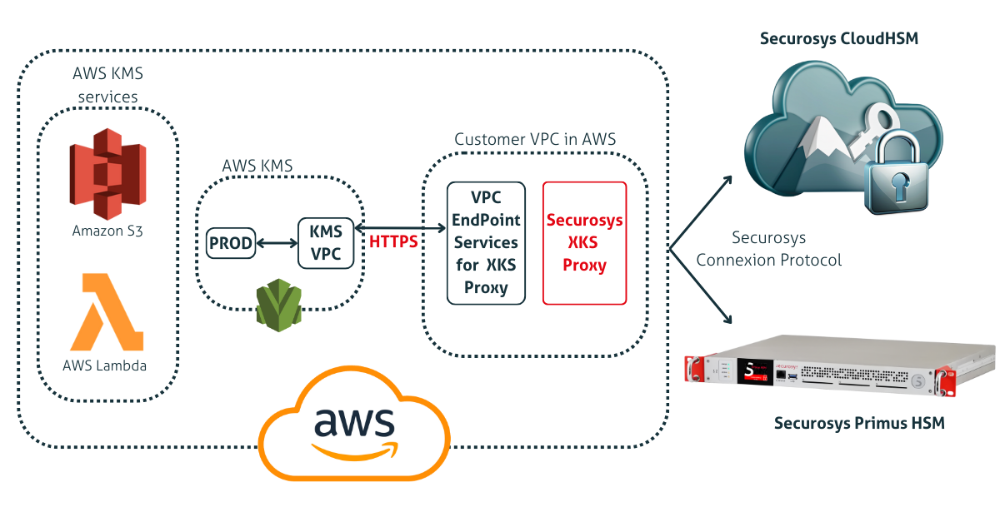

# External Key Store (XKS) Proxy for AWS KMS
### Securosys HSM - Integration Guide

[Amazon Web Services Key Management Service (AWS KMS)](https://aws.amazon.com/kms/) is an encryption and key management service scaled for the cloud. AWS KMS keys and functionality are used by various AWS services, and you can use them to protect data in your own applications that use AWS.

External Key Store (XKS) resources for AWS KMS integration enable you to manage keys stored in Securosys **Hardware Security Modules (HSMs)**, allowing AWS KMS to use the keys for cryptographic operations on demand.

### Control
All communication between AWS External Key Store and the HSM is facilitated through the **Securosys XKS proxy**. 

The Securosys XKS Proxy serves as a critical link between AWS KMS and the source key material stored in either Securosys Primus HSMs or Securosys Network CloudHSMs. It empowers you with key sovereignty, allowing you to retain full control over your keys outside of the AWS KMS, ensuring that the cryptographic operations are executed while preserving enduser control and meeting compliance requirements.

<figure className="image">
  
  <figcaption>
  Securosys Primus HSM integration with AWS XKS via built-in Securosys XKS Proxy
  </figcaption>
</figure>

### How it works

Deploying the Securosys XKS proxy is a quick and easy process. By simply configuring and running the Securosys XKS proxy docker image, it is possible to establish a link between the AWS KMS and your Securosys HSM:
- Primus HSM (on-premises) - [Contact sales](https://www.securosys.com/en/contact)
- [CloudHSM](/cloudhsm/overview/)

The concise Securosys XKS proxy logging can be configured to work on the client server or directed to a remote logging server.
The Securosys XKS proxy can be deployed in different architectures, such as deploying within AWS VPC EC2 instance or a public endpoint connection to AWS services with on premises deployment. 

:::tip No interaction with your data
AWS KMS or the Securosys XKS proxy never directly interact with your cryptographic data. Instead, all interactions are only forwarded through the Securosys XKS proxy software that you provide. This ensures that your HSM remains the sole entity responsible for encryption and decryption operations using your cryptographic key material.
:::

### About External Key Store (XKS) Proxy by Securosys
The XKS Proxy for AWS is a robust and scalable software solution designed to facilitate secure communication between clients and backend services deployed on the Amazon Web Services (AWS) cloud infrastructure. The proxy acts as an intermediary, routing requests from clients to the appropriate backend services and managing authentication, authorization, and encryption for seamless and secure data transmission. 

### More content

- [Getting Started with XKS Proxy for AWS](./Quickstart/quickstart.md)
- [Example - Creation of an XKS in AWS KMS](./Tutorials/Examples/Example-AWS-KMS.md)
- [Tutorial - How to encrypti/decrypt keys in AWS KMS?](./Tutorials/Examples/Example-AWS-KMS.md)
